# Teil 01

<!-- source-page: 1 -->

## High-Performance Computing
(CDS-110)

Prof. Dr. rer. nat. habil. Ralf-Peter Mundani
DAViS


<figure>
  
</figure>


<!-- source-page: 2 -->

## General Remarks
- lecture / exercises
  - Thursday, 1:30—4:45 pm

- homework
  - several exercise sheets throughout term
  - partially discussed during lecture
source: der-querschnitt.de
- examination (100%)
  - written, 120 minutes, open book, closed internet, no electronic devices


<figure>
  
</figure>


<!-- source-page: 3 -->

## General Remarks
- content
  - introduction
  - high-performance networks
  - foundations of parallelisation / load balancing
  - MPI programming
  - OpenMP programming / multithreading
  - examples of parallel algorithms


<!-- source-page: 4 -->

## General Remarks
- best practice for success?
  - lectures
  - homework
  - additional effort (books, internet, programming, …)
  - and not to forget: questions

source: fowllanguagecomics.com (© B. Gordon)


<figure>
  
</figure>


<figure>
  
</figure>


<figure>
  
</figure>


<figure>
  
</figure>


<!-- source-page: 5 -->

## General Remarks
- simulation – from phenomena to prediction

physical phenomenon
technical process
1. modelling
determination of parameters, expression of relations

2. numerical treatment
model discretisation, algorithm development

3. implementation
software development, parallelisation
discipline
4. visualisation
mathematics                               illustration of abstract simulation results

computer science                                  5. validation
comparison of results with reality
engineering application                                   6. embedding
insertion into working process


<!-- source-page: 6 -->

## General Remarks
- why parallel programming and HPC?
  - complex problems (especially the so called `grand challenges´) demand for
more computing power
    - climate or geophysics simulation (tsunami, e.g.)
    - structure or flow simulation (crash test, e.g.)
    - development systems (CAD, e.g.)
    - large data analysis (Large Hadron Collider at CERN, e.g.)
    - military applications (crypto analysis, e.g.)
    - ...

  - performance increase due to
    - faster hardware, more memory (`work harder´)
    - more efficient algorithms, optimisation (`work smarter´)
    - parallel computing (`get some help´)


<!-- source-page: 7 -->

## General Remarks
- objectives (in case all resources would be available N-times)
  - throughput: compute N problems simultaneously
    - running N instances of a sequential program with different data sets
(“embarrassing parallelism”); SETI@home, e.g.

  - response time: compute one problem at a fraction (1/N) of time
    - running one instance (i.e. N processes) of a parallel program for jointly
solving a problem; finding prime numbers, e.g.

  - problem size: compute one problem with N-times larger data
    - running one instance (i.e. N processes) of a parallel program, using the
sum of all local memories for computing larger problem sizes; iterative
solution of SLE, e.g.


<!-- source-page: 8 -->

## Course Goals
- upon successful completion of this course, you should be able to
  - appreciate and understand
    - basic hardware concepts such as cores and caches
    - different levels of parallelism and their exploitation
    - different hardware architectures and their distinction
  - develop an ability to apply performance measurements on parallel codes
  - express parallelisation strategies using the PRAM model


<figure>
  
</figure>


<!-- source-page: 9 -->

- overview

  - excursion: from bits and bytes to cache and cores
  - levels of parallelism
  - supercomputers
  - classification of parallel computers
  - quantitative performance evaluation
  - abstract parallel performance model

I think there is a world market
```pseudo
for maybe five computers.
```
—Thomas Watson,
chairman IBM, 1943


<!-- source-page: 10 -->

Excursion: from Bits and Bytes to Cache and Cores
- reminder: arithmetic logical unit (ALU)
  - schematic layout of the (classical 32-bit) arithmetic logical unit

…
registers
…
…

32-bit data bus
main memory

A               B
…
ALU
C

```pseudo
C <- A ⊗ B with arithmetic operation ⊗
```


<!-- source-page: 11 -->

Excursion: from Bits and Bytes to Cache and Cores
- reminder: arithmetic logical unit (cont’d)
  - mystery: clock rate
    - frequency at which a chip is running
    - nowadays measured in GigaHertz [GHz]
    - defining number of discrete time steps (so-called cycles) per second

  - example: 3 GHz
    - i.e. 3x109 cycles per second                  …
registers
    - one operation per cycle
…
=> theoretically 3x109 Op/s

A               B
ALU
C


<figure>
  
</figure>


<!-- source-page: 12 -->

Excursion: from Bits and Bytes to Cache and Cores
- memory hierarchy
  - memory hierarchy
    - exploitation of program characteristics such as locality
    - compromise between costs and performance
    - components with different speeds and capacities

single access

access speed
register

cache              block access

main memory                page access

background memory

capacity
serial access
archive memory


<!-- source-page: 13 -->

Excursion: from Bits and Bytes to Cache and Cores
- memory hierarchy (cont’d)
  - cache memory
    - fast access buffer between main memory and processor
    - provides copies of current (main) memory content for fast access
during program execution
  - cache management
      - tries to provide always those data that processor needs for the next
computation step
      - due to small capacity certain strategies for load and update operations
of cache content necessary
cache memory (m << n)
cache-line Li i = 0, ..., m-1
0                                          n-1
main memory
block Bj j = 0, ..., n-1       mapping Bj to Li
0                m-1


<!-- source-page: 14 -->

Excursion: from Bits and Bytes to Cache and Cores
- memory hierarchy (cont’d)
  - example: SCHOENAUER vector triad benchmark
    - main kernel
double *A, *B, *C, *D

```pseudo
for i <- 0 to N-1 do
A[i] <- B[i] + C[i] * D[i]
od
```

    - report performance for different N
    - kernel is limited by data transfer performance for all memory levels
    - using different compilers on Sandy-Bridge architecture
      - Intel Compiler 13.0.0 (icc)
      - GNU Compiler 4.6.3 (gcc)


<!-- source-page: 15 -->

Excursion: from Bits and Bytes to Cache and Cores
- memory hierarchy (cont’d)
L1D (32 KB)

L2 (256 KB)

factor ≈7.5

cache effects
L3 (20 MB)

Main Memory (192 GB)
swap
Memory Proc. 1(96 GB)


<figure>
  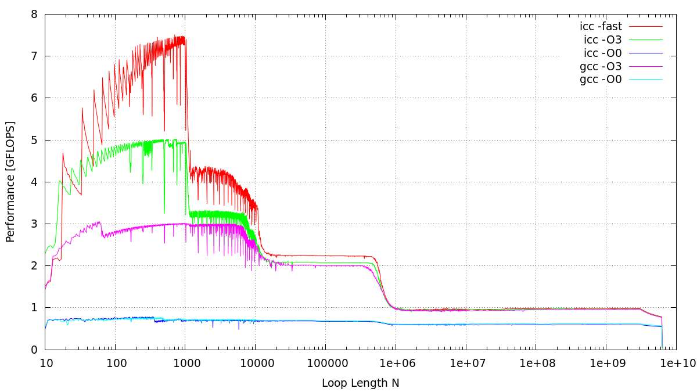
</figure>


<!-- source-page: 16 -->

Excursion: from Bits and Bytes to Cache and Cores
  - roofline model
    - an optimistic performance model (for node level optimisation)

high intensity (limited by execution)
best use of resources

Performance
Pmax

Throughput [data/sec]

Intensity [tasks/data]

Proc. capability Pmax [tasks/sec]
low intensity (limited by bottleneck)

Intensity


<!-- source-page: 17 -->

- overview

  - excursion: from bits and bytes to cache and cores ✓
  - levels of parallelism
  - supercomputers
  - classification of parallel computers
  - quantitative performance evaluation
  - abstract parallel performance model


<!-- source-page: 18 -->

## Levels of Parallelism
- qualitative meaning: level(s) on which work is done in parallel

=> instructions are further subdivided in units to be
sub-instruction level       => executed in parallel or via overlapping

granularity
=> parallel exe. of machine instructions; compilers can
instruction level           => increase this potential by modified command order

=> multithreading / shared memory parallelisation;
block level                 => blocks of instructions are executed in parallel
OpenMP + MPI => state of the art
=> distributed memory parallelisation; program is
process level                   => subdivided into processes to be exe. in parallel

=> parallel processing of different programs; =>
program level                      independent units without any shared data


<figure>
  
</figure>


<figure>
  
</figure>


<figure>
  
</figure>


<figure>
  
</figure>


<figure>
  
</figure>


<!-- source-page: 19 -->

## Levels of Parallelism
- instruction pipelining
  - instruction execution involves several operations
1. instruction fetch (IF)
2. decode (DE)
3. fetch operands (OP)
4. execute (EX)
5. write back (WB)
which are executed successively

  - hence, only one part of CPU works at a given moment

…     IF   DE    OP    EX   WB   IF   DE    OP    EX    WB   …

instruction N             instruction N+1


<!-- source-page: 20 -->

## Levels of Parallelism
- instruction pipelining (cont‘d)
  - observation: while processing particular stage of instruction, other stages
are idle
  - hence, multiple instructions to be overlapped in execution => instruction
pipelining (similar to assembly lines)
  - advantage: no additional hardware necessary

…
```pseudo
IF   DE    OP   EX    WB                     time
```
instruction N
instruction N+1              IF   DE   OP    EX   WB
instruction N+2                   IF   DE    OP    EX   WB

instruction N+3                         IF   DE   OP    EX   WB

instruction N+4                              IF   DE    OP    EX   WB
…


<!-- source-page: 21 -->

## Levels of Parallelism
- superscalar
  - faster CPU throughput due to simultaneously execution of instructions
within one clock cycle via redundant functional units (ALU, multiplier, …)
  - dispatcher decides (during runtime) which instructions read from memory
can be executed in parallel and dispatches them to different functional
units
  - for instance, PowerPC 970 (4 x ALU, 2 x FPU)

instr. 1   instr. 2   instr. 3   instr. 4   instr. A   instr. B

ALU        ALU        ALU        ALU        FPU        FPU

  - but, performance improvement is limited (intrinsic parallelism)


<figure>
  
</figure>


<!-- source-page: 22 -->

## Levels of Parallelism
- very long instruction word (VLIW)
  - in contrast to superscalar architectures, the compiler groups parallel
executable instructions during compilation (pipelining still possible)
  - advantage: no additional hardware logic necessary
  - drawback: not always fully useable (=> dummy filling (NOP))

VLIW instruction

instr. 1         instr. 2               instr. 3   instr. 4

registers


<!-- source-page: 23 -->

## Levels of Parallelism
- vector units
  - simultaneously execution of one instruction on a one-dimensional array of
data (≡ vector)
  - VU first appeared in 1970s and were the basis of most supercomputers in
the 1980s and 1990s

( A1       B1   A2        B2   A3        B3   ...   AN-1 BN-1 AN       BN ) T

instruction
1             2              3
...     N-1          N

( C1                C2             C3        ...     CN-1         CN ) T

  - specialised hardware => very expensive
  - limited application areas (mostly Computational Fluid Dynamics,
Computational Structures Dynamics, …)


<!-- source-page: 24 -->

## Levels of Parallelism
- dual core, quad core, many core, and multicore
  - observation: increasing frequency f (and thus core voltage v) over past
years => problem: thermal power dissipation P ~ f*v2

source: linux.sys-con.com             source: edwardbosworth.com


<figure>
  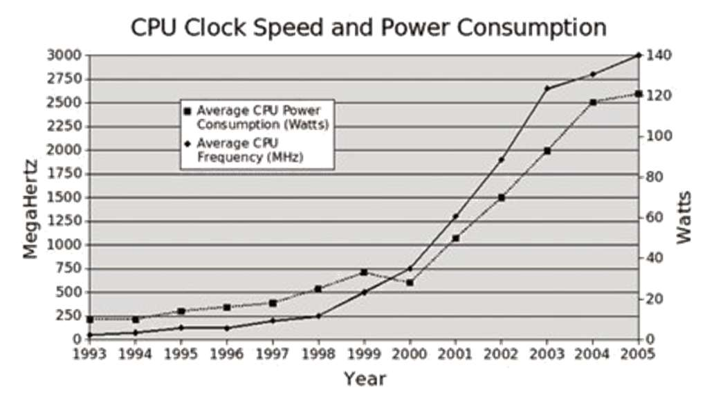
</figure>


<figure>
  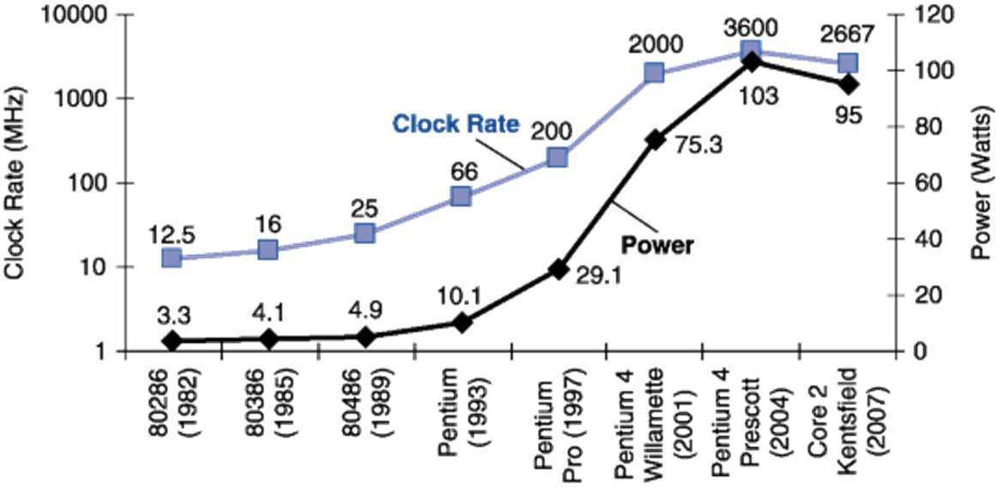
</figure>


<!-- source-page: 25 -->

## Levels of Parallelism
- dual core, quad core, many core, and multicore (cont’d)
  - 25% reduction in performance => approx. 50% reduction in dissipation
  - idea: installation of two cores with same dissipation as single core system

normal CPU                  ‘reduced’ CPU                 dual core

dissipation              performance


<!-- source-page: 26 -->

## Levels of Parallelism
- Intel Nehalem Core i7

core 0   core 1    core 2    core 3

L1+L2    L1+L2     L1+L2     L1+L2
shared L3

QPI
source: www.samrathacks.com

QPI: QuickPath Interconnect replaces FSB (QPI is a point-to-point interconnection – with a
memory controller now on-die – in order to allow both reduced latency and higher bandwidth =>
up to (theoretically) 25.6 GByte/s data transfer, i.e. 2x FSB)


<figure>
  
</figure>


<!-- source-page: 27 -->

## Levels of Parallelism
- Intel E5-2600 Sandy-Bridge Series
  - 2 CPUs connected by 2 QPIs (Intel Quick Path Interconnect)
  - Quick Path Interconnect (1 sending and 1 receiving port)
    - 8 GT/s ∙ 16 Bit/T payload ∙ 2 directions / 8 Bit/Byte = 32 GB/s max
bandwidth per QPI
    - 2 QPI links => 2 ∙ 32 GB/s = 64 GB/s max bandwidth

source: G. Wellein, RRZE


<figure>
  
</figure>


<figure>
  
</figure>


<!-- source-page: 28 -->

## Levels of Parallelism
- Intel Broadwell-EP
  - successor of Haswell architecture (22nm process) using a 14nm process
  - available in three different core count (xCC) configurations: HCC (7.2B
transistors), MCC (4.7B transistors), and LCC (3.2B transistors)
  - two bidirectional rings connect 12 cores each; intelligent routing decides
about north/south ring traffic (WC: 12 cycles)

source: tomshardware.com

LLC = last level cache


<figure>
  
</figure>


<!-- source-page: 29 -->

## Levels of Parallelism
- Intel Skylake-SP
  - redesign of Broadwell architecture using same 14nm process
  - available in three different core count (CC) configurations: XCC (28 cores),
HCC (18 cores), and LCC (10 cores)
  - 2D mesh topology (known from Intel’s Knights Landing) uses bi-directional
interconnects between cores, caches, and IO controllers

source: tomshardware.com
XCC (left),
HCC (right)


<figure>
  
</figure>


<figure>
  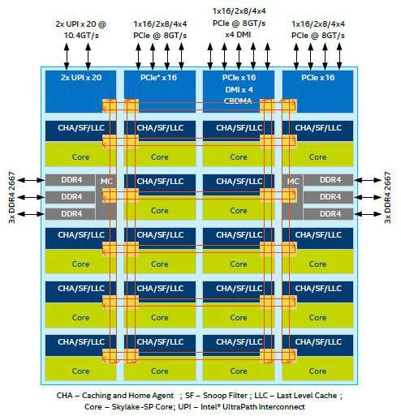
</figure>


<!-- source-page: 30 -->

- overview

  - excursion: from bits and bytes to cache and cores ✓
  - levels of parallelism ✓
  - supercomputers
  - classification of parallel computers
  - quantitative performance evaluation
  - abstract parallel performance model


<!-- source-page: 31 -->

## Supercomputers
- dawn of number crunchers
  - supercomputing or high-performance scientific computing as the most
important application of the big number crunchers
  - national initiatives due to huge budget requirements
    - Accelerated Strategic Computing Initiative (ASCI) in the U.S.
      - in the sequel of the nuclear testing moratorium in 1992/93
      - decision: develop, build, and install a series of five
supercomputers of up to $100 million each in the U.S.
      - start: ASCI Red (1997, Intel-based, Sandia National Laboratory, the
world’s first TFlops computer)
      - then: ASCI Blue Pacific (1998, LLNL), ASCI Blue Mountain,
ASCI White, ...

    - meanwhile new high-end computing memorandum (2004)


<!-- source-page: 32 -->

## Supercomputers
- MOORE’s law
  - observation of Intel co-founder Gordon E. MOORE, describes important
trend in history of computer hardware (1965)

source: intel.com            source: intel.com

“number of transistors that can be placed on an integrated circuit is increasing
exponentially, doubling approximately every two years”


<figure>
  
</figure>


<figure>
  
</figure>


<!-- source-page: 33 -->

## Supercomputers
- some numbers: Top500 (as of November 2025)


<figure>
  
</figure>


<!-- source-page: 34 -->

## Supercomputers
- some numbers: Top500 (as of November 2025)


<figure>
  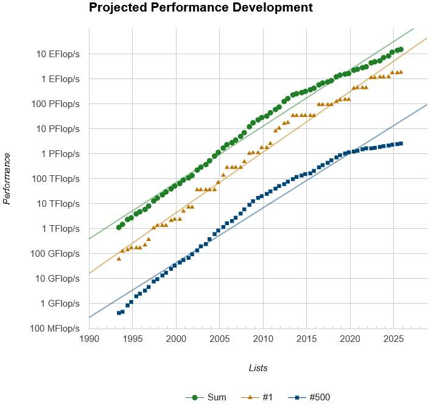
</figure>


<!-- source-page: 35 -->

## Supercomputers
- the 10 fastest supercomputers in the world (as of November 2025)


<figure>
  
</figure>


<!-- source-page: 36 -->

## Supercomputers
- the 10 fastest supercomputers in the world (as of November 2025)


<figure>
  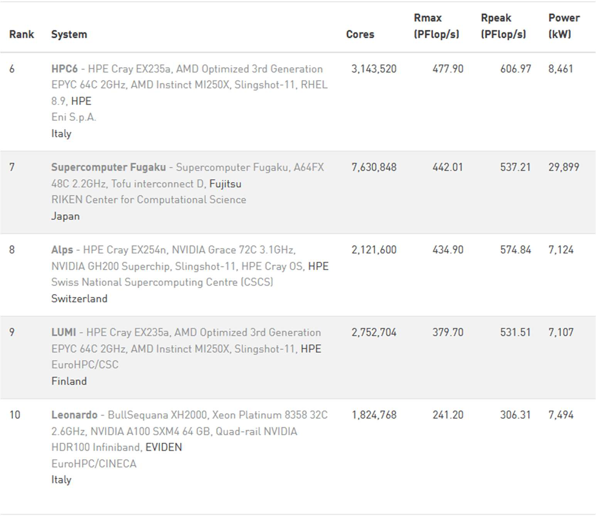
</figure>


<!-- source-page: 37 -->

- overview

  - excursion: from bits and bytes to cache and cores ✓
  - levels of parallelism ✓
  - supercomputers ✓
  - classification of parallel computers
  - quantitative performance evaluation
  - abstract parallel performance model


<!-- source-page: 38 -->

## Classification of Parallel Computers
- standard classification according to FLYNN
  - global data and instruction streams as criterion
    - instruction stream: sequence of commands to be executed
    - data stream: sequence of data subject to instruction streams
  - two-dimensional subdivision according to
    - amount of instructions per time a computer can execute
    - amount of data elements per time a computer can process
  - hence, FLYNN distinguishes four classes of architectures
    - SISD: single instruction, single data
    - SIMD: single instruction, multiple data
    - MISD: multiple instruction, single data
    - MIMD: multiple instruction, multiple data
  - drawback: very different computers may belong to the same class


<!-- source-page: 39 -->

## Classification of Parallel Computers
- standard classification according to FLYNN
  - SISD
    - one processing unit that has access to one data memory and to one
program memory
    - classical monoprocessor following VON NEUMANN’s principle

data memory           processor         program memory


<!-- source-page: 40 -->

## Classification of Parallel Computers
- standard classification according to FLYNN
  - SIMD
    - several processing units, each with separate access to a (shared or
distributed) data memory; one program memory
    - synchronous execution of instructions
    - example: array computer, vector computer
    - advantages: easy programming model due to control flow with a strict
synchronous-parallel execution of all instructions
    - drawbacks: specialised hardware necessary, easily becomes out-dated
due to recent developments at commodity market

data memory           processor

program memory

data memory           processor


<!-- source-page: 41 -->

## Classification of Parallel Computers
- standard classification according to FLYNN
  - MISD
    - several processing units that have access to one data memory; several
program memories
    - not very popular class (mainly for special applications such as Digital
Signal Processing)
    - operating on a single stream of data, forwarding results from one
processing unit to the next
    - example: systolic array (network of primitive processing elements that
“pump” data)

processor           program memory

data memory

processor           program memory


<!-- source-page: 42 -->

## Classification of Parallel Computers
- standard classification according to FLYNN
  - MIMD
    - several processing units, each with separate access to a (shared or
distributed) data memory; several program memories
    - classification according to (physical) memory organisation
      - shared memory => shared (global) address space
      - distributed memory => distributed (local) address space
    - example: multiprocessor systems, networks of computers

data memory            processor           program memory

data memory            processor           program memory


<!-- source-page: 43 -->

## Classification of Parallel Computers
- processor coupling
  - cooperation of processors / computers as well as their shared use of
various resources require communication and synchronisation
  - the following types of processor coupling can be distinguished
    - memory-coupled multiprocessor systems (MemMS)
    - message-coupled multiprocessor systems (MesMS)

global memory           distributed memory
shared
MemMS, SMP             Mem-MesMS (hybrid)
address space
distributed
∅                       MesMS
address space


<!-- source-page: 44 -->

## Classification of Parallel Computers
- processor coupling
  - uniform memory access (UMA)
    - each processor P has direct access via the network to each memory
module M with same access times to all data
    - standard programming model can be used (i.e. no explicit send /
receive of messages necessary)
    - communication and synchronisation via shared variables
(inconsistencies (write conflicts, e.g.) have to prevented in general by
the programmer)

M     M         ...       M

network

P     P        ...        P


<!-- source-page: 45 -->

## Classification of Parallel Computers
- processor coupling
  - non-uniform memory access (NUMA)
    - memory modules physically distributed among processors
    - shared address space, but access times depend on location of data
(i.e. local addresses faster than remote addresses)
    - differences in access times are visible in the program
    - example: DSM / VSM, Cray T3E

network

M                      M

P          ...           P


<!-- source-page: 46 -->

## Classification of Parallel Computers
- processor coupling
  - cache-coherent non-uniform memory access (ccNUMA)
    - caches for local and remote addresses; cache-coherence implemented
in hardware for entire address space
    - problem with scalability due to frequent cache actualisations
    - example: SGI Origin 2000

network

M                     M

C          ...          C
P                    P


<!-- source-page: 47 -->

## Classification of Parallel Computers
- processor coupling
  - cache-only memory access (COMA)
    - each processor has only cache-memory
    - entirety of all cache-memories = global shared memory
    - cache-coherence implemented in hardware
    - example: Kendall Square Research KSR-1

network

C    C             C
...
P    P             P


<!-- source-page: 48 -->

## Classification of Parallel Computers
- processor coupling
  - no remote memory access (NORMA)
    - each processor has direct access to its local memory only
    - access to remote memory only via explicit message exchange (due to
distributed address space) possible
    - synchronisation implicitly via the exchange of messages
    - performance improvement between memory and I/O due to parallel
data transfer (Direct Memory Access, e.g.) possible
    - example: IBM SP2, ASCI Red / Blue / White

network

P     P               P
...
M     M                M


<!-- source-page: 49 -->

- overview

  - excursion: from bits and bytes to cache and cores ✓
  - levels of parallelism ✓
  - supercomputers ✓
  - classification of parallel computers ✓
  - quantitative performance evaluation
  - abstract parallel performance model


<!-- source-page: 50 -->

## Quantitative Performance Evaluation
- execution time
  - time T of a parallel program between start of the execution on one
processor and end of all computations on the last processor
  - during execution all processors are in one of the following states
    - compute
      - TCOMP: time spent for computations

    - communicate
      - TCOMM: time spent for send and receive operations

    - idle
      - TIDLE: time spent for waiting (sending / receiving messages)

  - hence T = TCOMP + TCOMM + TIDLE


<!-- source-page: 51 -->

## Quantitative Performance Evaluation
- comparison multiprocessor / monoprocessor
  - correlation of multi- and monoprocessor systems’ performance
  - important: program that can be executed on both systems
  - definitions
    - T(1): execution time of a program on the monoprocessor system
(measured in steps or clock cycles)
    - T(p): execution time of a program on the multiprocessor system
(measured in steps or clock cycles) with p processors


<!-- source-page: 52 -->

## Quantitative Performance Evaluation
- comparison multiprocessor / monoprocessor
  - speed-up
    - S(p) indicates the improvement in processing speed

with 1 <= S(p) <= p

  - efficiency
    - E(p) indicates the relative improvement in processing speed
    - improvement is normalised by the amount of processors p

with 1/p <= E(p) <= 1


<!-- source-page: 53 -->

## Quantitative Performance Evaluation
- scalability
  - objective: adding further processing elements to the system shall reduce
the execution time without any program modifications
  - i.e. a linear performance increase with an efficiency close to 1
  - important for the scalability is a sufficient problem size
    - one porter may carry one suitcase in a minute
    - 60 porters won’t do it in a second
    - but 60 porters may carry 60 suitcases in a minute

  - in case of a fixed problem size and an increasing amount of processors
saturation will occur for a certain value of p, hence scalability is limited
  - when scaling the amount of processors together with the problem size (so
called scaled problem analysis) this effect will not appear for good scalable
hard- and software systems


<!-- source-page: 54 -->

## Quantitative Performance Evaluation
- AMDAHL’s law
  - the probably most important and most famous estimate for the speed-up
(even if quite pessimistic)
  - underlying model
    - each program has a sequential part s, 0 <= s <= 1, that can only be
executed in a sequential way: synchronisation, data I/O, …
    - furthermore, each program consists of a parallelisable part 1-s that
can be executed in parallel by several processes; finding the maximum
value within a set of numbers, e.g.

  - hence, the execution time for the parallel program executed on p
processors can be written as


<figure>
  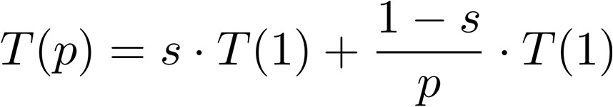
</figure>


<!-- source-page: 55 -->

## Quantitative Performance Evaluation
- AMDAHL’s law
  - the speed-up can thus be computed as

  - modified version (with communication)

where
    - Tlat denotes latency [s]
    - L denotes message length [bytes]
    - B denotes bandwidth [bytes/s]


<figure>
  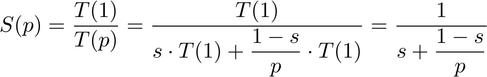
</figure>


<figure>
  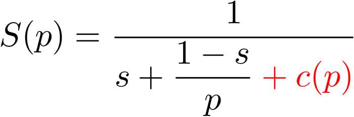
</figure>


<figure>
  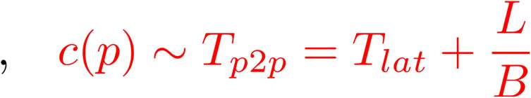
</figure>


<!-- source-page: 56 -->

## Quantitative Performance Evaluation
- AMDAHL’s law
  - when increasing p -> ∞ we finally get AMDAHL’s law

=> speed-up is bounded: S(p) <= 1/s
  - the sequential part can have a dramatic impact on the speed-up
  - therefore central effort of all (parallel) algorithms: keep s small
  - many parallel programs have a small sequential part (s < 0.1)


<figure>
  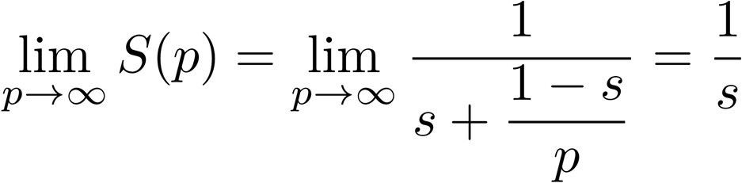
</figure>


<!-- source-page: 57 -->

## Quantitative Performance Evaluation
- AMDAHL’s law
  - example: s = 0.1
    - independent from p the speed-up is bounded by this limit
    - where’s the error?
10

9

8

7

6

speed-up
5

4

3

2

1
S(p)
0
0   5   10   15   20   25   30   35   40   45   50   55   60   65   70   75   80   85   90   95     100
# processes


<!-- source-page: 58 -->

## Quantitative Performance Evaluation
- some more thoughts about speed-up
  - theory tells: a superlinear speed-up does not exist
  - but superlinear speed-up can be observed
    - when improving an inferior sequential algorithm
    - when a parallel program (that does not fit into the main memory of
the monoprocessor system) completely runs in cache of the nodes
from the multiprocessor system

- strong vs. weak speed-up
  - strong speed-up: keep problem size fixed and only increase number of
processes => typically levels off at some point / number of processes
  - weak speed-up (or scale-up): increase problem size in the same way as
number of processes => should stay the same in the best case


<!-- source-page: 59 -->

## Quantitative Performance Evaluation
- CFD example (inhouse code – credits to Prof. Dr.-Ing. Jérôme Frisch)

28 TB memory footprint =>
20,000 cores @ SuperMUC

Energy due: 2500 kWh
(20-30 min. on 18 islands)

solving Δu = 0 for 3D domain with 19’173’961 grids and resolution 4096x4096x4096
(i.e. approx. 707B DOFs); times obtained on SuperMUC and Shaheen (IBM Blue Gene/P)


<figure>
  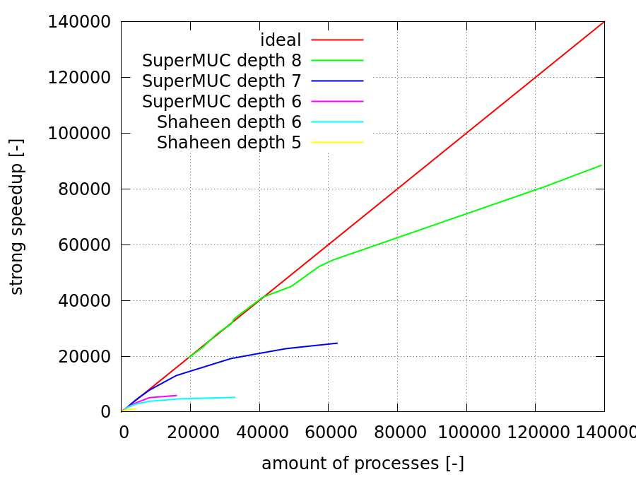
</figure>


<figure>
  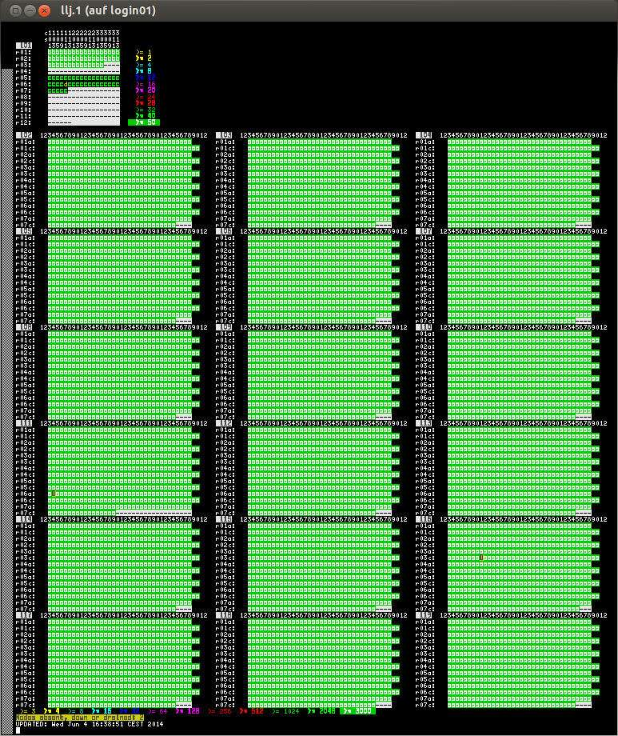
</figure>


<!-- source-page: 60 -->

## Quantitative Performance Evaluation
- CFD example (inhouse code – credits to Prof. Dr.-Ing. Jérôme Frisch)
  - time to solution for one time step (repeated V-cyles with adaptive
relaxation steps (and secret scaling factor ☺) until convergence)

depth 6: layout with 2x2x2
refinement and 16x16x16
blocks up to 16’384 procs.

depth 7: layout with 2x2x2
refinement and 16x16x16
blocks up to 65’536 procs.

depth 8: layout with 2x2x2
refinement and 16x16x16
blocks up to 147’456 procs.

depth 8: 4096x4096x4096 (total of 80B computing cells; 707B degrees of freedom)


<figure>
  
</figure>


<!-- source-page: 61 -->

## Quantitative Performance Evaluation
- CFD example (inhouse code – credits to Prof. Dr.-Ing. Jérôme Frisch)
  - time to solution for one time step (repeated V-cyles with adaptive
relaxation steps (and secret scaling factor ☺) until convergence)

depth 6: layout with 2x2x2
refinement and 16x16x16
blocks up to 16’384 procs.

depth 7: layout with 2x2x2
clocks                refinement and 16x16x16
blocks up to 65’536 procs.

depth 8: layout with 2x2x2
refinement and 16x16x16
blocks up to 147’456 procs.

depth 8: 4096x4096x4096 (total of 80B computing cells; 707B degrees of freedom)


<figure>
  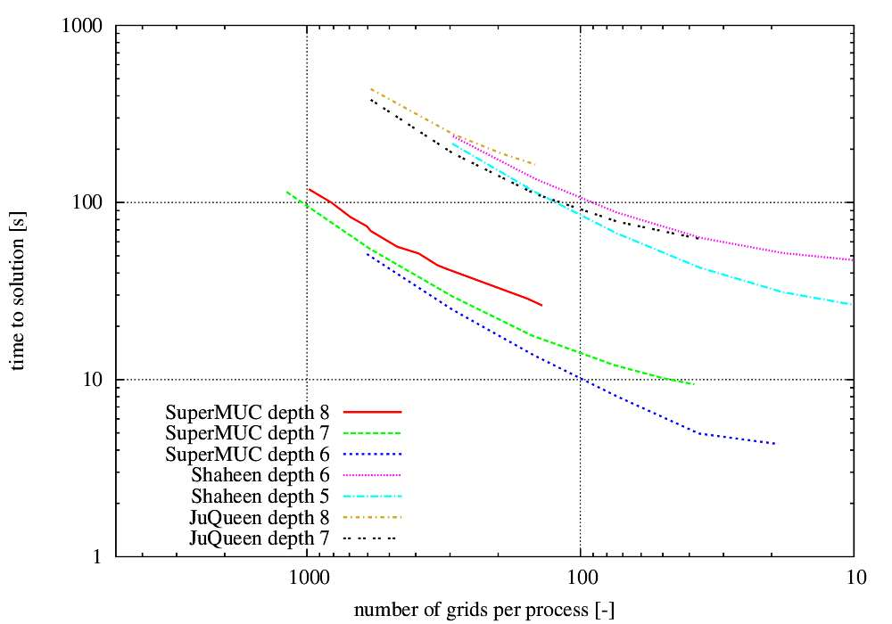
</figure>


<!-- source-page: 62 -->

- overview

  - excursion: from bits and bytes to cache and cores ✓
  - levels of parallelism ✓
  - supercomputers ✓
  - classification of parallel computers ✓
  - quantitative performance evaluation ✓
  - abstract parallel performance model


<!-- source-page: 63 -->

## Abstract Parallel Performance Model
- RAM: random-access machine
  - abstract computational-machine model used for complexity analysis
  - main features
    - infinite number of registers that store integers of unbounded size
    - instruction set includes
      - operations for moving data between registers
      - comparisons
      - loops and conditional branches
      - simple arithmetic operations (i.e. +, -, *, /)
    - all operations take unit time (regardless of operands)
    - execution ends with HALT instruction

  - time complexity ≡ number of instructions executed
  - space complexity ≡ number of memory cells accessed


<!-- source-page: 64 -->

## Abstract Parallel Performance Model
- RAM: random-access machine (cont’d)
  - simple computations with direct / indirect addressing possible

R[x] means content of register with address x
```pseudo
<- means copy / replace content without destruction of source
```

```pseudo
1.   R[11] <- 10
2.   R[12] <- 42
3.   R[13] <- 11
4.   R[12] <- R[R[13]] + 5
```
5.   HALT

  - what content has register 12?
  - what is the time / space complexity of this computation?


<!-- source-page: 65 -->

## Abstract Parallel Performance Model
- RAM: random-access machine (cont’d)
  - example: finding maximum element max in unsorted list of size N stored
at registers X[1] to X[N]
  - max, i, and N are abbreviated notations to some registers R[ ]

```pseudo
1.   max <- X[1]
2.   for i <- 2 to N do
3.     if X[i] > max then max <- X[i] fi
```
4.   od
5.   HALT

  - what is the time complexity of this computation?
  - and how does this work in parallel?


<!-- source-page: 66 -->

## Abstract Parallel Performance Model
- PRAM: parallel random-access machine
  - idealised model of shared memory SIMD machine
  - extension to RAM model with new features
    - infinite number of RAM processors, each one to be identified by some
unique processor ID (PID)
    - there is an infinite number of shared registers (prefixed with s_)
    - each processor can access any shared register (unless there is a
conflict) in unit time
    - processors exchange data via reading from / writing into shared
registers
    - computation proceeds until P0 halts

  - parallel time complexity ≡ time elapsed for P0’s computation
  - parallel space complexity ≡ total number of shared registers accessed


<!-- source-page: 67 -->

## Abstract Parallel Performance Model
- PRAM: parallel random-access machine (cont’d)
  - handling shared registers access conflicts
    - exclusive read exclusive write (EREW): no two processes are allowed to
read from / write into same shared register

```pseudo
s_R[ ] <-EE …
```

    - concurrent read exclusive write (CREW): simultaneously read from
same shared register possible, but only one process is allowed to write

```pseudo
s_R[ ] <-CE …
```

    - concurrent read concurrent write (CRCW): both simultaneous reads
and writes from / into same shared register are allowed

```pseudo
s_R[ ] <-CC …
```


<!-- source-page: 68 -->

## Abstract Parallel Performance Model
- PRAM: parallel random-access machine (cont’d)
  - parallel execution of operations via

```pseudo
for <condition> pardo <statement> od
```

  - example: parallel initialisation of shared registers s_X[1] to s_X[100]

```pseudo
1. for i <- 1 to 100 pardo
2.   s_X[i] <-CC PID
```
3. od

  - what is the content of shared registers s_X[ ] after execution?
  - what is the parallel time complexity of this computation?
  - why is access to shared registers via CRCW safe?


<!-- source-page: 69 -->

## Abstract Parallel Performance Model
- PRAM: parallel random-access machine (cont’d)
  - again: finding maximum element in unsorted list of size N stored at
shared registers s_X[1] to s_X[N]
  - gmax is an abbreviated notation to some shared register s_R[ ]
  - naïve approach

```pseudo
1. gmax <- s_X[1]
2. for i <- 1 to N pardo
3.   if s_X[i] > gmax then gmax <-EE s_X[i] fi
```
4. od

  - does this work?
  - what is the parallel time complexity of this computation?


<!-- source-page: 70 -->

## Abstract Parallel Performance Model
- PRAM: parallel random-access machine (cont’d)
  - again: finding maximum element max in unsorted list of size N stored at
shared registers s_X[1] to s_X[N]
  - idea: usage of shared auxiliary registers s_T[ ]

```pseudo
1.   for i <- 1 to N pardo s_T[i] <- 1 od
2.   for i, j <- 1 to N pardo
3.     if s_X[j] > s_X[i] then s_T[i] <- 0 fi
```
4.   od
```pseudo
5.   for i <- 1 to N pardo
6.     if s_T[i] = 1 then gmax <- s_X[i] fi
```
7.   od

  - what is the parallel time complexity in case of N, N2, N4 processors?
  - which memory access (EREW, CREW, CRCW) to be used here?


<!-- source-page: 71 -->

- overview

  - excursion: from bits and bytes to cache and cores ✓
  - levels of parallelism ✓
  - supercomputers ✓
  - classification of parallel computers ✓
  - quantitative performance evaluation ✓
  - abstract parallel performance model ✓


<!-- source-page: 72 -->

## Twelve Ways…
…to fool the masses when giving performance results on parallel computers.
—David H. Bailey,
NASA Ames Research Centre, 1991

1. Quote only 32-bit performance results, not 64-bit results.
2. Present performance figures for an inner kernel, and then represent these
figures as the performance of the entire application.
3. Quietly employ assembly code and other low-level language constructs.
4. Scale up the problem size with the number of processors, but omit any
mention of this fact.
5. Quote performance results projected to a full system.
6. Compare your results against scalar, unoptimised codes on Crays.


<!-- source-page: 73 -->

## Twelve Ways…
7. When direct run time comparisons are required, compare with an old code on
an obsolete system.
8. If MFLOPS rates must be quoted, base the operation count on the parallel
implementation, not on the best sequential implementation.
9. Quote performance in terms of processor utilisation, parallel speed-ups or
MFLOPS per dollar.
10. Mutilate the algorithm used in the parallel implementation to match the
architecture.
11. Measure parallel run times on a dedicated system, but measure conventional
run times in a busy environment.
12. If all else fails, show pretty pictures and animated videos, and don’t talk about
performance.
