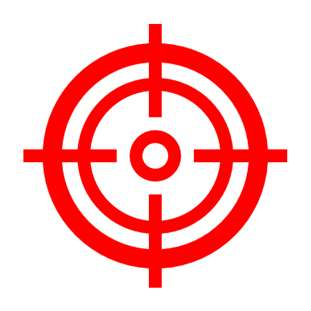
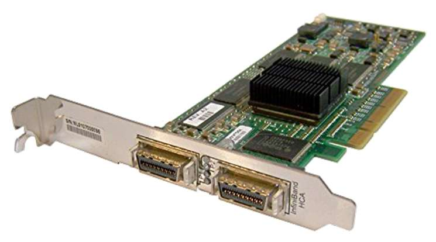

# Teil 02

<!-- source-page: 1 -->

## High-Performance Computing
(CDS-110)

Prof. Dr. rer. nat. habil. Ralf-Peter Mundani
DAViS


<figure>
  
</figure>


<!-- source-page: 2 -->

- overview

  - definitions
  - static topologies
  - dynamic topologies
  - examples

640k is enough for anyone,
and by the way, what’s a network?
—William Gates III,
chairman Microsoft Corp., 1984


<!-- source-page: 3 -->

## Course Goals
- upon successful completion of this course, you should be able to
  - appreciate and understand
    - basic evaluation concepts of network topologies
    - different types of network topologies
  - develop an ability to evaluate and name pros/cons of various static and
dynamic network topologies


<figure>
  
</figure>


<!-- source-page: 4 -->

## Definitions
- reminder: protocols

3-component model               ISO/OSI model                   internet protocols (examples)

application     7              application layer                  data transfer, email

6             presentation layer

5                session layer
communication
system          4               transport layer                   TCP, UDP

3                network layer                    IP, ICMP, IGMP
logical link control     network adaptation
2   data link layer
medium access control
network
1                physical layer


<!-- source-page: 5 -->

## Definitions
- degree (node degree)
  - number of connections (incoming and outgoing) between this node and
other nodes
  - degree of a network := max. degree of all nodes in the network
  - higher degrees lead to
    - more parallelism and bandwidth for the communication
    - more costs (due to a higher amount of connections)

  - objective: keep degree and, thus, costs small

degree = 3

degree = 4


<!-- source-page: 6 -->

## Definitions
- diameter
  - distance of a pair of nodes (length of the shortest path between a pair of
nodes), i.e. the number of nodes a message has to pass on its way from
the sender to the receiver
  - diameter of a network := max. distance of all pair of nodes in the network
  - higher diameters (between two nodes) lead to
    - longer communications
    - less fault tolerance (due to the higher amount of nodes that have to
work properly)

  - objective: small diameter

diameter = 4


<!-- source-page: 7 -->

## Definitions
- connectivity
  - min. number of edges (cables) that have to be removed to disconnect the
network, i.e. the network falls apart into two loose sub-networks
  - higher connectivity leads to
    - more independent paths between two nodes
    - better fault tolerance (due to more routing possibilities)
    - faster communication (due to the avoidance of congestions in the
network)

  - objective: high connectivity

connectivity = 2


<!-- source-page: 8 -->

## Definitions
- bisection width
  - min. number of edges (cables) that have to be removed to separate the
network into two equal parts (bisection width != connectivity, see below)
  - important for determining the number of messages that can be
transmitted in parallel between one half of the nodes to the other half
without the repeated usage of any connection
  - extreme case: Ethernet with bisection width = 1
  - objective: high bisection width (ideal: number of nodes/2)

bisection width = 4
(connectivity = 3)


<!-- source-page: 9 -->

## Definitions
- blocking
  - a desired connection between two nodes cannot be established due to
already existing connections between other pairs of nodes
  - objective: non-blocking networks

- fault tolerance (redundancy)
  - connections between (arbitrary) nodes can still be established even under
the breakdown of single components
  - a fault-tolerant network has to provide at least one redundant path
between all arbitrary pairs of nodes
  - graceful degradation: the ability of a system to stay functional (maybe with
less performance) even under the breakdown of single components


<!-- source-page: 10 -->

## Definitions
- bandwidth
  - max. transmission performance of a network for a certain amount of time
  - bandwidth B in general measured as megabits or megabytes per second
(Mbps or MBps, resp.), nowadays more often as gigabits or gigabytes per
second (Gbps or GBps, resp.)

- bisection bandwidth
  - max. transmission performance of a network over the bisection line, i.e.
sum of single bandwidths from all edges (cables) that are “cut” when
bisecting the network
  - thus bisection bandwidth is a measure of bottleneck bandwidth
  - units are same as for bandwidth


<!-- source-page: 11 -->

## Definitions
- latency
  - definition: delay time of a communication (time
between sending and receiving head of message)

source: cbs.lbl.gov
  - latency L measured in (milli/micro) seconds

“Arithmetic is cheap, latency is physics,
and bandwidth is money.” (K. Yelick)
- transmission time
  - time for transmitting an entire message between two nodes
  - transmission time depends on message size S
  - without conflicts, transmission time can be computed as
  - sometimes this is also referred to as delay


<figure>
  
</figure>


<!-- source-page: 12 -->

## Definitions
- throughput
  - bandwidth ≡ throughput (SMAX)
  - typically, the (theoretical) bandwidth is not achieved with common (i.e.
smaller) message sizes
  - throughput: ratio between message size and delay =>

  - throughput interesting for determination of half-power-point
    - i.e. message size SH for which half of the bandwidth can be achieved
    - example: L = 10 μs, B = 10 MBps

    - a lower half-power-point means a higher percentage of small(er)
messages that can take advantage of a network’s bandwidth


<figure>
  
</figure>


<!-- source-page: 13 -->

## Definitions
- static networks
  - fixed connections between pairs of nodes
  - control functions are done by the nodes or by special connection
hardware

- dynamic networks
  - no fixed connections between pairs of nodes
  - all nodes are connected via inputs and outputs to a so-called switching
component
  - control functions are concentrated in the switching component
  - various routes can be switched


<!-- source-page: 14 -->

- overview

  - definitions ✓
  - static topologies
  - dynamic topologies
  - examples


<!-- source-page: 15 -->

## Static Topologies
- chain (linear array)
  - one-dimensional network
  - N nodes and N-1 edges
  - degree = 2
  - diameter = N-1
  - bisection width = 1
  - drawback: too slow for large N


<!-- source-page: 16 -->

## Static Topologies
- ring
  - two-dimensional network
  - N nodes and N edges
  - degree = 2
  - diameter = ⌊N/2⌋
  - bisection width = 2
  - drawback: too slow for large N


<!-- source-page: 17 -->

## Static Topologies
- chordal ring
  - two-dimensional network
  - N nodes and 3N/2, 4N/2, 5N/2, ... edges
  - degree = 3, 4, 5, …
  - higher degrees lead to
    - smaller diameters
    - higher fault tolerance (due to redundant connections)
    - drawback: higher costs

left: chordal ring of degree = 3
right: chordal ring of degree = 4


<!-- source-page: 18 -->

## Static Topologies
- barrel shifter (special case of rings)
  - two-dimensional network
  - N = 2k nodes and 2k-1(2k-1) edges
  - degree = 2k-1
  - diameter = ⌈k/2⌉
  - each node connects to all nodes with distance d = 2i, i ∈ [0, k-1]
  - simple routing possible (=> address shifting)
0         1

7                    2

6                   3

5        4


<!-- source-page: 19 -->

## Static Topologies
- barrel shifter (cont’d)
  - spatial unfolding provides a shifter with k levels
  - example: k = 3
level 1

0       1     2     3       4   5   6   7

0      1              level 2

7                2
0       1     2     3       4   5   6   7

6               3

5     4              level 3

0       1     2     3       4   5   6   7


<!-- source-page: 20 -->

## Static Topologies
- completely connected
  - two-dimensional network
  - N nodes and N·(N-1)/2 edges
  - degree = N-1
  - diameter = 1
  - bisection width = ⌊N/2⌋·⌈N/2⌉
  - very high fault tolerance
  - drawback: too expensive for large N


<!-- source-page: 21 -->

## Static Topologies
- star
  - two-dimensional network
  - N nodes and N-1 edges
  - degree = N-1
  - diameter = 2
  - bisection width = ⌊N/2⌋
  - drawback: bottleneck in central node


<!-- source-page: 22 -->

## Static Topologies
- binary tree
  - two-dimensional network
  - N nodes and N-1 edges (tree height h = ⌊ld N⌋ )
  - degree = 3
  - diameter = 2h
  - bisection width = 1
  - drawback: bottleneck in direction of root (=> blocking)


<!-- source-page: 23 -->

## Static Topologies
- binary tree (cont’d)
  - addressing
    - label on level m consists of m bits; root has label ‘1’
    - suffix ‘0’ is added to left son, suffix ‘1’ is added to right son

  - routing
    - find common parent node P of nodes S and D
    - ascend from S -> P
    - descend from P -> D
1

10                              P 11

100           101           110           111

S             D
1000    1001 1010     1011 1100     1101 1110     1111


<!-- source-page: 24 -->

## Static Topologies
- binary tree (cont’d)
  - solution to overcome the bottleneck => fat tree
  - edges on level m get higher priority than edges on level m+1
  - capacity is doubled on each higher level
  - now, bisection width = 2h-1
  - frequently used: HLRB II, e.g.


<!-- source-page: 25 -->

## Static Topologies
- mesh / torus
  - k-dimensional network
  - N nodes and k·(N-rk-1) edges with r =
  - degree = 2k
  - diameter = k·(r-1)
  - bisection width = rk-1
  - high fault tolerance
  - drawback
    - large diameter
    - too expensive for k > 3

2D mesh


<!-- source-page: 26 -->

## Static Topologies
- mesh / torus (cont’d)
  - k-dimensional network
  - N nodes and k·N edges with r =
  - diameter = k·⌊r/2⌋
  - bisection width = 2rk-1
  - frequently used: BlueGene/L, e.g.
  - drawback: too expensive for k > 3

2D torus


<!-- source-page: 27 -->

## Static Topologies
- ILLIAC mesh
  - two-dimensional network
  - N nodes and 2N edges with r =
  - degree = 4
  - diameter = r-1
  - bisection width = 2r
  - conforms to a chordal ring of degree = 4

spatial unfolding
=>


<!-- source-page: 28 -->

## Static Topologies
- hypercube
  - k-dimensional network
  - 2k nodes and k·2k-1 edges
  - degree = k
  - diameter = k
  - bisection width = 2k-1
  - drawback: scalability (only doubling of nodes allowed)

4D hypercube


<!-- source-page: 29 -->

## Static Topologies
- hypercube (cont’d)
  - principle design
    - construction of a k-dimensional hypercube via connection of the
corresponding nodes of two k-1-dimensional hypercubes
    - inherent labelling via adding prefix ‘0’ to one sub-cube and prefix ‘1’ to
the other sub-cube
100                110
010
0            00               10     000

101
111

1            01               11     001                011

0D              1D                2D                          3D


<!-- source-page: 30 -->

## Static Topologies
- hypercube (cont’d)
  - nodes are directly connected for a HAMMING distance of 1 only
  - routing
    - compute S ⊗ D (XOR) for possible ways between nodes S and D
    - route in increasing / decreasing order until final destination is reached

  - example
    - S = ‘011’, D = ‘110’
    - S ⊗ D = ‘101’
100             D 110
    - decreasing: ‘011’ -> ‘010’ -> ‘110’
010
    - increasing: ‘011’ -> ‘111’ -> ‘110’           000

101
111

001               S 011


<!-- source-page: 31 -->

- overview

  - definitions ✓
  - static topologies ✓
  - dynamic topologies
  - examples


<!-- source-page: 32 -->

## Dynamic Topologies
- bus
  - simple and cheap single stage network
  - shared usage from all connected nodes, thus, just one frame transfer at
any point in time
  - frame transfer in one step (i.e. diameter = 1)
  - good extensibility, but bad scalability
  - example: CSMA/CD

send                    sender          receiver

receive

listen


<!-- source-page: 33 -->

## Dynamic Topologies
- crossbar
  - completely connected network with all possible permutations of N inputs
and N outputs (in general NxM inputs / outputs)
  - switch elements allow simultaneous communication between all possible
disjoint pairs of inputs and outputs without blocking
  - very fast (diameter = 1), but expensive due to N2 switch elements
  - used for processor—processor and processor—memory coupling
  - example: The Earth Simulator

1

2
input
3
switch element                                            output
1     2     3


<!-- source-page: 34 -->

## Dynamic Topologies
- permutation networks
  - tradeoff between low performance of buses and high costs of crossbars
  - based on 2x2 switch elements with four switching possibilities
    - straight
    - crossed
    - upper / lower broadcast

straight           crossed              upper               lower
broadcast           broadcast

  - switching N inputs to N outputs => permutation of inputs (to outputs)
    - single stage: one column with N/2 of 2x2 switch elements
    - multistage: several of those columns


<!-- source-page: 35 -->

## Dynamic Topologies
- permutation networks (cont’d)
  - permutations: unique (bijective) mapping of inputs to outputs
  - addressing
    - label inputs from 0 to 2N-1 (in case of N switch elements)
    - write labels in binary representation (aK, aK-1, ..., a2, a1)

  - permutations can now be expressed as simple bit manipulation
  - typical permutations
    - perfect shuffle         000                      000
    - butterfly               001                      001

    - exchange                010                      010

?
011                     011

100                     100
101                     101

110                     110
111                     111


<!-- source-page: 36 -->

## Dynamic Topologies
- permutation networks (cont’d)
  - perfect shuffle permutation
    - cyclic left shift
    - P(aK, aK-1, ..., a2, a1) -> (aK-1, ..., a2, a1, aK)

a3 a2 a1                         a2 a1 a3
0 0 0                            0 0 0       000   000
0 0 1                            0 0 1       001   001
0 1 0                            0 1 0       010   010
0 1 1                            0 1 1       011   011
1 0 0                            1 0 0       100   100
1 0 1                            1 0 1       101   101
1 1 0                            1 1 0       110   110
1 1 1                            1 1 1       111   111


<!-- source-page: 37 -->

## Dynamic Topologies
- permutation networks (cont’d)
  - butterfly permutation
    - exchange of first / highest and last / lowest bit
    - B(aK, aK-1, ..., a2, a1) -> (a1, aK-1, ..., a2, aK)

a3 a2 a1                         a1 a2 a3
0 0 0                            0 0 0       000      000
0 0 1                            0 0 1       001      001
0 1 0                            0 1 0       010      010
0 1 1                            0 1 1       011      011
1 0 0                            1 0 0       100      100
1 0 1                            1 0 1       101      101
1 1 0                            1 1 0       110      110
1 1 1                            1 1 1       111      111


<!-- source-page: 38 -->

## Dynamic Topologies
- permutation networks (cont’d)
  - exchange permutation
    - negation of last / lowest bit
    - E(aK, aK-1, ..., a2, a1) -> (aK, aK-1, ..., a2, a1)

a3 a2 a1                         a3 a2 a1
0 0 0                            0 0 0       000   000
0 0 1                            0 0 1       001   001
0 1 0                            0 1 0       010   010
0 1 1                            0 1 1       011   011

1 0 0                            1 0 0       100   100
1 0 1                            1 0 1       101   101

1 1 0                            1 1 0       110   110
1 1 1                            1 1 1       111   111


<!-- source-page: 39 -->

## Dynamic Topologies
- permutation networks (cont’d)
  - example: perfect shuffle connection pattern
  - problem: not all destinations are accessible from a source

0            0           0           0                0

1            1           1           1                1

2            2           2           2                2

3            3           3           3                3

4            4           4           4                4

5            5           5           5                5

6            6           6           6                6

7            7           7           7                7


<!-- source-page: 40 -->

## Dynamic Topologies
- permutation networks (cont’d)
  - adding additional exchange permutations (=> shuffle-exchange)
  - all destinations are now accessible from any source
replaced by 2x2 switch element

0         0     0           0       0              0       0     0

1          1    1           1       1              1       1     1

2         2     2           2       2              2       2     2

3         3     3           3       3              3       3     3

4         4     4           4       4              4       4     4

5         5     5           5       5              5       5     5

6          6    6           6       6              6       6     6

7         7     7           7       7              7       7     7


<!-- source-page: 41 -->

## Dynamic Topologies
- omega
  - based on the shuffle-exchange connection pattern
  - exchange permutations replaced by 2x2 switch elements

0                                 0

1                                 1

2                                 2

3                                 3

4                                 4

5                                 5

6                                 6

7                                 7


<!-- source-page: 42 -->

## Dynamic Topologies
- omega (cont’d)
  - multistage network (for N nodes => ld N stages)
  - N nodes and E = N/2*(ld N) switch elements
  - N! permutations possible, but only 2E (< N!) different switch states
  - (self configuring) routing
    - compare addresses from S and D bitwise from left to right
=> stage i evaluates address bits si and di
    - if equal switch straight (-), otherwise switch crossed (x)

  - example
    - S = ‘001’, D = ‘010’             001
010
    - switch states: - x x


<!-- source-page: 43 -->

## Dynamic Topologies
- omega (cont’d)
  - problem: there exists exactly one route from each input to each output
=> risk of blocking
  - example: simultaneous connections 1 -> 0 and 5 -> 3

    - 1 -> 0: S = ‘001’, D = ‘000’                                         0
=> switch states: - - x
1

    - 5 -> 3: S = ‘101’, D = ‘011’
=> switch states: x x -
3

    - conflicting switch states
5


<!-- source-page: 44 -->

## Dynamic Topologies
- banyan / butterfly
  - idea: unrolling of a static hypercube
  - bitwise processing of address bits ai from left to right => dynamic
hypercube a.k.a. butterfly (known from FFT flow diagram)

000                                      000

001                                      001
100               110
010                                      010
010
000                            011                                      011
101                100                                      100
111
101                                      101
001               011
110                                      110

111                                      111


<!-- source-page: 45 -->

## Dynamic Topologies
- banyan / butterfly (cont’d)
  - replace crossed connections by 2x2 switch elements
  - introduced by GOKE and LIPOVSKI in 1973; blocking still possible

0                                    0

1                                    1

2                                    2

3                                    3

4                                    4

5                                    5

6                                    6
banyan tree
7                                    7


<figure>
  
</figure>


<!-- source-page: 46 -->

## Dynamic Topologies
- BENEŠ
  - multistage network
  - built via merging butterfly network with its copied mirror
  - N nodes and N*(ld N)-N/2 switch elements
  - N! permutations possible, all can be switched
  - key property: for any permutation of inputs to outputs there is a
contention-free routing


<!-- source-page: 47 -->

## Dynamic Topologies
- BENEŠ (cont’d)
  - example
    - S1 = 2, D1 = 3 and S2 = 3, D2 = 1 => blocking for butterfly

1

2

3                                 3


<!-- source-page: 48 -->

## Dynamic Topologies
- BENEŠ (cont’d)
  - example
    - S1 = 2, D1 = 3 and S2 = 3, D2 = 1 => no blocking for BENEŠ

1

2

3                                                       3

one possibility of routing


<!-- source-page: 49 -->

## Dynamic Topologies
- CLOS
  - proposed by CLOS in 1953 for telephone switching systems
  - objective: to overcome the costs of crossbars (N2 switch elements)
  - idea
    - replace the entire crossbar with three stages of smaller ones
      - ingress stage: R crossbars with NxM inputs / outputs
      - middle stage: M crossbars with RxR inputs / outputs
      - egress stage: R crossbars with MxN inputs / outputs

    - thus much fewer switch elements than for the entire system

  - any incoming frame is routed from the input via one of the middle stage
crossbars to the respective output
  - a middle stage crossbar is available if both links to the ingress and egress
stage are free


<!-- source-page: 50 -->

## Dynamic Topologies
- CLOS (cont’d)
  - R*N inputs can be assigned to R*N outputs

1          1           1          1     1       1
1                      1              1
n          m           r          r     m       n

1          1           1          1     1       1
2                      2              2
n          m           r          r     m       n

…                     …               …
1          1           1          1     1       1
r                     m               r
n          m           r          r     m       n


<!-- source-page: 51 -->

## Dynamic Topologies
- CLOS (cont’d)
  - relative values of M and N define the blocking characteristics
    - M >= N: rearrangeable non-blocking
      - a free input can always be connected to a free output
      - existing connections might be assigned to different middle stage
crossbars (rearrangement)

    - M >= 2N-1: strict-sense non-blocking
      - a free input can always be connected to a free output
      - no re-assignment necessary


<!-- source-page: 52 -->

## Dynamic Topologies
- reminder: bipartite graph
  - definition: a graph whose vertices can be divided into two disjoint sets U
and V such that every edge connects a vertex in U to one in V
  - that is, U and V are each independent sets

U                          V

division of vertices in U and V, i.e. there are no edges within U and V,
only between U and V


<!-- source-page: 53 -->

## Dynamic Topologies
- reminder: perfect matching
  - definition: perfect matching (a.k.a. 1-factor) is a matching that matches all
vertices of a graph, i.e. every vertex is incident to exactly one edge of the
matching

A                N urse
nurse      pilot     lawyer
Alice     ✓
B                P ilot
Bob                 ✓         ✓
Carol     ✓          ✓
C                L awyer

problem: perfect matching for bipartite graph to be found


<!-- source-page: 54 -->

## Dynamic Topologies
- CLOS (cont’d)
  - proof for M >= N via HALL’s “Marriage Theorem”

  - Let G = (VIN, VOUT, E) be a bipartite graph. A perfect matching for G is an
injective function f : VIN -> VOUT so that for every x ∈ VIN, there is an edge
in E whose endpoints are x and f(x). One would expect a perfect matching
to exist if G contains “enough” edges, i.e. if for every subset A ⊂ VIN the
image set δA ⊂ VOUT is sufficient large.

Theorem: G has a perfect matching if and only if for every subset A ⊂ VIN
the inequality | A | <= | δA | holds.

  - often explained as follows: Imagine two groups of N men and N women.
```pseudo
If any subset S of boys (where 0 <= S <= N) knows S or more girls, each boy
```
can be married with a girl he knows.


<!-- source-page: 55 -->

## Dynamic Topologies
- CLOS (cont’d)
  - proof for M >= N via HALL’s “Marriage Theorem”

    - boy := ingress stage crossbar
    - girl := egress stage crossbar
    - a boy knows a girl if there exists a (direct) connection between them
    - assume there‘s one free input and one free output left

1) for 0 <= S <= R boys there are S*N connections => at least S girls
2) thus, HALL’s theorem states there exists a perfect matching
3) R connections can be handled by one middle stage crossbar
4) bundle these connections and delete the middle stage crossbar
5) repeat from step 1) until M = 1
6) new connection can be handled


<!-- source-page: 56 -->

## Dynamic Topologies
- CLOS (cont’d)
  - proof for M >= N via HALL’s “Marriage Theorem”
  - example: M = N = 2

initial situation: two     bundle connections to one   repeat steps until M = 1,
connections cannot be      middle stage crossbar and   then all connections should
established                delete it afterwards =>      be possible
maybe rearrangements are
necessary


<!-- source-page: 57 -->

## Dynamic Topologies
- CLOS (cont’d)
  - proof for M >= 2N-1 via worst case scenario
    - crossbar with N-1 inputs and crossbar with N-1 outputs, all
connected to different middle stage crossbars
    - one further connection

1
1
...
n-1                             n-1
n
1
n
n-1
...
n
2n-2

2n-1


<!-- source-page: 58 -->

## Dynamic Topologies
- constant bisection bandwidth
  - more general concept of CLOS and fat tree networks
  - construction of a non-blocking network connecting M nodes
    - using multiple levels of basic NxN switch elements (M > N)
    - for any given level, the downstream bandwidth (to nodes) is identical
to the upstream bandwidth (from nodes)

  - key for non-blocking: always preserve identical bandwidth (upstream and
downstream) between any two levels

  - observation
    - two-stage CBB network connecting M nodes always needs 3M ports
=> each node needs two ports in first and one port in second stage


<!-- source-page: 59 -->

## Dynamic Topologies
- constant bisection bandwidth (cont’d)
  - example: two-stage CBB
    - connecting M = 16 nodes with 4x4 switch elements
    - hence, in total 3M = 48 ports (i.e. 6 switch elements) necessary
    - upstream bandwidth = downstream bandwidth

level 2

upstream BW
downstream BW

level 1

1 2 3 4       5 6 7 8        9 10 11 12    13 14 15 16


<!-- source-page: 60 -->

- overview

  - definitions ✓
  - static topologies ✓
  - dynamic topologies ✓
  - examples


<!-- source-page: 61 -->

## Examples
- Myrinet
  - developed by Myricom (1994) for clusters
source: colfaxdirect.com
  - particularly efficient due to
    - usage of onboard (NIC) processors for protocol offload and low-
latency, kernel-bypass operations (ParaStation, e.g.)
    - highly scalable, cut-through switching

  - switches
    - consist of 256-port CLOS network
    - based on 32-port crossbar switch chipset
    - can be configured to support as many as 8,192 hosts
    - according to Myricom: used in nearly 38% of Top 500 supercomputers
    - NICs up to 2000 USD per card and switches >300 USD per port


<figure>
  
</figure>


<!-- source-page: 62 -->

## Examples
- Myrinet (cont’d)
  - programming model

Application

low level
TCP           UDP                  message
passing

IP
mmap

Ethernet        Myrinet                            proprietary protocol
OS kernel                                                  (ParaStation, e.g.)

Myrinet GM API
Ethernet                         Myrinet


<!-- source-page: 63 -->

## Examples
- InfiniBand
  - unification of two competing efforts in 1999
    - Future I/O initiative (Compaq, IBM, HP)                    source: serversupply.com
    - Next-Generation I/O initiative (Dell, Intel, SUN et al.)

  - idea: introduction of a future I/O standard as successor for PCI
    - overcome the bottleneck of limited I/O bandwidth
    - connection of hosts (via host channel adapters (HCA)) and devices
(via target channel adapters (TCA)) to the I/O “fabric”

  - switched point-to-point bidirectional links
  - bonding of links for bandwidth improvements: 1x (up to 5Gbps),
4x (up to 20Gbps), 8x (up to 40Gbps), 12x (up to 60Gbps), …
  - nowadays only used for cluster connection


<figure>
  
</figure>


<!-- source-page: 64 -->

## Examples
- InfiniBand (cont’d)
  - particularly efficient (among others) due to
    - protocol offload and reduced CPU utilisation
    - Remote Direct Memory Access (RDMA), i.e. direct R/W access via HCA
to local/remote memory without CPU usage/interrupts

  - switching: constant bisection bandwidth

CPU
memory                   link
controller        HCA            Switch            HCA
...

CPU
memory                           TCA
node


<!-- source-page: 65 -->

- overview

  - definitions ✓
  - static topologies ✓
  - dynamic topologies ✓
  - examples ✓
