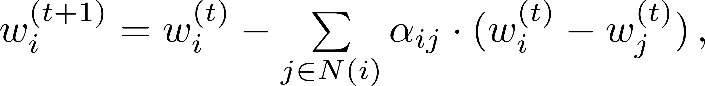
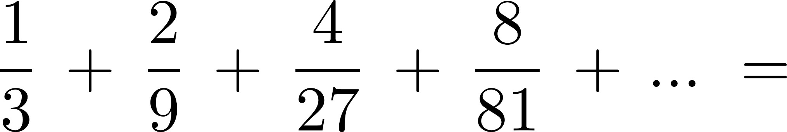

# Teil 03

<!-- source-page: 1 -->

## High-Performance Computing
(CDS-110)

Prof. Dr. rer. nat. habil. Ralf-Peter Mundani
DAViS


<figure>
  
</figure>


<!-- source-page: 2 -->

- overview

  - terms and definitions
  - process interaction on UMA / NUMA architectures
  - process interaction on NORMA architectures
  - putting everything together: an example
  - load balancing
  - state-of-art: space-filling curves

A distributed system is the one
that prevents you from working because of the failure
of a machine that you had never heard of.
—Leslie Lamport


<!-- source-page: 3 -->

## Course Goals
- upon successful completion of this course, you should be able to
  - appreciate and understand
    - principles of parallelisation strategies
    - basic synchronisation concepts
    - different process interaction techniques for various architectures
    - fundamentals of load balancing
  - develop an ability to apply synchronisation methods on parallel codes
  - express (mathematical) concepts of space-filling curves


<figure>
  
</figure>


<!-- source-page: 4 -->

## Terms and Definitions
- dependence analysis
  - sequential algorithms are characterised that way
    - all instructions U are processed in a certain sequence
    - this sequence is given due to the causal ordering of U, i.e. the causal
dependencies from another instructions’ result

  - hence, for set U a partial order <= can be declared
    - x <= y for x, y ∈ U
    - <= representing a reflexive, antisymmetric, transitive relation

  - example (a, b of type integer)
```pseudo
I1: a <- a - b
I2: b <- b + a        partial order: I1 <= I2 <= I3
I3: a <- b - a
```


<!-- source-page: 5 -->

## Terms and Definitions
- dependence analysis (cont’d)
  - (blocks of) instructions cannot be executed simultaneously if there exist
dependencies between them
  - hence, a dependence analysis of a given algorithm is necessary
  - example

```pseudo
for i <- 0 to N do                  for i <- 1 to N do
```

```pseudo
od
a[i] <- i + 1
x <- 2*i + 3
a[i] <- a[x]
```
?
```pseudo
od
```

  - as dependencies are not always obvious, an algorithmic / automated way
of recognising those (e.g. via the compiler) would preferable


<!-- source-page: 6 -->

## Terms and Definitions
- dependence analysis (cont’d)
  - BERNSTEIN (1966) established a set of conditions, sufficient for determining
whether two instructions can be executed in parallel
  - definitions
    - Ii (input): set of memory locations read by process Pi
    - Oi (output): set of memory locations written by process Pi
  - BERNSTEIN’s conditions
I1 ∩ O 2 = ∅       I2 ∩ O 1 = ∅        O1 ∩ O2 = ∅
  - example
```pseudo
I1: a <- x + y                          I2: b <- x + z
```
I1 = {x, y}, O1 = {a}, I2 = {x, z}, O2 = {b} => all conditions fulfilled


<!-- source-page: 7 -->

## Terms and Definitions
- dependence analysis (cont’d)
  - further example
```pseudo
I1: a <- x + y                          I2: b <- a + b
```
I1 = {x, y}, O1 = {a}, I2 = {a, b}, O2 = {b} => I2 ∩ O1 != ∅
  - BERNSTEIN’s conditions help to identify instruction-level parallelism or
coarser parallelism (e.g. loops)
  - hence, sometimes dependencies within loops can be solved
  - example: two loops with dependencies – which to be solved?
loop A:                              loop B:
```pseudo
for i <- 2 to 100 do                  for i <- 2 to 100 do
a[i] <- a[i-1] + 4                    a[i] <- a[i-2] + 4
od                                   od
```


<!-- source-page: 8 -->

## Terms and Definitions
- dependence analysis (cont’d)
  - expansion of loop B
```pseudo
a[2] <- a[0] + 4            a[3] <- a[1] + 4
a[4] <- a[2] + 4            a[5] <- a[3] + 4
a[6] <- a[4] + 4            a[7] <- a[5] + 4
```
  - hence, a[3] can only be computed after a[1], a[4] after a[2], ...
=> computation can be split into two independent loops
```pseudo
a[0] <- ...                            a[1] <- ...
for i <- 1 to 50 do                  for i <- 1 to 50 do
j <- 2*i                             j <- 2*i + 1
a[j] <- a[j-2] + 4                   a[j] <- a[j-2] + 4
od                                  od
```
  - many other techniques for recognising / creating parallelism exist (see also
part 5: Dependence Analysis)


<!-- source-page: 9 -->

## Terms and Definitions
- structures of parallel programs
  - typical parallelisation approaches

parallel program

function            data             competitive   ...
parallelism       parallelism         parallelism

macropipelining      ...        static     dynamic

commissioning            order
acceptance


<!-- source-page: 10 -->

## Terms and Definitions
- function parallelism
  - parallel execution (on different processors) of components such as
functions, procedures, or blocks of instructions (MIMD)
  - drawback
    - separate program for each processor necessary
    - limited degree of parallelism => limited scalability
  - macropipelining for data transfer between single components
    - overlapping parallelism similar to pipelining in processors
    - one component (producer) hands its processed data to the next one
(consumer) => stream of results
    - components should be of same complexity (=> idle times)
    - data transfer can either be synchronous (all components communicate
simultaneously) or asynchronous (buffered)


<!-- source-page: 11 -->

## Terms and Definitions
- data parallelism
  - parallel execution of same instructions (functions or even programs) on
different parts of the data (SIMD)
  - advantages
    - only one program for all processors necessary
    - in most cases ideal scalability
  - drawback: often communication between processors necessary
  - structuring of data parallel programs
    - static: compiler decides about parallel and sequential processing of
concurrent parts
    - dynamic: decision about parallel processing at run time, i.e. dynamic
structure allows for load balancing (at the expenses of organisation /
synchronisation overhead)


<!-- source-page: 12 -->

## Terms and Definitions
- data parallelism (cont’d)
  - dynamic structuring
    - commissioning (master-slave)
      - one master process assigns data to slave processes
      - both master and slave program necessary
      - master becomes potential bottleneck in case of too much slaves
(=> hierarchical organisation)
    - order polling (bag-of-tasks)
      - processes pick next part of available data ‘from a bag’ as soon as
they have finished their computations
      - mostly suitable for UMA / NUMA architectures as bag has to be
accessible from all processes (=> communication overhead for
NORMA architectures)


<!-- source-page: 13 -->

## Terms and Definitions
- competitive parallelism
  - parallel execution of different processes (based on different algorithms or
strategies) all solving the same problem
  - advantages
    - as soon as first process found the solution, computations of all
subsequent processes are allowed to stop
    - on average, superlinear speed-up possible
  - drawback
    - lots of different programs necessary
  - examples
    - sorting algorithms
    - theorem proving within computational semantics


<!-- source-page: 14 -->

## Terms and Definitions
- parallel programming languages
  - explicit parallelism
    - extension of sequential languages (e.g. C, Fortran, Python) by
additional parallel language constructs
    - implementation via procedure calls from respective libraries
    - example: MPI, PVM, Linda

    - sometimes parallel programming interface plus additional tools such
as compiler, libraries, debugger, profiler, ... -> most environments
come along with a parallel computer
    - example: MPICH


<!-- source-page: 15 -->

## Terms and Definitions
- parallel programming languages (cont’d)
  - implicit parallelism
    - mapping of programs (written in a sequential language) to the parallel
computer via compiler directives
    - primarily for the parallelisation of loops
    - only minor modifications of source code necessary
    - level of parallelism
      - block level for parallelising compilers (=> threads)
      - instruction / sub-instruction level for vectorising compilers
    - example: OpenMP (parallelising), Intel compiler (vectorising)


<!-- source-page: 16 -->

- overview

  - terms and definitions ✓
  - process interaction on UMA / NUMA architectures
  - process interaction on NORMA architectures
  - putting everything together: an example
  - load balancing
  - state-of-art: space-filling curves


<!-- source-page: 17 -->

Process Interaction on UMA / NUMA Architectures
- motivation
  - problem: ATM race condition with two withdraw threads

thread 1                 thread 2                 balance

(withdraw $50)           (withdraw $50)
read balance: $125                                $ 125
time                              read balance: $125       $ 125
set balance: $(125-50)   $ 75
set balance: $(125-50)                            $ 75
give out cash: $50                                $ 75
give out cash: $50       $ 75


<!-- source-page: 18 -->

Process Interaction on UMA / NUMA Architectures
- principles
  - processes depend from each other if they have to be executed in a certain
order; this can have two reasons
    - cooperation: processes execute parts of a common task
      - producer / consumer: one process generates data to be processed
by another one
      - client / server: same as above, but second process also returns
some data (e.g. result of a computation)
      - ...
    - competition: activities of one process hinder other processes
  - synchronisation: management of cooperation / competition of processes
=> ordering of processes’ activities
  - realised via shared variables with read / write access


<!-- source-page: 19 -->

Process Interaction on UMA / NUMA Architectures
- synchronisation
  - two types of synchronisation can be distinguished
    - unilateral: if activity A2 depends on the results of activity A1 then A1
has to be executed before A2 (i.e. A2 has to wait until A1 finishes);
synchronisation does not affect A1
    - multilateral: order of execution of A1 and A2 does not matter, but A1
and A2 are not allowed to be executed in parallel (e.g. due to write /
write or read / write conflicts)
  - activities affected by multilateral synchronisation are mutual exclusive,
i.e. they cannot be executed in parallel and act to each other atomically
(no activity can interrupt another one)
  - instructions requiring mutual exclusion are called critical sections
  - synchronisation might lead to deadlocks (mutual blocking) or lockout
(‘starvation’) of processes, i.e. indefinable long delays


<!-- source-page: 20 -->

Process Interaction on UMA / NUMA Architectures
- synchronisation (cont’d)
  - necessary and sufficient constraints for deadlocks
    - resources are only exclusively useable
    - resources cannot be withdrawn from a process
    - processes do not release assigned resources while waiting for the
allocation of other resources
    - there exists a cyclic chain of processes that use at least one resource
needed by the next processes within the chain

A                              resource requested
by process
P1                               P2
resource allocated
B                              by process


<!-- source-page: 21 -->

Process Interaction on UMA / NUMA Architectures
- synchronisation (cont’d)
  - possibilities to handle deadlocks
    - deadlock detection
      - techniques to detect deadlocks (e.g. identification of cycles in
waiting graphs) and measures to eliminate them (e.g. rollback)
    - deadlock avoidance
      - by rules: paying attention that at least one of the four constraints
```pseudo
for deadlocks is not fulfilled
```
      - by requirements analysis: analysing future resource allocations of
processes and forbidding states that could lead to deadlocks (e.g.
HABERMANN’s / banker’s algorithm well known from OS)


<!-- source-page: 22 -->

Process Interaction on UMA / NUMA Architectures
- methods of synchronisation
  - lock variable / mutex
  - semaphore
  - monitor
  - barrier


<!-- source-page: 23 -->

Process Interaction on UMA / NUMA Architectures
- lock variable / mutex
  - used to control the access to critical sections
  - when entering a critical section a process
    - has to wait until the respective lock is open
    - enters and closes the lock, thus no other process can follow
    - opens the lock and leaves when finished
    - lock / unlock have to be executed from the same process
  - lock variables are abstract data types consisting of
    - a boolean variable of type mutex
    - at least two functions lock and unlock
    - further functions (Pthreads): init, destroy, trylock, ...
  - function lock consists of two operations ‘test’ and ‘set’ which together
```pseudo
form a non interruptible (i.e. atomic) activity
```


<!-- source-page: 24 -->

Process Interaction on UMA / NUMA Architectures
- semaphore
  - abstract data type consisting of
    - nonnegative variable of type integer (semaphore counter)
    - two atomic operations P (‘passeeren’) and V (‘vrijgeven’)
  - after initialisation of semaphore S the counter can only be manipulated
with the operations P(S) and V(S)
    - P(S): if S > 0 then S <- S - 1
```pseudo
else the processes executing P(S) will be suspended
```
    - V(S): S <- S + 1
  - after V-operation any suspended process is reactivated (busy waiting);
alternatives: always next process in queue
  - binary semaphore: has only values ‘0’ and ‘1’ (similar to lock variable, but
P and V can be executed by different processes)
  - general semaphore: has any nonnegative number


<!-- source-page: 25 -->

Process Interaction on UMA / NUMA Architectures
- semaphore (cont’d)
  - example: mutual exclusion

```pseudo
(binary) semaphore s <- 1
int counter <- 0
```

```pseudo
begin procedure proc1( )                    begin procedure proc2( )
while (true) do                             while (true) do
P(s)                                        P(s)
```
counter++                                      counter++
```pseudo
V(s)                                        V(s)
od                                          od
end                                         end
```

```pseudo
procedures proc1( ) and proc2( ) to be executed in parallel
```


<!-- source-page: 26 -->

Process Interaction on UMA / NUMA Architectures
- semaphore (cont’d)
  - example: consumer-producer-problem (i.e. semaphore indicates
difference between produced and consumed elements)
  - assumption: unlimited buffer, atomic operations store and remove

```pseudo
(general) semaphore s <- 0
```

```pseudo
begin procedure producer( )                 begin procedure consumer( )
while (true) do                             while (true) do
```
produce X                                   P(s)
store X                                     remove X
```pseudo
V(s)                                        consume X
od                                          od
end                                         end
procedures producer( ) and consumer( ) to be executed in parallel
```


<!-- source-page: 27 -->

Process Interaction on UMA / NUMA Architectures
- monitor
  - semaphores solve synchronisation on a very low level => already one
wrong semaphore operation might cause breakdown of the entire system
  - better: synchronisation on a higher level with monitors
    - abstract data type with implicit synchronisation mechanism, i.e.
implementation details (such as access to shared data or mutual
exclusion) are hidden from the user
    - all access operations are mutual exclusive, thus all resources
(controlled by the monitor) are only exclusively useable
  - monitors consist of
    - several monitor variables and monitor procedures
    - a monitor body (instructions executed after program start for
initialisation of the monitor variables)


<!-- source-page: 28 -->

Process Interaction on UMA / NUMA Architectures
- monitor (cont’d)
  - only access to monitor-bound variables via monitor procedures, direct
access from outside the monitor is not possible
  - only one process can enter a monitor at each point in time, all others are
suspended and have to wait outside the monitor
  - synchronisation via condition variables (based on mutex)
    - wait(c): calling process is blocked and appended to an internal queue
of processes also blocked due to condition c
    - signal(c): if queue for condition c is not empty, the process at the
queue’s head is reactivated (and also preferred to processes waiting
outside for entering the monitor)
  - condition variables are only accessible via operations wait and signal (=>
no manipulation from outside)


<!-- source-page: 29 -->

Process Interaction on UMA / NUMA Architectures
- monitor (cont’d)
  - consumer-producer-problem with limited (circular) buffer

define monitor
buffer:
integer: n, in, out, buffer[size]
condition: notempty, notfull                                 n=7
out = 3                in = 10
```pseudo
end
```

```pseudo
begin procedure remove(X)                   begin procedure store(X)
if n = 0 then wait(notempty) fi             if n = size then wait(notfull) fi
X <- buffer[out]; out <- out + 1              buffer[in] <- X; in <- in + 1
if out = size then out <- 0 fi               if in = size then in <- 0 fi
n<-n-1                                       n<-n+1
```
signal(notfull)                             signal(notempty)
```pseudo
end                                         end
```


<!-- source-page: 30 -->

Process Interaction on UMA / NUMA Architectures
- monitor (cont’d)
  - consumer-producer-problem with limited (circular) buffer
  - once remove( ) and store( ) have been implemented to be used w/o risk

```pseudo
begin procedure monitor_init( )
n <- 0; in <- 0; out <- 0
end
```

```pseudo
begin procedure producer( )                    begin procedure consumer( )
while (true) do                                while (true) do
```
produce X                                      remove(X)
store(X)                                       consume X
```pseudo
od                                             od
end                                            end
```

```pseudo
procedures producer( ) and consumer( ) to be executed in parallel
```


<!-- source-page: 31 -->

Process Interaction on UMA / NUMA Architectures
- barrier
  - synchronisation point for several processes, i.e. each process has to wait
until the last one also arrived
  - initialisation of counter C before usage with the number of processes that
should wait (init-barrier operation)
  - each process executes a wait-barrier operation
    - counter C is decremented by one
    - process is suspended if C > 0, otherwise all processes are reactivated
and the counter C is set back to the initial value
  - useful for setting all processes (after independent processing steps) into
the same state and for debugging purposes


<!-- source-page: 32 -->

Process Interaction on UMA / NUMA Architectures
- simple case study

“Program testing can be used to show the presence
of bugs, but never to show their absence.”
E.W. Dijkstra


<figure>
  
</figure>


<!-- source-page: 33 -->

Process Interaction on UMA / NUMA Architectures
- simple case study (cont’d)                                    boolean x <- 0
  - test case: reader-writer-problem                           begin procedure rw0( )
(according to S. Siegel, UD, USA)                            while (true) do
```pseudo
0:       x<-0
```
  - to be examined                                       1:       sync( )
pc0
    - deadlock: program will never deadlock            2:       if x = 0 then
3:          use_resource
    - mutual exclusion: resource is never
fi
used by both processes at same time                     od
    - liveness: resource will eventually be                 end
used by any process
```pseudo
begin procedure rw1( )
```
  - status variables                                            while (true) do
```pseudo
0:       x<-1
```
    - x, pc0, pc1
1:       sync( )
    - hence, 32 states possible (but 12 states   pc1
2:       if x = 1 then
not reachable)                                   3:          use_resource
fi
```pseudo
od
end
```


<!-- source-page: 34 -->

Process Interaction on UMA / NUMA Architectures
```pseudo
boolean x <- 0
```
legend                           deadlock?         begin procedure rw0( )
1st digit: x     011   111
```pseudo
while (true) do
```
2nd digit: pc0
```pseudo
mutual      0:       x<-0
```
3rd digit: pc1
022   122      exclusion?   1:       sync( )
2:       if x = 0 then
liveness?   3:          use_resource
020   102                            fi
```pseudo
od
end
```
032           030   103      123
```pseudo
begin procedure rw1( )
while (true) do
002           013   131      120          0:       x<-1
```
1:       sync( )
2:       if x = 1 then
000           012   121      100
3:          use_resource
fi
010   101                          od
```pseudo
end
```


<!-- source-page: 35 -->

Process Interaction on UMA / NUMA Architectures
```pseudo
boolean x <- 0
```
legend                                            begin procedure rw0( )
1st digit: x     011   111
```pseudo
while (true) do
```
2nd digit: pc0
```pseudo
0:       x<-0
```
3rd digit: pc1
022   122                  1:       sync( )
2:       if x = 0 then
3:          use_resource
020   102                           fi
```pseudo
od
end
```

```pseudo
begin procedure rw1( )
while (true) do
002                          120         0:       x<-1
```
1:       sync( )
2:       if x = 1 then
000           012   121      100
3:          use_resource
fi
010   101                         od
```pseudo
end
```


<!-- source-page: 36 -->

Process Interaction on UMA / NUMA Architectures
```pseudo
boolean x <- 0
```
legend                                            begin procedure rw0( )
1st digit: x     011   111
```pseudo
while (true) do
```
2nd digit: pc0
```pseudo
0:       x<-0
```
3rd digit: pc1
022   122                  1:       sync( )
2:       if x = 0 then
3:          use_resource
020   102                           fi
```pseudo
od
end
```

```pseudo
begin procedure rw1( )
while (true) do
0:       x<-1
```
1:       sync( )
2:       if x = 1 then
000           012   121
3:          use_resource
fi
010   101                         od
```pseudo
end
```


<!-- source-page: 37 -->

Process Interaction on UMA / NUMA Architectures
```pseudo
boolean x <- 0
```
legend                                            begin procedure rw0( )
1st digit: x     011   111
```pseudo
while (true) do
```
2nd digit: pc0
```pseudo
0:       x<-0
```
3rd digit: pc1
022   122                  1:       sync( )
2:       if x = 0 then
3:          use_resource
020   102                           fi
```pseudo
od
end
```

```pseudo
begin procedure rw1( )
while (true) do
0:       x<-1
```
1:       sync( )
2:       if x = 1 then
000           012   121
3:          use_resource
fi
010   101                         od
```pseudo
end
```


<!-- source-page: 38 -->

Process Interaction on UMA / NUMA Architectures
```pseudo
boolean x <- 0
```
legend                                            begin procedure rw0( )
1st digit: x     011   111
```pseudo
while (true) do
```
2nd digit: pc0
```pseudo
0:       x<-0
```
3rd digit: pc1
022   122                  1:       sync( )
2:       if x = 0 then
3:          use_resource
020   102                           fi
```pseudo
od
end
```

```pseudo
begin procedure rw1( )
while (true) do
0:       x<-1
```
1:       sync( )
2:       if x = 1 then
000            012   121
3:          use_resource
fi
010   101                         od
```pseudo
end
```


<!-- source-page: 39 -->

Process Interaction on UMA / NUMA Architectures
```pseudo
boolean x <- 0
```
legend                                            begin procedure rw0( )
1st digit: x     011   111
```pseudo
while (true) do
```
2nd digit: pc0
```pseudo
0:       x<-0
```
3rd digit: pc1
022   122                  1:       sync( )
2:       if x = 0 then
3:          use_resource
020   102                           fi
```pseudo
od
end
```

```pseudo
begin procedure rw1( )
while (true) do
0:       x<-1
```
1:       sync( )
2:       if x = 1 then
000            012   121
3:          use_resource
fi
010   101                         od
```pseudo
end
```


<!-- source-page: 40 -->

Process Interaction on UMA / NUMA Architectures
```pseudo
boolean x <- 0
```
legend                                            begin procedure rw0( )
1st digit: x     011   111
```pseudo
while (true) do
```
2nd digit: pc0
```pseudo
0:       x<-0
```
3rd digit: pc1
022   122                  1:       sync( )
2:       if x = 0 then
3:          use_resource
020   102                           fi
```pseudo
od
end
```

```pseudo
begin procedure rw1( )
while (true) do
0:       x<-1
```
1:       sync( )
2:       if x = 1 then
000            012   121
3:          use_resource
fi
010   101                         od
```pseudo
end
```


<!-- source-page: 41 -->

Process Interaction on UMA / NUMA Architectures
```pseudo
boolean x <- 0
```
legend                                            begin procedure rw0( )
1st digit: x     011   111
```pseudo
while (true) do
```
2nd digit: pc0
```pseudo
0:       x<-0
```
3rd digit: pc1
022   122                  1:       sync( )
2:       if x = 0 then
3:          use_resource
020   102                           fi
```pseudo
od
end
```

```pseudo
begin procedure rw1( )
while (true) do
0:       x<-1
```
1:       sync( )
2:       if x = 1 then
000            012   121
3:          use_resource
fi
010   101                         od
```pseudo
end
```


<!-- source-page: 42 -->

Process Interaction on UMA / NUMA Architectures
```pseudo
boolean x <- 0
```
legend                                            begin procedure rw0( )
1st digit: x     011   111
```pseudo
while (true) do
```
2nd digit: pc0
```pseudo
0:       x<-0
```
3rd digit: pc1
022   122                  1:       sync( )
2:       if x = 0 then
3:          use_resource
020   102                           fi
```pseudo
od
end
```

```pseudo
begin procedure rw1( )
while (true) do
0:       x<-1
```
1:       sync( )
2:       if x = 1 then
000            012   121
3:          use_resource
fi
010   101                         od
```pseudo
end
```


<!-- source-page: 43 -->

Process Interaction on UMA / NUMA Architectures
```pseudo
boolean x <- 0
```
legend                                            begin procedure rw0( )
1st digit: x     011   111
```pseudo
while (true) do
```
2nd digit: pc0
```pseudo
0:       x<-0
```
3rd digit: pc1
022   122                  1:       sync( )
2:       if x = 0 then
3:          use_resource
020   102                           fi
```pseudo
od
end
```

```pseudo
begin procedure rw1( )
while (true) do
0:       x<-1
```
1:       sync( )
2:       if x = 1 then
000            012   121
3:          use_resource
fi
010   101                         od
```pseudo
end
```


<!-- source-page: 44 -->

Process Interaction on UMA / NUMA Architectures
```pseudo
boolean x <- 0
```
legend                                            begin procedure rw0( )
1st digit: x     011   111
```pseudo
while (true) do
```
2nd digit: pc0
```pseudo
0:       x<-0
```
3rd digit: pc1
022   122                  1:       sync( )
2:       if x = 0 then
3:          use_resource
020   102                           fi
```pseudo
od
end
```

```pseudo
begin procedure rw1( )
while (true) do
0:       x<-1
```
1:       sync( )
2:       if x = 1 then
000            012   121
3:          use_resource
fi
010   101                         od
```pseudo
end
```


<!-- source-page: 45 -->

- overview

  - terms and definitions ✓
  - process interaction on UMA / NUMA architectures ✓
  - process interaction on NORMA architectures
  - putting everything together: an example
  - load balancing
  - state-of-art: space-filling curves


<!-- source-page: 46 -->

Process Interaction on NORMA Architectures
- message passing paradigm
  - no shared memory for synchronisation and communication
  - hence, transfer mechanism for information interchange necessary
  - message passing
    - messages: data units transferred between processes
    - send / receive operations instead of read / write operations
  - implicit (sequential) order during send-receive-stage
    - a message can only be received after a prior send
    - communication via message passing (independent from the
transferred data) leads to an implicit synchronisation
    - synchronisation due to availability / unavailability of messages
    - messages are resources that don’t exist before the send and in general
also after the receive operation


<!-- source-page: 47 -->

Process Interaction on NORMA Architectures
- messages
  - created whenever a process performs a send
  - necessary information to be provided from the sender
    - destination (e.g. process, node, communication channel)
    - unique message identifier (e.g. number)                   header
    - data type and number of elements to be transferred
    - memory (address) containing the data to be transferred    body

header                             body

message

  - data type and number of elements must match for the receiver, otherwise
a correct interpretation of data cannot be guaranteed


<!-- source-page: 48 -->

Process Interaction on NORMA Architectures
- sending/receiving messages
  - send operations can be
    - synchronous / asynchronous: sender is dependent on the availability of
the receiver (synchronous) or not (asynchronous)
    - buffered / unbuffered: sender may first copy the data into so-called
send buffer for later transfer (buffered) or directly perform the
transfer from memory to memory (unbuffered)
    - blocking / non-blocking: sender gets blocked until send operation
finishes (blocking) or is given immediate control to continue with
course of program (non-blocking)

  - receive operations can be
    - destructive / non-destructive: message is destroyed after receive
(destructive) or kept for later usage (non-destructive)
    - synchronous / asynchronous: receiver is dependent on the availability
of the sender (synchronous) or not (asynchronous)


<!-- source-page: 49 -->

- overview

  - terms and definitions ✓
  - process interaction on UMA / NUMA architectures ✓
  - process interaction on NORMA architectures ✓
  - putting everything together: an example
  - load balancing
  - state-of-art: space-filling curves


<!-- source-page: 50 -->

Putting Everything Together: An Example
- problem setup
  - given: map of some labyrinth that contains
    - one entrance
    - one exit
    - no cycles

source: viralmonster.net

  - task: determine if there exists a way from the entrance through the
labyrinth to the exit (not the way itself) => binary answer: yes | no


<figure>
  
</figure>


<!-- source-page: 51 -->

Putting Everything Together: An Example
- problem solution
  - sequential algorithm
```pseudo
position <- entrance
while (true) do
position <- walk ( )
```
switch (position) do
```pseudo
case ‘crossing’:   position <- turn_right ( )
case ‘dead end’: position <- turn_around ( )
```
case ‘exit’:       halt (‘exit found’)
case ‘entrance’: halt (‘error’)
```pseudo
od
od                                                 source: moviepilot.de
```


<figure>
  
</figure>


<figure>
  
</figure>


<!-- source-page: 52 -->

Putting Everything Together: An Example
- problem definition
  - labyrinth stored as graph G = (V, E)

entrance
exit


<!-- source-page: 53 -->

Putting Everything Together: An Example
- competitive parallelism
  - start N processes following N different algorithms
  - first process reaching exit or entrance tells other processes to stop
  - possible algorithms
    - always go left instead of going right
    - start from the exit and try to reach the entrance
    - randomly walk around and remember all paths that have already been
examined
    - ...
  - questions
    - shared or distributed memory
    - drawbacks


<!-- source-page: 54 -->

Putting Everything Together: An Example
- function parallelism
  - assumption: pool of processes [0, N-1]
  - start new processes at crossroads
  - terminate processes at dead ends
  - halt in case
    - one process reached the exit (=> success)
    - all processes terminated (=> error)
  - questions
    - shared or distributed memory
    - drawbacks


<!-- source-page: 55 -->

Putting Everything Together: An Example
- data parallelism
  - cut graph into N parts and distribute among processes
  - solve corresponding subproblems for all entrance-exit pairs
  - collect results, assemble ‘smaller’ problem, and repeat previous steps
  - simplified case
  - questions
    - shared or distributed memory
    - drawbacks
    - and what about MINSKY ☺


<figure>
  
</figure>


<!-- source-page: 56 -->

- overview

  - terms and definitions ✓
  - process interaction on UMA / NUMA architectures ✓
  - process interaction on NORMA architectures ✓
  - putting everything together: an example ✓
  - load balancing
  - state-of-art: space-filling curves


<!-- source-page: 57 -->

## Load Balancing
- motivation
  - central issue: fairly distribution of computations across all processors /
nodes in order to optimise
    - run time (user’s point of view)
    - system load (computing centre’s point of view)
  - problem
    - amount of work is often not known prior to execution
    - load situation changes permanently (adaptive mesh refinement within
numerical simulations, I/O, searches, ...)
    - different processor speeds (e.g. heterogeneous systems)
    - different latencies for communication (e.g. grid / cloud computing)
  - objective: simple, but efficient load balancing strategies


<!-- source-page: 58 -->

## Load Balancing
- static load balancing
  - to be applied before execution of any process (in contrast to dynamic load
balancing to be applied during execution)
  - usually referred to as mapping problem or scheduling problem
  - potential techniques
    - round robin: assigning tasks in sequential order to processes, coming
back to the first when all processes have been served
    - randomised: selecting processes at random to assign tasks
    - recursive bisection: recursive division into smaller tasks of equal
computational effort with less communication costs
    - genetic algorithm: finding an optimal distribution of tasks according to
a given objective function


<!-- source-page: 59 -->

## Load Balancing
- dynamic load balancing
  - division of tasks dependent upon execution of the program => entails
additional overhead (to be kept small, otherwise bureaucracy wins)
  - assignment of tasks to processes can be classified as
    - centralised
      - tasks are handed out from a centralised location
      - within a master-slave structure one dedicated master process is
responsible for assignment of tasks to slaves
    - decentralised
      - tasks are passed between arbitrary processes
      - worker processes operate upon the problem and interact among
themselves => a worker process may receive tasks from other or
may send tasks to others


<!-- source-page: 60 -->

## Load Balancing
- diffusion model (a.k.a first order scheme)
  - analogy to physical processes in nature (e.g. salt or ink in water)
  - original algorithm introduced by CYBENKO (1989) for static network
topologies, meanwhile it has been often studied and derived (e.g. second
order scheme, dynamic network topologies)
  - idea: a process Pi balances its load simultaneously with all its
neighbours N(i) => ratio αij of load difference between process Pi and Pj is
swapped between them according to

1 <= i <= p,   -1 < αij < 1

where wi(t) defines the workload done by process Pi at time t
  - various methods to be found that determine parameter αij such as
    - optimal choice: needs global knowledge of the network
    - BOILLAT choice: needs only local knowledge of the neighbours


<figure>
  
</figure>


<!-- source-page: 61 -->

## Load Balancing
- diffusion model (cont’d)
  - update of workload can be done
a) after all balancing factors have been computed (JACOBI-like)
b)during computation of balancing factors (GAUSS-SEIDEL-like)
    - example: first two iteration steps according to method a) for a 2D grid with
a ratio of α = 0.25 for workload swapping

80         0       0         0   40        20       0         0   30        15       5         0

0          0       0         0   20         0       0         0   15        10       0         0

0          0       0         0   0          0       0         0   5          0       0         0

0          0       0         0   0          0       0         0   0          0       0         0
initial setup (t = 0)            initial setup (t = 1)            initial setup (t = 2)


<!-- source-page: 62 -->

## Load Balancing
- bidding (economic model)
  - analogy to mechanisms of price fixing in markets
  - idea
    - process (with high workload) advertises tasks to its neighbours
    - neighbours submit their free resources as bid
    - process with highest bid (i.e. largest free resources) wins
  - remarks
    - maybe several rounds of bidding necessary => successively extending
the range of bidders
    - in case of sudden workload peaks, a process might reject the
purchased tasks
    - processes with free resources are still allowed to ask for tasks
  - drawback: quite complex analysis of this model


<!-- source-page: 63 -->

- overview

  - terms and definitions ✓
  - process interaction on UMA / NUMA architectures ✓
  - process interaction on NORMA architectures ✓
  - putting everything together: an example ✓
  - load balancing ✓
  - state-of-art: space-filling curves


<!-- source-page: 64 -->

```pseudo
State-of-art: Space-Filling Curves
```
- definition
  - origin of the idea: analysis and topology (‘topological monsters’)
  - nice example of a construct from pure mathematics that gets practical
relevance only decades later
  - definition of a space filling curve (SFC)
    - curve: image of a continuous mapping f : [0,1] -> [0,1]D
    - SFC: continuous, surjective mapping f : [0,1] -> [0,1]D that covers an
area (with a JORDAN content) greater than zero
  - prominent representatives
    - HILBERT’s SFC (1891): most famous SFC
    - PEANO’s SFC (1890): oldest SFC
    - LEBESGUE’s SFC: most important SFC for computer science
  - further reading: M. Bader, Space-Filling Curves, Springer (2012)


<!-- source-page: 65 -->

```pseudo
State-of-art: Space-Filling Curves
```
- HILBERT’s space filling curve
  - for reasons of simplicity only in 2D => f : I = [0,1] -> [0,1]2 = Q
  - construction of SFC follows the geometric conception

```pseudo
If I can be mapped onto Q in the space filling sense, then each of the four
```
congruent subintervals of I can be mapped to one of the four quadrants of
Q in the space filling sense, too.

  - recursive application of above preserves
    - neighbourhood relations: neighbouring subintervals in I are mapped
onto neighbouring subsquares of Q
    - subset relations (inclusion): from I1 ⊆ I2 follows f(I1) ⊆ f(I2)
  - border case: HILBERT’s SFC


<!-- source-page: 66 -->

```pseudo
State-of-art: Space-Filling Curves
```
- HILBERT’s space filling curve (cont’d)
  - generation process
1) starting with a generator or ‘Leitmotiv’ that defines the order in
which the subsquares are visited
2) recursively applying generator in each subsquare (with appropriate
similarity transformations if necessary)
3) connecting the open ends

generator for HILBERT’s SFC

  - of course, the iterative steps in this generation process are of practical
relevance, not the border case itself


<!-- source-page: 67 -->

```pseudo
State-of-art: Space-Filling Curves
```
- HILBERT’s space filling curve (cont’d)
  - classical version of HILBERT

6     7     10         11

2                3               8

5                9      12
3     14

1                4         4                      13

1     2     15         16

1     2    3     4         1-4   5-8   9-12     13-16   1-16   17-32   33-48   49-64


<!-- source-page: 68 -->

```pseudo
State-of-art: Space-Filling Curves
```
- HILBERT’s space filling curve (cont’d)
  - variant of MOORE

7     8        9              10

2               3                5        12
6                             11
14

1               4          3          4        13

2     1        16             15

1     2    3     4         1-4   5-8      9-12      13-16     1-16   17-32   33-48   49-64

  - modulo symmetry, these are the only two possibilities


<!-- source-page: 69 -->

```pseudo
State-of-art: Space-Filling Curves
```
- HILBERT’s space filling curve (cont’d)
  - all iterations are injective, but HILBERT’s SFC itself is not injective (there are
image points with more than one source point)

  - important precondition: there exists a bijective mapping between two
finite-dimensional smooth manifolds (CANTOR, 1878), but it cannot be both
bijective and continuous (NETTO, 1879)


<!-- source-page: 70 -->

```pseudo
State-of-art: Space-Filling Curves
```
- PEANO’s space filling curve
  - ancestor of all SFCs
  - subdivision of I and Q into nine congruent subdomains
  - definition of a generator, again, defines the order of visit

3        4       9

2        5       8

1        6       7


<!-- source-page: 71 -->

```pseudo
State-of-art: Space-Filling Curves
```
- PEANO’s space filling curve (cont’d)
  - there are (modulo symmetry) 273 different possibilities to recursively
apply the generator preserving neighbourhood and inclusion

meander type                serpentine type             serpentine type


<!-- source-page: 72 -->

```pseudo
State-of-art: Space-Filling Curves
```
- LEBESGUE’s space filling curve
  - definition of LEBESGUE’s SFC by the CANTOR set
  - CANTOR set C: repeatedly deleting the middle thirds of [0,1]

0                                                               1

...   ...   ...   ...              ...   ...    ...   ...

  - C is defined as set of points not excluded, hence the remaining interval can
be computed by the total length removed

  - the proportion of the remaining interval seems to be 1 - 1 = 0, but in fact
C has the same cardinality as the unit interval [0,1] (!)


<figure>
  
</figure>


<figure>
  
</figure>


<!-- source-page: 73 -->

```pseudo
State-of-art: Space-Filling Curves
```
- LEBESGUE’s space filling curve (cont’d)
  - nested intervals of C to be represented by ternary numbers of the form
03.w1w2w3... with wi ∈ {0, 1, 2}

03.0                 03.1                  03.2                  (13.0)

  - example: parameter T = 2/9

[03.0,0
.02,03.1]
3.1]
.0201]
.021]

  - since the middle third (indicated by ‘1’) is repeatedly deleted, the CANTOR
set only contains ternary numbers that consist of ‘0’ and ‘2’


<!-- source-page: 74 -->

```pseudo
State-of-art: Space-Filling Curves
```
- LEBESGUE’s space filling curve (cont’d)
  - when mapping C to [0,1]2 according to

03.w1w2w3w4...         02.x2x4...
f:                     ->
2               02.y1y3...
and connecting the image points via linear interpolation, this results to
LEBESGUE’s SFC also referred to as ‘Z-order’


<!-- source-page: 75 -->

```pseudo
State-of-art: Space-Filling Curves
```
- LEBESGUE’s space filling curve (cont’d)
  - Z-ordering is well-known from quadtrees / octrees when linearising a tree
by a depth-first traversal (=> lexicographic or MORTON index)
  - for load distribution inverse function f -1 : [0,1]D -> [0,1] necessary
  - bitwise interleaving of coordinate values (x, y) leads to Z-value

7   42 43 46 47 58 59 62 63
6   40 41 44 45 56 57 60 61
x = 6 -> 1102
5   34 35 38 39 50 51 54 55
y = 4 -> 1002                        4   32 33 36 37 48 49 52 53
3   10 11 14 15 26 27 30 31
1101002 -> 52 = Z                    2   8   9   12 13 24 25 28 29
1   2   3   6   7   18 19 22 23
=> simple conversion (x,y) ↔ Z
0   0   1   4   5   16 17 20 21
0   1   2   3   4   5   6   7


<!-- source-page: 76 -->

```pseudo
State-of-art: Space-Filling Curves
```
- applications
  - sequentialisation of multidimensional data to 1D while preserving locality
    - data are ‘stringed’ sequentially like pearls
    - neighbouring points in image space [0,1]D are neighbouring points in
unit interval [0,1]
  - important applications such as
    - efficient multidimensional range searches in databases (e.g. Oracle)
    - multi-particle or N-body problems
    - adaptive grid refinement for partial differential equations
    - dynamic load balancing


<!-- source-page: 77 -->

```pseudo
State-of-art: Space-Filling Curves
```
- load distribution / balancing
  - assign some iteration of SFC to points in nD-space
  - linearise data according to SFC
  - simple partitioning of data (preserving locality) to processors possible

A               F          G E    C H        I B   A   D    F

B
D       J
I

E                                                                       J
G E    C     H    I B       A   D        F
H
G                            P1             P2             P3
C

  - what to do in case of AMR or data (‘J’) newly inserted into image space?


<!-- source-page: 78 -->

- overview

  - terms and definitions ✓
  - process interaction on UMA / NUMA architectures ✓
  - process interaction on NORMA architectures ✓
  - putting everything together: an example ✓
  - load balancing ✓
  - state-of-art: space-filling curves ✓
