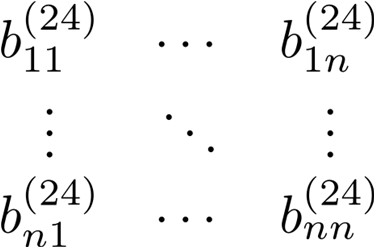
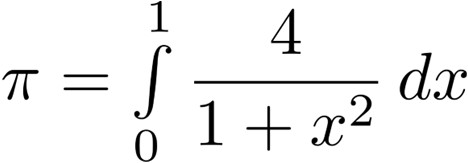

# Teil 04 (Update 23.04.26)

<!-- source-page: 1 -->

## High-Performance Computing
(CDS-110)

Prof. Dr. rer. nat. habil. Ralf-Peter Mundani
DAViS


<figure>
  
</figure>


<!-- source-page: 2 -->

- overview

  - message passing paradigm
  - collective communication
  - programming with MPI

At some point...
we must have faith in the intelligence of the end user.
—Anonymous


<!-- source-page: 3 -->

## Course Goals
- upon successful completion of this course, you should be able to
  - appreciate and understand
    - principles of message-coupled systems
    - different communication concepts
    - synchronisation pitfalls arising from message exchange
  - develop an ability to apply MPI in order to write parallel code


<figure>
  
</figure>


<!-- source-page: 4 -->

## Message Passing Paradigm
- message passing
  - very general principle, applicable to nearly all types of parallel
architectures (UMA, NUMA, and NORMA)
  - standard programming paradigm for supercomputers and clusters
  - typical (machine-independent) standards: MPI, PVM

- underlying principle
  - parallel program with P processes (with different address space)
  - communication takes place via exchange of messages
  - message exchange via library functions that are available for standard
languages such as C/C++ or Fortran and Python ☺


<!-- source-page: 5 -->

## Message Passing Paradigm
- user’s view
  - library functions are the only interface to communication system
  - message exchange via send and receive

process

process                                               process

A
send( )       communication system

process                 A

process                                             process

receive( )


<!-- source-page: 6 -->

## Message Passing Paradigm
- types of communication
  - point-to-point a.k.a. P2P (1:1-communication)
  - two processes involved: sender and receiver
  - way of sending interacts with execution of sub-program
    - synchronous: send is provided information about completion of
message transfer, i.e. communication does not complete until message
has been received
    - asynchronous: send only knows when message has left;
communication completes as soon as message is on its way
    - blocking: operations only finish when communication has completed
    - non-blocking: operations return straight away and allow program to
continue; at some later point in time program can test for completion


<!-- source-page: 7 -->

## Message Passing Paradigm
- types of communication (cont’d)
  - collective (1:M-communication, M <= P, P number of processes)
  - all (some) processes involved
  - types of collective communication
    - barrier: synchronises processes (no data exchange), i.e. each process is
blocked until all have called barrier routine
    - broadcast: one process sends same message to all (several)
destinations with a single operation
    - scatter / gather: one process provides data items to / takes
data items from all (several) processes
    - reduce: one process takes data items from all (several) processes and
reduces them to a single data item; typical reduce operations: sum,
product, minimum / maximum, ...


<!-- source-page: 8 -->

## Message Passing Paradigm
- order of transmission
  - problem: there is no global time in a distributed system
  - hence, wrong send-receive assignments may occur (in case of more than
two processes and the usage of wildcards)

1           2          3                1           2           3

send                                    send
to P3                                   to P3
send                              or    send
to P3                recv buf1          to P3
from any                                 recv buf1
from any

recv buf2                                recv buf2
from any                                 from any


<!-- source-page: 9 -->

- overview

  - message passing paradigm ✓
  - collective communication
  - programming with MPI


<!-- source-page: 10 -->

## Collective Communication
- broadcast
  - sends same message to all participating processes

A

A                                         A

A

A

sender   receiver


<!-- source-page: 11 -->

## Collective Communication
- scatter
  - data from one process are distributed among all processes

A

A   B   C   D                            B

C

D

sender   receiver


<!-- source-page: 12 -->

## Collective Communication
- gather
  - data from all processes are collected by a single process

A

B                                          A     B   C   D

C

D

sender            receiver


<!-- source-page: 13 -->

## Collective Communication
- gather-to-all
  - all processes collect distributed data from all others

A                                             A   B    C   D

B                                             A   B    C   D

C                                             A   B    C   D

D                                             A   B    C   D

sender           receiver


<!-- source-page: 14 -->

## Collective Communication
- all-to-all
  - data from all processes are distributed among all others
  - example: any ideas?

A   B   C   D                             A     E   I   M

E   F   G   H                             B     F   J   N

I   J   K   L                             C     G   K   O

M    N   O   P                             D     H   L   P

sender            receiver


<!-- source-page: 15 -->

## Collective Communication
- all-to-all (cont’d)
  - also referred to as total exchange
  - example: transposition of matrix A (stored row-wise in memory)
      - total exchange of blocks Bij
      - afterwards, each process computes transposition of its blocks

( B11    B12   B13   B14 )           ( B11    B21   B31   B41 )
|                        |           |                        |
| B21    B22   B23   B24 |
->      | B12    B22   B32   B42 |
A=|                                 A =|
T
B     B32   B33   B34 |              B     B23   B33   B43 |
|| 31                    ||          || 13                    ||
=> B41   B42   B43   B44 )            => B14   B24   B34   B44 )


<figure>
  
</figure>


<!-- source-page: 16 -->

## Collective Communication
- reduce
  - data from all processes are reduced to single data item(s)
  - example: global minimum / maximum / sum / product / ...

A

A
-
B                      B                 R
-
C
-
D
C

D

sender   receiver


<!-- source-page: 17 -->

## Collective Communication
- all-reduce
  - all processes are provided reduced data item(s)

A                                      R

A
-
B                      B               R
-
C
-
D
C                                      R

D                                       R

sender   receiver


<!-- source-page: 18 -->

## Collective Communication
- reduce-scatter
  - data from all processes are reduced and distributed

A    B   C   D                            R
```pseudo
(R <- A - E - I - M)
```
B
-
E   F   G   H          F                   S
-
J
-
N
I   J   K   L                            T
```pseudo
(T <- C - G - K - O)
```

M    N   O   P                            U
```pseudo
(U <- D - H - L - P)
```

sender            receiver


<!-- source-page: 19 -->

## Collective Communication
- parallel prefix
  - processes receive partial result of reduce operation
  - example: matrix multiplication in quantum chemistry

A                                         R
```pseudo
(R <- A)
```
A
-
B                      B                  S
-
```pseudo
C                (S <- A - B)
```
-
D
C                                         T
```pseudo
(T <- A - B - C)
```

D                                         U
```pseudo
(U <- A - B - C - D)
```

sender           receiver


<!-- source-page: 20 -->

## Collective Communication
- parallel prefix (cont’d)
  - problem: finding all (partial) results within O(log N) steps
  - implementation: two stages (up and down) using binary trees
  - example: computing partial sums of numbers 1 to 8

36                                                              36

10                                 26                             10                             36

3                7                11                15            3                10              21              36

1        2        3       4        5        6        7        8   1        3        6        10    15        21    28        36

ascend:                                                           descend (level-wise):
valP <- valC1 + valC2                                              even index ( ): valC <- valP
```pseudo
odd index ( ): valC <- valC + valP-1
```


<!-- source-page: 21 -->

- overview

  - message passing paradigm ✓
  - collective communication ✓
  - programming with MPI


<!-- source-page: 22 -->

## Programming with MPI
- brief overview
  - de facto standard for writing parallel programs
  - both free available and vendor-supplied implementations
  - supports most interconnects
  - available for C/C++, Fortran 77/90, and Python (module mpi4py)
  - target platforms: SMPs, clusters, massively parallel processors
  - useful links: http://www.mpi-forum.org

- running MPI programs
  - here, running program 'heat_equation.py' with 20 processes in a shell
mpiexec -n 20 python heat_equation.py


<!-- source-page: 23 -->

## Programming with MPI
- types of communication
  - communication hierarchy

MPI communication

point-to-point                                    collective

blocking                    non-blocking               blocking    non-blocking
(> MPI-2)

synchr.      asynchr.        synchr.       asynchr.


<!-- source-page: 24 -->

## Programming with MPI
- some basics
  - processes can only communicate if they share a communicator
    - predefined / standard communicator MPI.COMM_WORLD
      - processes consecutively numbered from 0 (referred to as rank)
      - rank identifies each process within communicator
      - size identifies number of all processes within communicator
    - why creating a new communicator
      - restrict collective communication to subset of processes
      - creating a virtual topology (e.g. torus)
      - ...
```pseudo
MPI.MY_COMM                         5       6
```
2
9
1           0
8
3               7
```pseudo
MPI.COMM_WORLD
```
4


<!-- source-page: 25 -->

## Programming with MPI
- some basics (cont’d)
  - determination of rank
comm = MPI.COMM_WORLD
rank = comm.Get_rank()
  - determination of size
comm = MPI.COMM_WORLD
size = comm.Get_size()
  - remarks
    - rank ∈ [0, size-1]
    - size has to be specified at program start


<!-- source-page: 26 -->

## Programming with MPI
- some basics (cont’d)
  - example 1: Hello World ☺
from mpi4py import MPI
comm = MPI.COMM_WORLD
rank = comm.Get_rank()
size = comm.Get_size()
```pseudo
if rank == 0:
```
print(f'{size} processes running...')
```pseudo
else:
```
print(f'slave {rank}: Hello world!’)

  - run with n = {10, 20, 50} processes
    - what’s the output…?


<figure>
  
</figure>


<!-- source-page: 27 -->

## Programming with MPI
- some basics (cont’d)

MPI data type           Python equivalent
```pseudo
MPI.CHAR                  signed char
MPI.SHORT                 signed short int
MPI.INT                   signed int
MPI.LONG                  signed long int
MPI.UNSIGNED_CHAR         unsigned char
MPI.UNSIGNED_SHORT        unsigned short int
MPI.UNSIGNED              unsigned int
MPI.UNSIGNED_LONG         unsigned long int
MPI.FLOAT                 float
MPI.DOUBLE                double
MPI.LONG_DOUBLE           long double
MPI.PACKED                for matching any other type
```


<!-- source-page: 28 -->

## Programming with MPI
- point-to-point communication (P2P)
  - different communication modes
    - synchronous send: completes when receive has been started
    - buffered send: always completes (even if receive has not been
started); conforms to an asynchronous send
    - standard send: either buffered or unbuffered
    - ready send: always completes (even if receive has not been started)
    - receive: completes when a message has arrived
  - all modes exist in both blocking and non-blocking form
    - blocking: return from routine implies completion of message passing
    - non-blocking: modes have to be tested (manually) for completion
  - all modes exist for generic (pickle-based) Python and buffer-like objects
    - use lower-case names (e.g. MPI.send) for first and upper-case names
(e.g. MPI.Send) for latter ones


<!-- source-page: 29 -->

## Programming with MPI
- blocking P2P communication
  - neither sender nor receiver are able to continue the program execution
during the message passing stage
  - sending a message (generic)
comm.Send(buf, dest, tag=0)
  - receiving a message
comm.Recv(buf, source=MPI.ANY_SOURCE, tag=MPI.ANY_TAG, status=None)
  - tag: marker to distinguish between different sorts of messages (i.e.
communication context)
  - status: sender and tag can be queried for received messages


<!-- source-page: 30 -->

## Programming with MPI
- blocking P2P communication (cont’d)
  - synchronous send: comm.Ssend( arguments )
    - start of data reception finishes send routine, hence, sending process is
idle until receiving process catches up
    - non-local operation: successful completion depends on the occurrence
of a matching receive

  - buffered send: comm.Bsend( arguments )
    - message is copied to send buffer for later transmission
    - user must attach buffer space first (MPI.Attach_buffer()); size should
be at least the sum of all outstanding sends
    - only one buffer can be attached per process at a time
    - buffered send guarantees to complete immediately => local operation:
independent from occurrence of matching receive
    - non-blocking version has no advantage over blocking version


<!-- source-page: 31 -->

## Programming with MPI
- blocking P2P communication (cont’d)
  - standard send: comm.Send( arguments )
    - MPI decides (e.g. depending on message size) to send
      - buffered: completes immediately
      - unbuffered: completes when matching receive has been posted
    - completion might depend on occurrence of matching receive

  - ready send: comm.Rsend( arguments )
    - completes immediately
    - matching receive must have already been posted, otherwise outcome
is undefined
    - performance may be improved by avoiding handshaking and buffering
between sender and receiver
    - non-blocking version has no advantage over blocking version


<!-- source-page: 32 -->

## Programming with MPI
- blocking P2P communication (cont’d)
  - receive: comm.Recv( arguments )
    - completes when message has arrived
    - usage of wildcards possible
  - general rule: messages from one sender (to one receiver) do not pass each
other, message from different senders (to one receiver) might arrive in
different order than being sent

2       1


<!-- source-page: 33 -->

## Programming with MPI
- blocking P2P communication (cont’d)
  - example 2: ping-pong between two processes with ranks 0, 1
from mpi4py import MPI
comm = MPI.COMM_WORLD
rank = comm.Get_rank()
```pseudo
if rank == 0:
```
comm.Send(rank, dest=1, tag=0)
comm.Recv(buf, source=1, tag=0)
elif rank ==1:
comm.Recv(buf, source=0, tag=0)
comm.Send(rank, dest=0, tag=0)
```pseudo
else:
```
print('ERROR: rank does not exist’)

  - run with n = {2, 3} processes
    - what do you observe…?


<figure>
  
</figure>


<!-- source-page: 34 -->

## Programming with MPI
- blocking P2P communication (cont’d)
  - example 3: buffered send of two consecutive messages
import numpy as np
from mpi4py import MPI

bufsize = 2*500 + 2*MPI.BSEND_OVERHEAD
buffer = np.empty(bufsize, dtype=np.float32)
```pseudo
MPI.Attach_buffer(buffer)
```

comm = MPI.COMM_WORLD
comm.Bsend(msg1, dest=..., tag=...)
comm.Bsend(msg2, dest=..., tag=...)

```pseudo
MPI.Detach_buffer()
```

  - homework: finish code and run with n = 2 processes


<figure>
  
</figure>


<!-- source-page: 35 -->

## Programming with MPI
- blocking P2P communication (cont’d)
  - communication in a ring – does this work?
from mpi4py import MPI
comm = MPI.COMM_WORLD
rank = comm.Get_rank()
size = comm.Get_size()
next = (rank+1)%size
prev = (rank-1+size)%size

comm.Recv(buf, source=prev, tag=0)
comm.Send(rank, dest=next, tag=0)


<!-- source-page: 36 -->

## Programming with MPI
- non-blocking P2P communication
  - problem: blocking communication does not return until communication
has been completed => risk of idly waiting and/or deadlocks
  - hence, usage of non-blocking communication
  - communication is separated into three phases
1) initiate non-blocking communication
2) do some work (e.g. involving other communications)
3) wait for non-blocking communication to complete
  - non-blocking routines have identical arguments to blocking counterparts,
except for an extra argument request
  - request handle is important for testing if communication has been
completed


<!-- source-page: 37 -->

## Programming with MPI
- non-blocking P2P communication (cont’d)
  - sending a message (generic)
request = comm.Isend(buf, dest, tag=0)
  - receiving a message
request = comm.Irecv(buf, source=MPI.ANY_SOURCE, tag=MPI.ANY_TAG)
  - communication modes
    - synchronous send: comm.Issend( arguments )
    - buffered send: comm.Ibsend( arguments )
    - standard send: comm.Isend( arguments )
    - ready send: comm.Irsend( arguments )


<!-- source-page: 38 -->

## Programming with MPI
- non-blocking P2P communication (cont’d)
  - testing communication for completion is essential before
    - making use of the transferred data
    - re-using the communication buffer
  - tests for completion are available in two different types
    - wait: blocks until communication has been completed
```pseudo
MPI.Request.Wait(status=None)
```
    - test: returns TRUE or FALSE depending whether or not communication
has been completed; it does not block
```pseudo
MPI.Request.Test(status=None)
```
  - what’s a comm.Isend( ) with an immediate MPI.Request.Wait( ) ...?


<!-- source-page: 39 -->

## Programming with MPI
- non-blocking P2P communication (cont’d)
  - waiting / testing for completion of multiple communications

```pseudo
MPI.Request.Waitall( )    blocks until all have been completed
MPI.Request.Testall( )    TRUE if all, otherwise FALSE
```
blocks until one or more have been completed,
```pseudo
MPI.Request.Waitany( )
```
returns (arbitrary) index
```pseudo
MPI.Request.Testany( )    returns flag and (arbitrary) index
```
blocks until one ore more have been completed,
```pseudo
MPI.Request.Waitsome( )
```
returns index of all completed ones
```pseudo
MPI.Request.Testsome( )   returns flag and index of all completed ones
```

  - blocking and non-blocking communication can be combined


<!-- source-page: 40 -->

## Programming with MPI
- non-blocking P2P communication (cont’d)
  - example 4: communication in a ring – again
from mpi4py import MPI
comm = MPI.COMM_WORLD
rank = comm.Get_rank()
size = comm.Get_size()
next = (rank+1)%size
prev = (rank-1+size)%size

comm.Irecv(buf, source=prev, tag=0)
comm.Send(rank, dest=next, tag=0)
```pseudo
MPI.Request.Wait()
```

  - finish code and run for n = {5, 10, 15} processes


<figure>
  
</figure>


<!-- source-page: 41 -->

## Programming with MPI
- collective communication
  - characteristics
    - all processes (within communicator) communicate
    - synchronisation may or may not occur
    - no tags allowed
    - all receive buffers must be exactly of the same size


<!-- source-page: 42 -->

## Programming with MPI
- collective communication (cont’d)
  - barrier synchronisation
    - blocks calling process until all other processes have reached barrier
    - hence, comm.Barrier( ) always synchronises
comm.Barrier( )
  - broadcast
    - has a specified root process
    - every process receives one copy of the message from root
    - all processes must specify the same root
comm.Bcast(buf, root=0)


<!-- source-page: 43 -->

## Programming with MPI
- collective communication (cont’d)
  - gather and scatter
    - have a specified root process
    - all processes must specify the same root
    - send and receive details must be specified as arguments
comm.Gather(sendbuf, recvbuf, root=0)
comm.Scatter(sendbuf, recvbuf, root=0)
  - variants
    - comm.Allgather( ): all processes collect data from all others
    - comm.Alltoall( ): total exchange


<!-- source-page: 44 -->

## Programming with MPI
- collective communication (cont’d)
  - global reduction
    - has a specified root process
    - all processes must specify the same root
    - all processes must specify the same operation
    - reduction operations can be predefined or user-defined
    - root process ends up with an array of results
comm.Reduce(sendbuf, recvbuf, op=MPI.SUM, root=0)
  - variants (no specified root)
    - comm.Allreduce( ): all processes receive result
    - comm.Reduce_scatter( ): resulting vector is distributed among all
    - comm.Scan( ): processes receive partial result (=> parallel prefix)


<!-- source-page: 45 -->

## Programming with MPI
- collective communication (cont’d)
  - some reduction operations

operator                             result
```pseudo
MPI.MAX             find global maximum
MPI.MIN             find global minimum
MPI.SUM             calculate global sum
MPI.PROD            calculate global product
MPI.LAND            make logical AND
MPI.LOR             make logical OR
MPI.LXOR            make logical XOR
MPI.MAXLOC          find global minimum and its position (i.e. rank)
MPI.MINLOC          find global maximum and its position (i.e. rank)
```


<!-- source-page: 46 -->

## Programming with MPI
- non-blocking P2P communication (cont’d)
  - example 5: parallel computation of π
    - Berechnung durch Integration

->

comm = MPI.COMM_WORLD
rank = comm.Get_rank()
size = comm.Get_size()
N = 10**6
h = 1./N; sum = 0.
```pseudo
for i in range(rank,N,size):
```
x = h*(i + 0.5)
sum += 4./(1. + x**2)
local_pi = h*sum
comm.Reduce(local_pi, pi, op=MPI.SUM, root=0)


<figure>
  
</figure>


<figure>
  
</figure>


<figure>
  
</figure>


<!-- source-page: 47 -->

## Programming with MPI
- outlook: bandwidth stress test
  - compute average bandwidth between two processes
from mpi4py import MPI
comm = MPI.COMM_WORLD
rank = comm.Get_rank()
```pseudo
for i in range(1,MAX):
buf = np.ones(2**i)    <- default dtype: np.float64
```
time = MPI.Wtime()
```pseudo
for k in range(10):
```
send buf from rank 0 to rank 1
bps = (8*2**i/(MPI.Wtime()-time)/10.)/10**9

```pseudo
if rank == 0:
```
print("%02d => %.3f GBps" % (i, bps))


<figure>
  
</figure>


<!-- source-page: 48 -->

## Programming with MPI
- outlook: parallel Jacobi solver (to be done later)
  - using DD for parallel approach (here size = 4)
  - solving Δu = f for 512 x 512 grid size and initial solution u = 0

  - result (best of three): 73s (par) vs. 210s (ser) -> Sp(4) = 2.87, Eff(4) = 0.719


<figure>
  
</figure>


<!-- source-page: 49 -->

## Programming with MPI
- example: sieve of ERATOSTHENES 1
  - given: set of integer numbers A ranging from 2 to N
  - algorithm
1) find minimum value aMIN of A => next prime number
2) delete all multiples of aMIN within A
3) continue with step 1) until aMIN >
4) hence, A contains only prime numbers
  - parallel approach
      - distribute A among all processes (=> data parallelism)
      - find local minimum and compute global minimum
      - delete all multiples of global minimum in parallel

1 Greek mathematician, born 276 BC in Cyrene (in modern-day Lybia), died 194 BC in Alexandria


<!-- source-page: 50 -->

## Programming with MPI
- example: sieve of ERATOSTHENES (cont’d)
  - naïve approach (array A contains N-1 numbers)
import numpy as np
from mpi4py import MPI

comm = MPI.COMM_WORLD
size = comm.Get_size()

#divide A into size parts Ai
```pseudo
while min <= np.sqrt(N):
```
#find local minimum mini from Ai
comm.Allreduce(mini, min, op=MPI.MIN)
#delete all multiples of min from Ai

  - homework: finish code and run for different numbers of N (e.g. 107 or 108)
and various numbers of processes
    - what do you observe…?


<figure>
  
</figure>


<!-- source-page: 51 -->

- overview

  - message passing paradigm ✓
  - collective communication ✓
  - programming with MPI ✓
