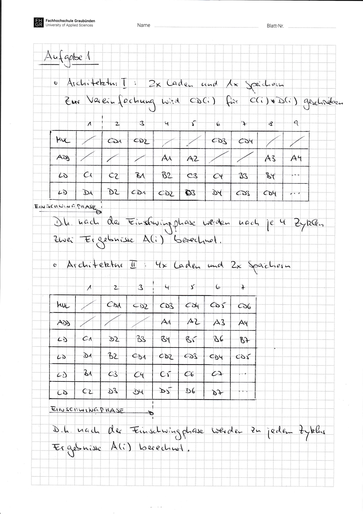

# Aufgabenblatt 01 -- Lösung

<!-- source-page: 1 -->
<!-- visual-only-page: no trusted machine text emitted -->

<figure>
  
</figure>

<!-- source-page: 2 -->
<!-- visual-only-page: no trusted machine text emitted -->

<figure>
  
</figure>
