# High Performance Computing Script

This is the versioned working script for the course. Pass 1 covers all slide PDFs and keeps the material reviewable. Later passes should improve one section at a time.

## Source Coverage

- [Teil 01](../.extracted/slides/01-teil-01.mdx)
- [Teil 02](../.extracted/slides/02-teil-02.mdx)
- [Teil 03](../.extracted/slides/03-teil-03.mdx)
- [Teil 04 (Update 23.04.26)](../.extracted/slides/04-teil-04-update-23-04-26.mdx)
- [Teil 05](../.extracted/slides/05-teil-05.mdx)

## Curated Opening

This script is the curated study version of the course material. It is based on
the deterministic extraction in `.extracted`, but this file is allowed to remove
slide noise, repair structure, and add missing connective explanation.

## Course Setup

The course combines lecture and exercises. Homework sheets are distributed
throughout the term and are partly discussed during the lecture.

The exam is a written 120 minute open-book exam. Internet access and electronic
devices are not allowed.

## Course Scope

The course covers:

- introduction to high-performance computing
- high-performance networks
- foundations of parallelisation and load balancing
- MPI programming
- OpenMP programming and multithreading
- examples of parallel algorithms

The practical goal is not only to know terms, but to understand how hardware,
program structure, communication, memory behavior, and performance models fit
together.

## Why HPC Exists

High-performance computing is needed when a problem is too large, too slow, or
too data-heavy for a normal sequential computation.

Typical examples are:

- climate and geophysics simulations
- crash tests and flow simulations
- CAD and engineering systems
- large-scale data analysis, for example particle physics data
- cryptanalysis and other military applications

There are three basic ways to get more useful computation:

- use faster hardware and more memory
- use better algorithms and optimisation
- use parallel computing

The third point is the core of this course: use multiple execution units so that
the computation is split across cores, processors, nodes, or complete systems.

## Objectives of Parallel Computing

If resources were available `N` times, parallel computing can improve three
different things.

### Throughput

Run `N` independent problems at the same time. This is the easiest case because
the computations do not need to communicate. A classic example is embarrassingly
parallel work, where the same program runs on different data sets.

### Response Time

Solve one problem faster by splitting it into `N` cooperating parts. This is
harder because the parts need to coordinate, exchange data, or wait for each
other.

### Problem Size

Solve a larger version of one problem by using the combined memory and compute
capacity of multiple resources. This matters when the sequential machine cannot
hold or process the full problem at the desired resolution.

## Course Goals

After the course, the important abilities are:

- understand basic hardware concepts such as cores and caches
- distinguish levels of parallelism
- distinguish parallel hardware architectures
- measure and reason about performance of parallel code
- express parallelisation strategies with abstract models such as PRAM

## From Bits and Bytes to Cache and Cores

Modern processors execute operations in discrete clock cycles. A 3 GHz processor
has roughly `3 * 10^9` cycles per second. If one operation could be completed in
every cycle, this would suggest `3 * 10^9` operations per second.

That number is only a theoretical upper bound. Real performance is limited by
memory access, instruction dependencies, cache behavior, communication, and the
amount of parallel work the program exposes.

## Memory Hierarchy

A processor cannot treat all storage as equally fast. Fast memory is expensive
and small; large memory is slower. HPC performance depends heavily on exploiting
this hierarchy.

Typical hierarchy:

- registers
- cache
- main memory
- background memory
- archive memory

The goal is to keep the data that will be used soon close to the processor. This
uses locality: programs often access the same data repeatedly or access nearby
data soon after each other.

## Cache Memory

Cache is a fast buffer between processor and main memory. It stores copies of
selected main-memory blocks so that repeated or nearby accesses do not always
have to go back to slower main memory.

If cache memory contains `m` cache lines and main memory contains `n` blocks,
usually `m << n`. This means the cache can only hold a small subset of memory at
one time. Cache management therefore decides which memory blocks are loaded,
kept, replaced, or updated.

Conceptually:

- cache line `L_i`, where `i = 0, ..., m-1`
- memory block `B_j`, where `j = 0, ..., n-1`
- cache management maps some memory blocks `B_j` to cache lines `L_i`

## Vector Triad Benchmark

The Schoenauer vector triad benchmark is used to show memory hierarchy effects.
The main kernel is:

```pseudo
for i <- 0 to N-1 do
  A[i] <- B[i] + C[i] * D[i]
od
```

For small `N`, the arrays may fit into a fast cache level. For larger `N`, the
data moves through slower memory levels. The runtime can therefore jump at cache
size boundaries even though the mathematical operation stays the same.

<figure>
  
</figure>

## Roofline Model

The roofline model is an optimistic node-level performance model. It separates
two broad limits:

- low operational intensity: performance is limited by data movement
- high operational intensity: performance is limited by execution capability

Operational intensity means how much useful work is done per amount of data
moved. A computation with low intensity spends much of its time waiting for data.
A computation with high intensity can make better use of the processor.

## Full Slide Pass

# Teil 01

Source extraction: [../.extracted/slides/01-teil-01.mdx](../.extracted/slides/01-teil-01.mdx)

<!-- source: page 1 -->

## High-Performance Computing
(CDS-110)

Prof. Dr. rer. nat. habil. Ralf-Peter Mundani
DAViS


<figure>
  
</figure>


<!-- source: page 2 -->

## General Remarks
- lecture / exercises
  - Thursday, 1:30—4:45 pm

- homework
  - several exercise sheets throughout term
  - partially discussed during lecture
source: der-querschnitt.de
- examination (100%)
  - written, 120 minutes, open book, closed internet, no electronic devices


<figure>
  
</figure>


<!-- source: page 3 -->

## General Remarks
- content
  - introduction
  - high-performance networks
  - foundations of parallelisation / load balancing
  - MPI programming
  - OpenMP programming / multithreading
  - examples of parallel algorithms


<!-- source: page 4 -->

## General Remarks
- best practice for success?
  - lectures
  - homework
  - additional effort (books, internet, programming, …)
  - and not to forget: questions

source: fowllanguagecomics.com (© B. Gordon)


<figure>
  
</figure>


<figure>
  
</figure>


<figure>
  
</figure>


<figure>
  
</figure>


<!-- source: page 5 -->

## General Remarks
- simulation – from phenomena to prediction

physical phenomenon
technical process
1. modelling
determination of parameters, expression of relations

2. numerical treatment
model discretisation, algorithm development

3. implementation
software development, parallelisation
discipline
4. visualisation
mathematics                               illustration of abstract simulation results

computer science                                  5. validation
comparison of results with reality
engineering application                                   6. embedding
insertion into working process


<!-- source: page 6 -->

## General Remarks
- why parallel programming and HPC?
  - complex problems (especially the so called `grand challenges´) demand for
more computing power
    - climate or geophysics simulation (tsunami, e.g.)
    - structure or flow simulation (crash test, e.g.)
    - development systems (CAD, e.g.)
    - large data analysis (Large Hadron Collider at CERN, e.g.)
    - military applications (crypto analysis, e.g.)
    - ...

  - performance increase due to
    - faster hardware, more memory (`work harder´)
    - more efficient algorithms, optimisation (`work smarter´)
    - parallel computing (`get some help´)


<!-- source: page 7 -->

## General Remarks
- objectives (in case all resources would be available N-times)
  - throughput: compute N problems simultaneously
    - running N instances of a sequential program with different data sets
(“embarrassing parallelism”); SETI@home, e.g.

  - response time: compute one problem at a fraction (1/N) of time
    - running one instance (i.e. N processes) of a parallel program for jointly
solving a problem; finding prime numbers, e.g.

  - problem size: compute one problem with N-times larger data
    - running one instance (i.e. N processes) of a parallel program, using the
sum of all local memories for computing larger problem sizes; iterative
solution of SLE, e.g.


<!-- source: page 8 -->

## Course Goals
- upon successful completion of this course, you should be able to
  - appreciate and understand
    - basic hardware concepts such as cores and caches
    - different levels of parallelism and their exploitation
    - different hardware architectures and their distinction
  - develop an ability to apply performance measurements on parallel codes
  - express parallelisation strategies using the PRAM model


<figure>
  
</figure>


<!-- source: page 9 -->

- overview

  - excursion: from bits and bytes to cache and cores
  - levels of parallelism
  - supercomputers
  - classification of parallel computers
  - quantitative performance evaluation
  - abstract parallel performance model

I think there is a world market
```pseudo
for maybe five computers.
```
—Thomas Watson,
chairman IBM, 1943


<!-- source: page 10 -->

Excursion: from Bits and Bytes to Cache and Cores
- reminder: arithmetic logical unit (ALU)
  - schematic layout of the (classical 32-bit) arithmetic logical unit

…
registers
…
…

32-bit data bus
main memory

A               B
…
ALU
C

```pseudo
C <- A ⊗ B with arithmetic operation ⊗
```


<!-- source: page 11 -->

Excursion: from Bits and Bytes to Cache and Cores
- reminder: arithmetic logical unit (cont’d)
  - mystery: clock rate
    - frequency at which a chip is running
    - nowadays measured in GigaHertz [GHz]
    - defining number of discrete time steps (so-called cycles) per second

  - example: 3 GHz
    - i.e. 3x109 cycles per second                  …
registers
    - one operation per cycle
…
=> theoretically 3x109 Op/s

A               B
ALU
C


<figure>
  
</figure>


<!-- source: page 12 -->

Excursion: from Bits and Bytes to Cache and Cores
- memory hierarchy
  - memory hierarchy
    - exploitation of program characteristics such as locality
    - compromise between costs and performance
    - components with different speeds and capacities

single access

access speed
register

cache              block access

main memory                page access

background memory

capacity
serial access
archive memory


<!-- source: page 13 -->

Excursion: from Bits and Bytes to Cache and Cores
- memory hierarchy (cont’d)
  - cache memory
    - fast access buffer between main memory and processor
    - provides copies of current (main) memory content for fast access
during program execution
  - cache management
      - tries to provide always those data that processor needs for the next
computation step
      - due to small capacity certain strategies for load and update operations
of cache content necessary
cache memory (m << n)
cache-line Li i = 0, ..., m-1
0                                          n-1
main memory
block Bj j = 0, ..., n-1       mapping Bj to Li
0                m-1


<!-- source: page 14 -->

Excursion: from Bits and Bytes to Cache and Cores
- memory hierarchy (cont’d)
  - example: SCHOENAUER vector triad benchmark
    - main kernel
double *A, *B, *C, *D

```pseudo
for i <- 0 to N-1 do
A[i] <- B[i] + C[i] * D[i]
od
```

    - report performance for different N
    - kernel is limited by data transfer performance for all memory levels
    - using different compilers on Sandy-Bridge architecture
      - Intel Compiler 13.0.0 (icc)
      - GNU Compiler 4.6.3 (gcc)


<!-- source: page 15 -->

Excursion: from Bits and Bytes to Cache and Cores
- memory hierarchy (cont’d)
L1D (32 KB)

L2 (256 KB)

factor ≈7.5

cache effects
L3 (20 MB)

Main Memory (192 GB)
swap
Memory Proc. 1(96 GB)


<figure>
  
</figure>


<!-- source: page 16 -->

Excursion: from Bits and Bytes to Cache and Cores
  - roofline model
    - an optimistic performance model (for node level optimisation)

high intensity (limited by execution)
best use of resources

Performance
Pmax

Throughput [data/sec]

Intensity [tasks/data]

Proc. capability Pmax [tasks/sec]
low intensity (limited by bottleneck)

Intensity


<!-- source: page 17 -->

- overview

  - excursion: from bits and bytes to cache and cores ✓
  - levels of parallelism
  - supercomputers
  - classification of parallel computers
  - quantitative performance evaluation
  - abstract parallel performance model


<!-- source: page 18 -->

## Levels of Parallelism
- qualitative meaning: level(s) on which work is done in parallel

=> instructions are further subdivided in units to be
sub-instruction level       => executed in parallel or via overlapping

granularity
=> parallel exe. of machine instructions; compilers can
instruction level           => increase this potential by modified command order

=> multithreading / shared memory parallelisation;
block level                 => blocks of instructions are executed in parallel
OpenMP + MPI => state of the art
=> distributed memory parallelisation; program is
process level                   => subdivided into processes to be exe. in parallel

=> parallel processing of different programs; =>
program level                      independent units without any shared data


<figure>
  
</figure>


<figure>
  
</figure>


<figure>
  
</figure>


<figure>
  
</figure>


<figure>
  
</figure>


<!-- source: page 19 -->

## Levels of Parallelism
- instruction pipelining
  - instruction execution involves several operations
1. instruction fetch (IF)
2. decode (DE)
3. fetch operands (OP)
4. execute (EX)
5. write back (WB)
which are executed successively

  - hence, only one part of CPU works at a given moment

…     IF   DE    OP    EX   WB   IF   DE    OP    EX    WB   …

instruction N             instruction N+1


<!-- source: page 20 -->

## Levels of Parallelism
- instruction pipelining (cont‘d)
  - observation: while processing particular stage of instruction, other stages
are idle
  - hence, multiple instructions to be overlapped in execution => instruction
pipelining (similar to assembly lines)
  - advantage: no additional hardware necessary

…
```pseudo
IF   DE    OP   EX    WB                     time
```
instruction N
instruction N+1              IF   DE   OP    EX   WB
instruction N+2                   IF   DE    OP    EX   WB

instruction N+3                         IF   DE   OP    EX   WB

instruction N+4                              IF   DE    OP    EX   WB
…


<!-- source: page 21 -->

## Levels of Parallelism
- superscalar
  - faster CPU throughput due to simultaneously execution of instructions
within one clock cycle via redundant functional units (ALU, multiplier, …)
  - dispatcher decides (during runtime) which instructions read from memory
can be executed in parallel and dispatches them to different functional
units
  - for instance, PowerPC 970 (4 x ALU, 2 x FPU)

instr. 1   instr. 2   instr. 3   instr. 4   instr. A   instr. B

ALU        ALU        ALU        ALU        FPU        FPU

  - but, performance improvement is limited (intrinsic parallelism)


<figure>
  
</figure>


<!-- source: page 22 -->

## Levels of Parallelism
- very long instruction word (VLIW)
  - in contrast to superscalar architectures, the compiler groups parallel
executable instructions during compilation (pipelining still possible)
  - advantage: no additional hardware logic necessary
  - drawback: not always fully useable (=> dummy filling (NOP))

VLIW instruction

instr. 1         instr. 2               instr. 3   instr. 4

registers


<!-- source: page 23 -->

## Levels of Parallelism
- vector units
  - simultaneously execution of one instruction on a one-dimensional array of
data (≡ vector)
  - VU first appeared in 1970s and were the basis of most supercomputers in
the 1980s and 1990s

( A1       B1   A2        B2   A3        B3   ...   AN-1 BN-1 AN       BN ) T

instruction
1             2              3
...     N-1          N

( C1                C2             C3        ...     CN-1         CN ) T

  - specialised hardware => very expensive
  - limited application areas (mostly Computational Fluid Dynamics,
Computational Structures Dynamics, …)


<!-- source: page 24 -->

## Levels of Parallelism
- dual core, quad core, many core, and multicore
  - observation: increasing frequency f (and thus core voltage v) over past
years => problem: thermal power dissipation P ~ f*v2

source: linux.sys-con.com             source: edwardbosworth.com


<figure>
  
</figure>


<figure>
  
</figure>


<!-- source: page 25 -->

## Levels of Parallelism
- dual core, quad core, many core, and multicore (cont’d)
  - 25% reduction in performance => approx. 50% reduction in dissipation
  - idea: installation of two cores with same dissipation as single core system

normal CPU                  ‘reduced’ CPU                 dual core

dissipation              performance


<!-- source: page 26 -->

## Levels of Parallelism
- Intel Nehalem Core i7

core 0   core 1    core 2    core 3

L1+L2    L1+L2     L1+L2     L1+L2
shared L3

QPI
source: www.samrathacks.com

QPI: QuickPath Interconnect replaces FSB (QPI is a point-to-point interconnection – with a
memory controller now on-die – in order to allow both reduced latency and higher bandwidth =>
up to (theoretically) 25.6 GByte/s data transfer, i.e. 2x FSB)


<figure>
  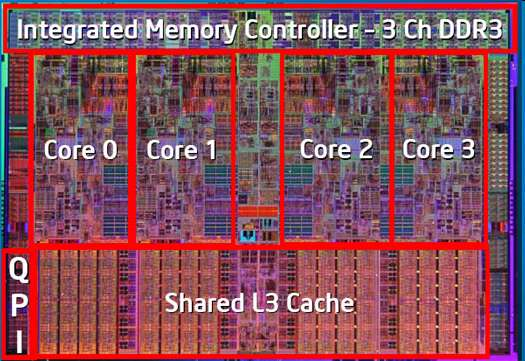
</figure>


<!-- source: page 27 -->

## Levels of Parallelism
- Intel E5-2600 Sandy-Bridge Series
  - 2 CPUs connected by 2 QPIs (Intel Quick Path Interconnect)
  - Quick Path Interconnect (1 sending and 1 receiving port)
    - 8 GT/s ∙ 16 Bit/T payload ∙ 2 directions / 8 Bit/Byte = 32 GB/s max
bandwidth per QPI
    - 2 QPI links => 2 ∙ 32 GB/s = 64 GB/s max bandwidth

source: G. Wellein, RRZE


<figure>
  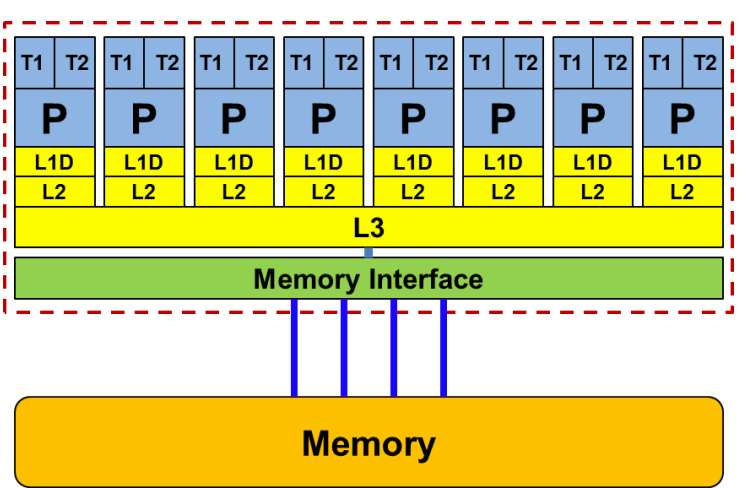
</figure>


<figure>
  
</figure>


<!-- source: page 28 -->

## Levels of Parallelism
- Intel Broadwell-EP
  - successor of Haswell architecture (22nm process) using a 14nm process
  - available in three different core count (xCC) configurations: HCC (7.2B
transistors), MCC (4.7B transistors), and LCC (3.2B transistors)
  - two bidirectional rings connect 12 cores each; intelligent routing decides
about north/south ring traffic (WC: 12 cycles)

source: tomshardware.com

LLC = last level cache


<figure>
  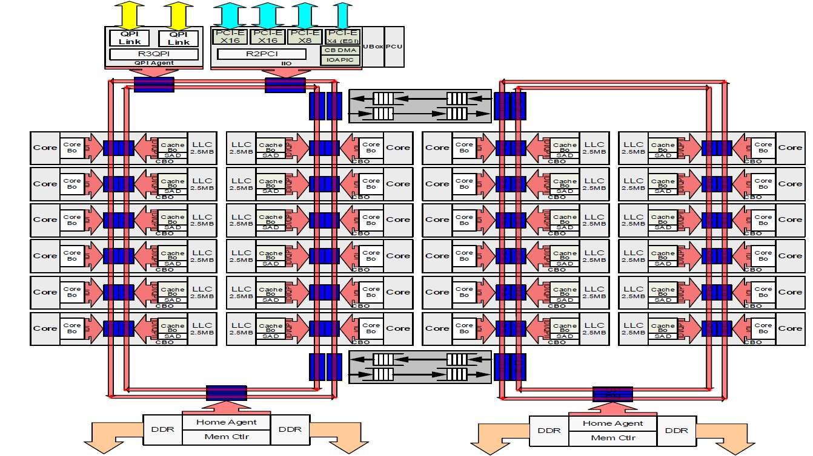
</figure>


<!-- source: page 29 -->

## Levels of Parallelism
- Intel Skylake-SP
  - redesign of Broadwell architecture using same 14nm process
  - available in three different core count (CC) configurations: XCC (28 cores),
HCC (18 cores), and LCC (10 cores)
  - 2D mesh topology (known from Intel’s Knights Landing) uses bi-directional
interconnects between cores, caches, and IO controllers

source: tomshardware.com
XCC (left),
HCC (right)


<figure>
  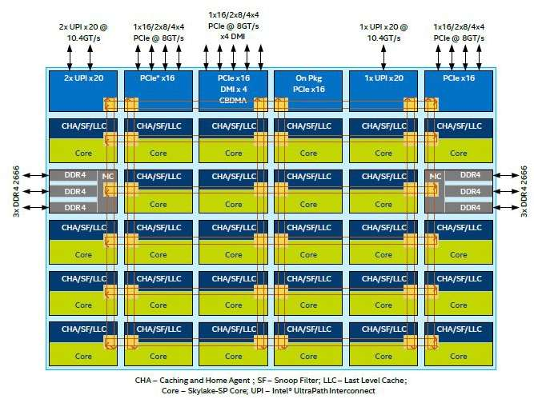
</figure>


<figure>
  
</figure>


<!-- source: page 30 -->

- overview

  - excursion: from bits and bytes to cache and cores ✓
  - levels of parallelism ✓
  - supercomputers
  - classification of parallel computers
  - quantitative performance evaluation
  - abstract parallel performance model


<!-- source: page 31 -->

## Supercomputers
- dawn of number crunchers
  - supercomputing or high-performance scientific computing as the most
important application of the big number crunchers
  - national initiatives due to huge budget requirements
    - Accelerated Strategic Computing Initiative (ASCI) in the U.S.
      - in the sequel of the nuclear testing moratorium in 1992/93
      - decision: develop, build, and install a series of five
supercomputers of up to $100 million each in the U.S.
      - start: ASCI Red (1997, Intel-based, Sandia National Laboratory, the
world’s first TFlops computer)
      - then: ASCI Blue Pacific (1998, LLNL), ASCI Blue Mountain,
ASCI White, ...

    - meanwhile new high-end computing memorandum (2004)


<!-- source: page 32 -->

## Supercomputers
- MOORE’s law
  - observation of Intel co-founder Gordon E. MOORE, describes important
trend in history of computer hardware (1965)

source: intel.com            source: intel.com

“number of transistors that can be placed on an integrated circuit is increasing
exponentially, doubling approximately every two years”


<figure>
  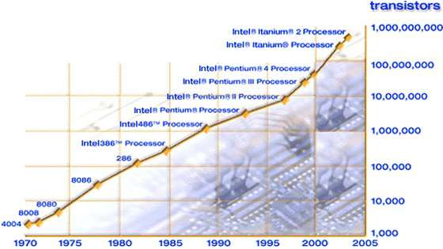
</figure>


<figure>
  
</figure>


<!-- source: page 33 -->

## Supercomputers
- some numbers: Top500 (as of November 2025)


<figure>
  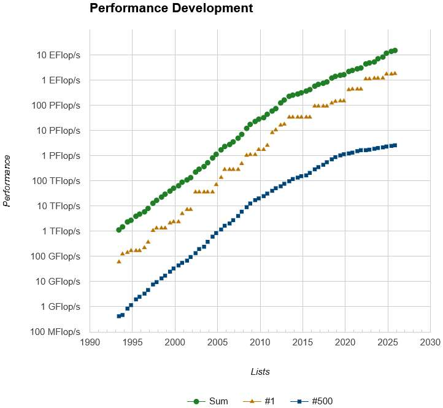
</figure>


<!-- source: page 34 -->

## Supercomputers
- some numbers: Top500 (as of November 2025)


<figure>
  
</figure>


<!-- source: page 35 -->

## Supercomputers
- the 10 fastest supercomputers in the world (as of November 2025)


<figure>
  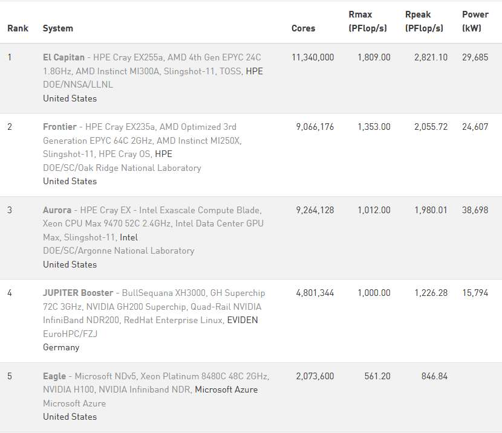
</figure>


<!-- source: page 36 -->

## Supercomputers
- the 10 fastest supercomputers in the world (as of November 2025)


<figure>
  
</figure>


<!-- source: page 37 -->

- overview

  - excursion: from bits and bytes to cache and cores ✓
  - levels of parallelism ✓
  - supercomputers ✓
  - classification of parallel computers
  - quantitative performance evaluation
  - abstract parallel performance model


<!-- source: page 38 -->

## Classification of Parallel Computers
- standard classification according to FLYNN
  - global data and instruction streams as criterion
    - instruction stream: sequence of commands to be executed
    - data stream: sequence of data subject to instruction streams
  - two-dimensional subdivision according to
    - amount of instructions per time a computer can execute
    - amount of data elements per time a computer can process
  - hence, FLYNN distinguishes four classes of architectures
    - SISD: single instruction, single data
    - SIMD: single instruction, multiple data
    - MISD: multiple instruction, single data
    - MIMD: multiple instruction, multiple data
  - drawback: very different computers may belong to the same class


<!-- source: page 39 -->

## Classification of Parallel Computers
- standard classification according to FLYNN
  - SISD
    - one processing unit that has access to one data memory and to one
program memory
    - classical monoprocessor following VON NEUMANN’s principle

data memory           processor         program memory


<!-- source: page 40 -->

## Classification of Parallel Computers
- standard classification according to FLYNN
  - SIMD
    - several processing units, each with separate access to a (shared or
distributed) data memory; one program memory
    - synchronous execution of instructions
    - example: array computer, vector computer
    - advantages: easy programming model due to control flow with a strict
synchronous-parallel execution of all instructions
    - drawbacks: specialised hardware necessary, easily becomes out-dated
due to recent developments at commodity market

data memory           processor

program memory

data memory           processor


<!-- source: page 41 -->

## Classification of Parallel Computers
- standard classification according to FLYNN
  - MISD
    - several processing units that have access to one data memory; several
program memories
    - not very popular class (mainly for special applications such as Digital
Signal Processing)
    - operating on a single stream of data, forwarding results from one
processing unit to the next
    - example: systolic array (network of primitive processing elements that
“pump” data)

processor           program memory

data memory

processor           program memory


<!-- source: page 42 -->

## Classification of Parallel Computers
- standard classification according to FLYNN
  - MIMD
    - several processing units, each with separate access to a (shared or
distributed) data memory; several program memories
    - classification according to (physical) memory organisation
      - shared memory => shared (global) address space
      - distributed memory => distributed (local) address space
    - example: multiprocessor systems, networks of computers

data memory            processor           program memory

data memory            processor           program memory


<!-- source: page 43 -->

## Classification of Parallel Computers
- processor coupling
  - cooperation of processors / computers as well as their shared use of
various resources require communication and synchronisation
  - the following types of processor coupling can be distinguished
    - memory-coupled multiprocessor systems (MemMS)
    - message-coupled multiprocessor systems (MesMS)

global memory           distributed memory
shared
MemMS, SMP             Mem-MesMS (hybrid)
address space
distributed
∅                       MesMS
address space


<!-- source: page 44 -->

## Classification of Parallel Computers
- processor coupling
  - uniform memory access (UMA)
    - each processor P has direct access via the network to each memory
module M with same access times to all data
    - standard programming model can be used (i.e. no explicit send /
receive of messages necessary)
    - communication and synchronisation via shared variables
(inconsistencies (write conflicts, e.g.) have to prevented in general by
the programmer)

M     M         ...       M

network

P     P        ...        P


<!-- source: page 45 -->

## Classification of Parallel Computers
- processor coupling
  - non-uniform memory access (NUMA)
    - memory modules physically distributed among processors
    - shared address space, but access times depend on location of data
(i.e. local addresses faster than remote addresses)
    - differences in access times are visible in the program
    - example: DSM / VSM, Cray T3E

network

M                      M

P          ...           P


<!-- source: page 46 -->

## Classification of Parallel Computers
- processor coupling
  - cache-coherent non-uniform memory access (ccNUMA)
    - caches for local and remote addresses; cache-coherence implemented
in hardware for entire address space
    - problem with scalability due to frequent cache actualisations
    - example: SGI Origin 2000

network

M                     M

C          ...          C
P                    P


<!-- source: page 47 -->

## Classification of Parallel Computers
- processor coupling
  - cache-only memory access (COMA)
    - each processor has only cache-memory
    - entirety of all cache-memories = global shared memory
    - cache-coherence implemented in hardware
    - example: Kendall Square Research KSR-1

network

C    C             C
...
P    P             P


<!-- source: page 48 -->

## Classification of Parallel Computers
- processor coupling
  - no remote memory access (NORMA)
    - each processor has direct access to its local memory only
    - access to remote memory only via explicit message exchange (due to
distributed address space) possible
    - synchronisation implicitly via the exchange of messages
    - performance improvement between memory and I/O due to parallel
data transfer (Direct Memory Access, e.g.) possible
    - example: IBM SP2, ASCI Red / Blue / White

network

P     P               P
...
M     M                M


<!-- source: page 49 -->

- overview

  - excursion: from bits and bytes to cache and cores ✓
  - levels of parallelism ✓
  - supercomputers ✓
  - classification of parallel computers ✓
  - quantitative performance evaluation
  - abstract parallel performance model


<!-- source: page 50 -->

## Quantitative Performance Evaluation
- execution time
  - time T of a parallel program between start of the execution on one
processor and end of all computations on the last processor
  - during execution all processors are in one of the following states
    - compute
      - TCOMP: time spent for computations

    - communicate
      - TCOMM: time spent for send and receive operations

    - idle
      - TIDLE: time spent for waiting (sending / receiving messages)

  - hence T = TCOMP + TCOMM + TIDLE


<!-- source: page 51 -->

## Quantitative Performance Evaluation
- comparison multiprocessor / monoprocessor
  - correlation of multi- and monoprocessor systems’ performance
  - important: program that can be executed on both systems
  - definitions
    - T(1): execution time of a program on the monoprocessor system
(measured in steps or clock cycles)
    - T(p): execution time of a program on the multiprocessor system
(measured in steps or clock cycles) with p processors


<!-- source: page 52 -->

## Quantitative Performance Evaluation
- comparison multiprocessor / monoprocessor
  - speed-up
    - S(p) indicates the improvement in processing speed

with 1 <= S(p) <= p

  - efficiency
    - E(p) indicates the relative improvement in processing speed
    - improvement is normalised by the amount of processors p

with 1/p <= E(p) <= 1


<!-- source: page 53 -->

## Quantitative Performance Evaluation
- scalability
  - objective: adding further processing elements to the system shall reduce
the execution time without any program modifications
  - i.e. a linear performance increase with an efficiency close to 1
  - important for the scalability is a sufficient problem size
    - one porter may carry one suitcase in a minute
    - 60 porters won’t do it in a second
    - but 60 porters may carry 60 suitcases in a minute

  - in case of a fixed problem size and an increasing amount of processors
saturation will occur for a certain value of p, hence scalability is limited
  - when scaling the amount of processors together with the problem size (so
called scaled problem analysis) this effect will not appear for good scalable
hard- and software systems


<!-- source: page 54 -->

## Quantitative Performance Evaluation
- AMDAHL’s law
  - the probably most important and most famous estimate for the speed-up
(even if quite pessimistic)
  - underlying model
    - each program has a sequential part s, 0 <= s <= 1, that can only be
executed in a sequential way: synchronisation, data I/O, …
    - furthermore, each program consists of a parallelisable part 1-s that
can be executed in parallel by several processes; finding the maximum
value within a set of numbers, e.g.

  - hence, the execution time for the parallel program executed on p
processors can be written as


<figure>
  
</figure>


<!-- source: page 55 -->

## Quantitative Performance Evaluation
- AMDAHL’s law
  - the speed-up can thus be computed as

  - modified version (with communication)

where
    - Tlat denotes latency [s]
    - L denotes message length [bytes]
    - B denotes bandwidth [bytes/s]


<figure>
  
</figure>


<figure>
  
</figure>


<figure>
  
</figure>


<!-- source: page 56 -->

## Quantitative Performance Evaluation
- AMDAHL’s law
  - when increasing p -> ∞ we finally get AMDAHL’s law

=> speed-up is bounded: S(p) <= 1/s
  - the sequential part can have a dramatic impact on the speed-up
  - therefore central effort of all (parallel) algorithms: keep s small
  - many parallel programs have a small sequential part (s < 0.1)


<figure>
  
</figure>


<!-- source: page 57 -->

## Quantitative Performance Evaluation
- AMDAHL’s law
  - example: s = 0.1
    - independent from p the speed-up is bounded by this limit
    - where’s the error?
10

9

8

7

6

speed-up
5

4

3

2

1
S(p)
0
0   5   10   15   20   25   30   35   40   45   50   55   60   65   70   75   80   85   90   95     100
# processes


<!-- source: page 58 -->

## Quantitative Performance Evaluation
- some more thoughts about speed-up
  - theory tells: a superlinear speed-up does not exist
  - but superlinear speed-up can be observed
    - when improving an inferior sequential algorithm
    - when a parallel program (that does not fit into the main memory of
the monoprocessor system) completely runs in cache of the nodes
from the multiprocessor system

- strong vs. weak speed-up
  - strong speed-up: keep problem size fixed and only increase number of
processes => typically levels off at some point / number of processes
  - weak speed-up (or scale-up): increase problem size in the same way as
number of processes => should stay the same in the best case


<!-- source: page 59 -->

## Quantitative Performance Evaluation
- CFD example (inhouse code – credits to Prof. Dr.-Ing. Jérôme Frisch)

28 TB memory footprint =>
20,000 cores @ SuperMUC

Energy due: 2500 kWh
(20-30 min. on 18 islands)

solving Δu = 0 for 3D domain with 19’173’961 grids and resolution 4096x4096x4096
(i.e. approx. 707B DOFs); times obtained on SuperMUC and Shaheen (IBM Blue Gene/P)


<figure>
  
</figure>


<figure>
  
</figure>


<!-- source: page 60 -->

## Quantitative Performance Evaluation
- CFD example (inhouse code – credits to Prof. Dr.-Ing. Jérôme Frisch)
  - time to solution for one time step (repeated V-cyles with adaptive
relaxation steps (and secret scaling factor ☺) until convergence)

depth 6: layout with 2x2x2
refinement and 16x16x16
blocks up to 16’384 procs.

depth 7: layout with 2x2x2
refinement and 16x16x16
blocks up to 65’536 procs.

depth 8: layout with 2x2x2
refinement and 16x16x16
blocks up to 147’456 procs.

depth 8: 4096x4096x4096 (total of 80B computing cells; 707B degrees of freedom)


<figure>
  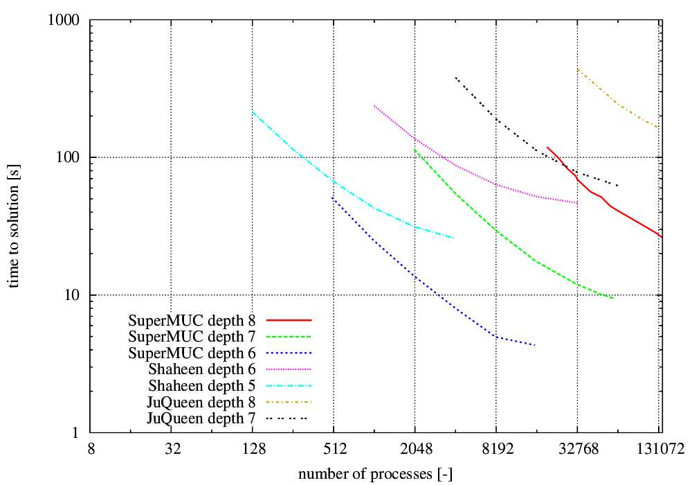
</figure>


<!-- source: page 61 -->

## Quantitative Performance Evaluation
- CFD example (inhouse code – credits to Prof. Dr.-Ing. Jérôme Frisch)
  - time to solution for one time step (repeated V-cyles with adaptive
relaxation steps (and secret scaling factor ☺) until convergence)

depth 6: layout with 2x2x2
refinement and 16x16x16
blocks up to 16’384 procs.

depth 7: layout with 2x2x2
clocks                refinement and 16x16x16
blocks up to 65’536 procs.

depth 8: layout with 2x2x2
refinement and 16x16x16
blocks up to 147’456 procs.

depth 8: 4096x4096x4096 (total of 80B computing cells; 707B degrees of freedom)


<figure>
  
</figure>


<!-- source: page 62 -->

- overview

  - excursion: from bits and bytes to cache and cores ✓
  - levels of parallelism ✓
  - supercomputers ✓
  - classification of parallel computers ✓
  - quantitative performance evaluation ✓
  - abstract parallel performance model


<!-- source: page 63 -->

## Abstract Parallel Performance Model
- RAM: random-access machine
  - abstract computational-machine model used for complexity analysis
  - main features
    - infinite number of registers that store integers of unbounded size
    - instruction set includes
      - operations for moving data between registers
      - comparisons
      - loops and conditional branches
      - simple arithmetic operations (i.e. +, -, *, /)
    - all operations take unit time (regardless of operands)
    - execution ends with HALT instruction

  - time complexity ≡ number of instructions executed
  - space complexity ≡ number of memory cells accessed


<!-- source: page 64 -->

## Abstract Parallel Performance Model
- RAM: random-access machine (cont’d)
  - simple computations with direct / indirect addressing possible

R[x] means content of register with address x
```pseudo
<- means copy / replace content without destruction of source
```

```pseudo
1.   R[11] <- 10
2.   R[12] <- 42
3.   R[13] <- 11
4.   R[12] <- R[R[13]] + 5
```
5.   HALT

  - what content has register 12?
  - what is the time / space complexity of this computation?


<!-- source: page 65 -->

## Abstract Parallel Performance Model
- RAM: random-access machine (cont’d)
  - example: finding maximum element max in unsorted list of size N stored
at registers X[1] to X[N]
  - max, i, and N are abbreviated notations to some registers R[ ]

```pseudo
1.   max <- X[1]
2.   for i <- 2 to N do
3.     if X[i] > max then max <- X[i] fi
```
4.   od
5.   HALT

  - what is the time complexity of this computation?
  - and how does this work in parallel?


<!-- source: page 66 -->

## Abstract Parallel Performance Model
- PRAM: parallel random-access machine
  - idealised model of shared memory SIMD machine
  - extension to RAM model with new features
    - infinite number of RAM processors, each one to be identified by some
unique processor ID (PID)
    - there is an infinite number of shared registers (prefixed with s_)
    - each processor can access any shared register (unless there is a
conflict) in unit time
    - processors exchange data via reading from / writing into shared
registers
    - computation proceeds until P0 halts

  - parallel time complexity ≡ time elapsed for P0’s computation
  - parallel space complexity ≡ total number of shared registers accessed


<!-- source: page 67 -->

## Abstract Parallel Performance Model
- PRAM: parallel random-access machine (cont’d)
  - handling shared registers access conflicts
    - exclusive read exclusive write (EREW): no two processes are allowed to
read from / write into same shared register

```pseudo
s_R[ ] <-EE …
```

    - concurrent read exclusive write (CREW): simultaneously read from
same shared register possible, but only one process is allowed to write

```pseudo
s_R[ ] <-CE …
```

    - concurrent read concurrent write (CRCW): both simultaneous reads
and writes from / into same shared register are allowed

```pseudo
s_R[ ] <-CC …
```


<!-- source: page 68 -->

## Abstract Parallel Performance Model
- PRAM: parallel random-access machine (cont’d)
  - parallel execution of operations via

```pseudo
for <condition> pardo <statement> od
```

  - example: parallel initialisation of shared registers s_X[1] to s_X[100]

```pseudo
1. for i <- 1 to 100 pardo
2.   s_X[i] <-CC PID
```
3. od

  - what is the content of shared registers s_X[ ] after execution?
  - what is the parallel time complexity of this computation?
  - why is access to shared registers via CRCW safe?


<!-- source: page 69 -->

## Abstract Parallel Performance Model
- PRAM: parallel random-access machine (cont’d)
  - again: finding maximum element in unsorted list of size N stored at
shared registers s_X[1] to s_X[N]
  - gmax is an abbreviated notation to some shared register s_R[ ]
  - naïve approach

```pseudo
1. gmax <- s_X[1]
2. for i <- 1 to N pardo
3.   if s_X[i] > gmax then gmax <-EE s_X[i] fi
```
4. od

  - does this work?
  - what is the parallel time complexity of this computation?


<!-- source: page 70 -->

## Abstract Parallel Performance Model
- PRAM: parallel random-access machine (cont’d)
  - again: finding maximum element max in unsorted list of size N stored at
shared registers s_X[1] to s_X[N]
  - idea: usage of shared auxiliary registers s_T[ ]

```pseudo
1.   for i <- 1 to N pardo s_T[i] <- 1 od
2.   for i, j <- 1 to N pardo
3.     if s_X[j] > s_X[i] then s_T[i] <- 0 fi
```
4.   od
```pseudo
5.   for i <- 1 to N pardo
6.     if s_T[i] = 1 then gmax <- s_X[i] fi
```
7.   od

  - what is the parallel time complexity in case of N, N2, N4 processors?
  - which memory access (EREW, CREW, CRCW) to be used here?


<!-- source: page 71 -->

- overview

  - excursion: from bits and bytes to cache and cores ✓
  - levels of parallelism ✓
  - supercomputers ✓
  - classification of parallel computers ✓
  - quantitative performance evaluation ✓
  - abstract parallel performance model ✓


<!-- source: page 72 -->

## Twelve Ways…
…to fool the masses when giving performance results on parallel computers.
—David H. Bailey,
NASA Ames Research Centre, 1991

1. Quote only 32-bit performance results, not 64-bit results.
2. Present performance figures for an inner kernel, and then represent these
figures as the performance of the entire application.
3. Quietly employ assembly code and other low-level language constructs.
4. Scale up the problem size with the number of processors, but omit any
mention of this fact.
5. Quote performance results projected to a full system.
6. Compare your results against scalar, unoptimised codes on Crays.


<!-- source: page 73 -->

## Twelve Ways…
7. When direct run time comparisons are required, compare with an old code on
an obsolete system.
8. If MFLOPS rates must be quoted, base the operation count on the parallel
implementation, not on the best sequential implementation.
9. Quote performance in terms of processor utilisation, parallel speed-ups or
MFLOPS per dollar.
10. Mutilate the algorithm used in the parallel implementation to match the
architecture.
11. Measure parallel run times on a dedicated system, but measure conventional
run times in a busy environment.
12. If all else fails, show pretty pictures and animated videos, and don’t talk about
performance.

# Teil 02

Source extraction: [../.extracted/slides/02-teil-02.mdx](../.extracted/slides/02-teil-02.mdx)

<!-- source: page 1 -->

## High-Performance Computing
(CDS-110)

Prof. Dr. rer. nat. habil. Ralf-Peter Mundani
DAViS


<figure>
  
</figure>


<!-- source: page 2 -->

- overview

  - definitions
  - static topologies
  - dynamic topologies
  - examples

640k is enough for anyone,
and by the way, what’s a network?
—William Gates III,
chairman Microsoft Corp., 1984


<!-- source: page 3 -->

## Course Goals
- upon successful completion of this course, you should be able to
  - appreciate and understand
    - basic evaluation concepts of network topologies
    - different types of network topologies
  - develop an ability to evaluate and name pros/cons of various static and
dynamic network topologies


<figure>
  
</figure>


<!-- source: page 4 -->

## Definitions
- reminder: protocols

3-component model               ISO/OSI model                   internet protocols (examples)

application     7              application layer                  data transfer, email

6             presentation layer

5                session layer
communication
system          4               transport layer                   TCP, UDP

3                network layer                    IP, ICMP, IGMP
logical link control     network adaptation
2   data link layer
medium access control
network
1                physical layer


<!-- source: page 5 -->

## Definitions
- degree (node degree)
  - number of connections (incoming and outgoing) between this node and
other nodes
  - degree of a network := max. degree of all nodes in the network
  - higher degrees lead to
    - more parallelism and bandwidth for the communication
    - more costs (due to a higher amount of connections)

  - objective: keep degree and, thus, costs small

degree = 3

degree = 4


<!-- source: page 6 -->

## Definitions
- diameter
  - distance of a pair of nodes (length of the shortest path between a pair of
nodes), i.e. the number of nodes a message has to pass on its way from
the sender to the receiver
  - diameter of a network := max. distance of all pair of nodes in the network
  - higher diameters (between two nodes) lead to
    - longer communications
    - less fault tolerance (due to the higher amount of nodes that have to
work properly)

  - objective: small diameter

diameter = 4


<!-- source: page 7 -->

## Definitions
- connectivity
  - min. number of edges (cables) that have to be removed to disconnect the
network, i.e. the network falls apart into two loose sub-networks
  - higher connectivity leads to
    - more independent paths between two nodes
    - better fault tolerance (due to more routing possibilities)
    - faster communication (due to the avoidance of congestions in the
network)

  - objective: high connectivity

connectivity = 2


<!-- source: page 8 -->

## Definitions
- bisection width
  - min. number of edges (cables) that have to be removed to separate the
network into two equal parts (bisection width != connectivity, see below)
  - important for determining the number of messages that can be
transmitted in parallel between one half of the nodes to the other half
without the repeated usage of any connection
  - extreme case: Ethernet with bisection width = 1
  - objective: high bisection width (ideal: number of nodes/2)

bisection width = 4
(connectivity = 3)


<!-- source: page 9 -->

## Definitions
- blocking
  - a desired connection between two nodes cannot be established due to
already existing connections between other pairs of nodes
  - objective: non-blocking networks

- fault tolerance (redundancy)
  - connections between (arbitrary) nodes can still be established even under
the breakdown of single components
  - a fault-tolerant network has to provide at least one redundant path
between all arbitrary pairs of nodes
  - graceful degradation: the ability of a system to stay functional (maybe with
less performance) even under the breakdown of single components


<!-- source: page 10 -->

## Definitions
- bandwidth
  - max. transmission performance of a network for a certain amount of time
  - bandwidth B in general measured as megabits or megabytes per second
(Mbps or MBps, resp.), nowadays more often as gigabits or gigabytes per
second (Gbps or GBps, resp.)

- bisection bandwidth
  - max. transmission performance of a network over the bisection line, i.e.
sum of single bandwidths from all edges (cables) that are “cut” when
bisecting the network
  - thus bisection bandwidth is a measure of bottleneck bandwidth
  - units are same as for bandwidth


<!-- source: page 11 -->

## Definitions
- latency
  - definition: delay time of a communication (time
between sending and receiving head of message)

source: cbs.lbl.gov
  - latency L measured in (milli/micro) seconds

“Arithmetic is cheap, latency is physics,
and bandwidth is money.” (K. Yelick)
- transmission time
  - time for transmitting an entire message between two nodes
  - transmission time depends on message size S
  - without conflicts, transmission time can be computed as
  - sometimes this is also referred to as delay


<figure>
  
</figure>


<!-- source: page 12 -->

## Definitions
- throughput
  - bandwidth ≡ throughput (SMAX)
  - typically, the (theoretical) bandwidth is not achieved with common (i.e.
smaller) message sizes
  - throughput: ratio between message size and delay =>

  - throughput interesting for determination of half-power-point
    - i.e. message size SH for which half of the bandwidth can be achieved
    - example: L = 10 μs, B = 10 MBps

    - a lower half-power-point means a higher percentage of small(er)
messages that can take advantage of a network’s bandwidth


<figure>
  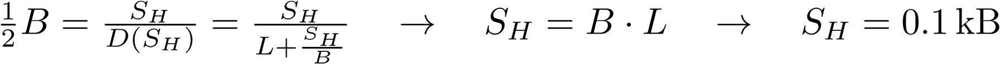
</figure>


<!-- source: page 13 -->

## Definitions
- static networks
  - fixed connections between pairs of nodes
  - control functions are done by the nodes or by special connection
hardware

- dynamic networks
  - no fixed connections between pairs of nodes
  - all nodes are connected via inputs and outputs to a so-called switching
component
  - control functions are concentrated in the switching component
  - various routes can be switched


<!-- source: page 14 -->

- overview

  - definitions ✓
  - static topologies
  - dynamic topologies
  - examples


<!-- source: page 15 -->

## Static Topologies
- chain (linear array)
  - one-dimensional network
  - N nodes and N-1 edges
  - degree = 2
  - diameter = N-1
  - bisection width = 1
  - drawback: too slow for large N


<!-- source: page 16 -->

## Static Topologies
- ring
  - two-dimensional network
  - N nodes and N edges
  - degree = 2
  - diameter = ⌊N/2⌋
  - bisection width = 2
  - drawback: too slow for large N


<!-- source: page 17 -->

## Static Topologies
- chordal ring
  - two-dimensional network
  - N nodes and 3N/2, 4N/2, 5N/2, ... edges
  - degree = 3, 4, 5, …
  - higher degrees lead to
    - smaller diameters
    - higher fault tolerance (due to redundant connections)
    - drawback: higher costs

left: chordal ring of degree = 3
right: chordal ring of degree = 4


<!-- source: page 18 -->

## Static Topologies
- barrel shifter (special case of rings)
  - two-dimensional network
  - N = 2k nodes and 2k-1(2k-1) edges
  - degree = 2k-1
  - diameter = ⌈k/2⌉
  - each node connects to all nodes with distance d = 2i, i ∈ [0, k-1]
  - simple routing possible (=> address shifting)
0         1

7                    2

6                   3

5        4


<!-- source: page 19 -->

## Static Topologies
- barrel shifter (cont’d)
  - spatial unfolding provides a shifter with k levels
  - example: k = 3
level 1

0       1     2     3       4   5   6   7

0      1              level 2

7                2
0       1     2     3       4   5   6   7

6               3

5     4              level 3

0       1     2     3       4   5   6   7


<!-- source: page 20 -->

## Static Topologies
- completely connected
  - two-dimensional network
  - N nodes and N·(N-1)/2 edges
  - degree = N-1
  - diameter = 1
  - bisection width = ⌊N/2⌋·⌈N/2⌉
  - very high fault tolerance
  - drawback: too expensive for large N


<!-- source: page 21 -->

## Static Topologies
- star
  - two-dimensional network
  - N nodes and N-1 edges
  - degree = N-1
  - diameter = 2
  - bisection width = ⌊N/2⌋
  - drawback: bottleneck in central node


<!-- source: page 22 -->

## Static Topologies
- binary tree
  - two-dimensional network
  - N nodes and N-1 edges (tree height h = ⌊ld N⌋ )
  - degree = 3
  - diameter = 2h
  - bisection width = 1
  - drawback: bottleneck in direction of root (=> blocking)


<!-- source: page 23 -->

## Static Topologies
- binary tree (cont’d)
  - addressing
    - label on level m consists of m bits; root has label ‘1’
    - suffix ‘0’ is added to left son, suffix ‘1’ is added to right son

  - routing
    - find common parent node P of nodes S and D
    - ascend from S -> P
    - descend from P -> D
1

10                              P 11

100           101           110           111

S             D
1000    1001 1010     1011 1100     1101 1110     1111


<!-- source: page 24 -->

## Static Topologies
- binary tree (cont’d)
  - solution to overcome the bottleneck => fat tree
  - edges on level m get higher priority than edges on level m+1
  - capacity is doubled on each higher level
  - now, bisection width = 2h-1
  - frequently used: HLRB II, e.g.


<!-- source: page 25 -->

## Static Topologies
- mesh / torus
  - k-dimensional network
  - N nodes and k·(N-rk-1) edges with r =
  - degree = 2k
  - diameter = k·(r-1)
  - bisection width = rk-1
  - high fault tolerance
  - drawback
    - large diameter
    - too expensive for k > 3

2D mesh


<!-- source: page 26 -->

## Static Topologies
- mesh / torus (cont’d)
  - k-dimensional network
  - N nodes and k·N edges with r =
  - diameter = k·⌊r/2⌋
  - bisection width = 2rk-1
  - frequently used: BlueGene/L, e.g.
  - drawback: too expensive for k > 3

2D torus


<!-- source: page 27 -->

## Static Topologies
- ILLIAC mesh
  - two-dimensional network
  - N nodes and 2N edges with r =
  - degree = 4
  - diameter = r-1
  - bisection width = 2r
  - conforms to a chordal ring of degree = 4

spatial unfolding
=>


<!-- source: page 28 -->

## Static Topologies
- hypercube
  - k-dimensional network
  - 2k nodes and k·2k-1 edges
  - degree = k
  - diameter = k
  - bisection width = 2k-1
  - drawback: scalability (only doubling of nodes allowed)

4D hypercube


<!-- source: page 29 -->

## Static Topologies
- hypercube (cont’d)
  - principle design
    - construction of a k-dimensional hypercube via connection of the
corresponding nodes of two k-1-dimensional hypercubes
    - inherent labelling via adding prefix ‘0’ to one sub-cube and prefix ‘1’ to
the other sub-cube
100                110
010
0            00               10     000

101
111

1            01               11     001                011

0D              1D                2D                          3D


<!-- source: page 30 -->

## Static Topologies
- hypercube (cont’d)
  - nodes are directly connected for a HAMMING distance of 1 only
  - routing
    - compute S ⊗ D (XOR) for possible ways between nodes S and D
    - route in increasing / decreasing order until final destination is reached

  - example
    - S = ‘011’, D = ‘110’
    - S ⊗ D = ‘101’
100             D 110
    - decreasing: ‘011’ -> ‘010’ -> ‘110’
010
    - increasing: ‘011’ -> ‘111’ -> ‘110’           000

101
111

001               S 011


<!-- source: page 31 -->

- overview

  - definitions ✓
  - static topologies ✓
  - dynamic topologies
  - examples


<!-- source: page 32 -->

## Dynamic Topologies
- bus
  - simple and cheap single stage network
  - shared usage from all connected nodes, thus, just one frame transfer at
any point in time
  - frame transfer in one step (i.e. diameter = 1)
  - good extensibility, but bad scalability
  - example: CSMA/CD

send                    sender          receiver

receive

listen


<!-- source: page 33 -->

## Dynamic Topologies
- crossbar
  - completely connected network with all possible permutations of N inputs
and N outputs (in general NxM inputs / outputs)
  - switch elements allow simultaneous communication between all possible
disjoint pairs of inputs and outputs without blocking
  - very fast (diameter = 1), but expensive due to N2 switch elements
  - used for processor—processor and processor—memory coupling
  - example: The Earth Simulator

1

2
input
3
switch element                                            output
1     2     3


<!-- source: page 34 -->

## Dynamic Topologies
- permutation networks
  - tradeoff between low performance of buses and high costs of crossbars
  - based on 2x2 switch elements with four switching possibilities
    - straight
    - crossed
    - upper / lower broadcast

straight           crossed              upper               lower
broadcast           broadcast

  - switching N inputs to N outputs => permutation of inputs (to outputs)
    - single stage: one column with N/2 of 2x2 switch elements
    - multistage: several of those columns


<!-- source: page 35 -->

## Dynamic Topologies
- permutation networks (cont’d)
  - permutations: unique (bijective) mapping of inputs to outputs
  - addressing
    - label inputs from 0 to 2N-1 (in case of N switch elements)
    - write labels in binary representation (aK, aK-1, ..., a2, a1)

  - permutations can now be expressed as simple bit manipulation
  - typical permutations
    - perfect shuffle         000                      000
    - butterfly               001                      001

    - exchange                010                      010

?
011                     011

100                     100
101                     101

110                     110
111                     111


<!-- source: page 36 -->

## Dynamic Topologies
- permutation networks (cont’d)
  - perfect shuffle permutation
    - cyclic left shift
    - P(aK, aK-1, ..., a2, a1) -> (aK-1, ..., a2, a1, aK)

a3 a2 a1                         a2 a1 a3
0 0 0                            0 0 0       000   000
0 0 1                            0 0 1       001   001
0 1 0                            0 1 0       010   010
0 1 1                            0 1 1       011   011
1 0 0                            1 0 0       100   100
1 0 1                            1 0 1       101   101
1 1 0                            1 1 0       110   110
1 1 1                            1 1 1       111   111


<!-- source: page 37 -->

## Dynamic Topologies
- permutation networks (cont’d)
  - butterfly permutation
    - exchange of first / highest and last / lowest bit
    - B(aK, aK-1, ..., a2, a1) -> (a1, aK-1, ..., a2, aK)

a3 a2 a1                         a1 a2 a3
0 0 0                            0 0 0       000      000
0 0 1                            0 0 1       001      001
0 1 0                            0 1 0       010      010
0 1 1                            0 1 1       011      011
1 0 0                            1 0 0       100      100
1 0 1                            1 0 1       101      101
1 1 0                            1 1 0       110      110
1 1 1                            1 1 1       111      111


<!-- source: page 38 -->

## Dynamic Topologies
- permutation networks (cont’d)
  - exchange permutation
    - negation of last / lowest bit
    - E(aK, aK-1, ..., a2, a1) -> (aK, aK-1, ..., a2, a1)

a3 a2 a1                         a3 a2 a1
0 0 0                            0 0 0       000   000
0 0 1                            0 0 1       001   001
0 1 0                            0 1 0       010   010
0 1 1                            0 1 1       011   011

1 0 0                            1 0 0       100   100
1 0 1                            1 0 1       101   101

1 1 0                            1 1 0       110   110
1 1 1                            1 1 1       111   111


<!-- source: page 39 -->

## Dynamic Topologies
- permutation networks (cont’d)
  - example: perfect shuffle connection pattern
  - problem: not all destinations are accessible from a source

0            0           0           0                0

1            1           1           1                1

2            2           2           2                2

3            3           3           3                3

4            4           4           4                4

5            5           5           5                5

6            6           6           6                6

7            7           7           7                7


<!-- source: page 40 -->

## Dynamic Topologies
- permutation networks (cont’d)
  - adding additional exchange permutations (=> shuffle-exchange)
  - all destinations are now accessible from any source
replaced by 2x2 switch element

0         0     0           0       0              0       0     0

1          1    1           1       1              1       1     1

2         2     2           2       2              2       2     2

3         3     3           3       3              3       3     3

4         4     4           4       4              4       4     4

5         5     5           5       5              5       5     5

6          6    6           6       6              6       6     6

7         7     7           7       7              7       7     7


<!-- source: page 41 -->

## Dynamic Topologies
- omega
  - based on the shuffle-exchange connection pattern
  - exchange permutations replaced by 2x2 switch elements

0                                 0

1                                 1

2                                 2

3                                 3

4                                 4

5                                 5

6                                 6

7                                 7


<!-- source: page 42 -->

## Dynamic Topologies
- omega (cont’d)
  - multistage network (for N nodes => ld N stages)
  - N nodes and E = N/2*(ld N) switch elements
  - N! permutations possible, but only 2E (< N!) different switch states
  - (self configuring) routing
    - compare addresses from S and D bitwise from left to right
=> stage i evaluates address bits si and di
    - if equal switch straight (-), otherwise switch crossed (x)

  - example
    - S = ‘001’, D = ‘010’             001
010
    - switch states: - x x


<!-- source: page 43 -->

## Dynamic Topologies
- omega (cont’d)
  - problem: there exists exactly one route from each input to each output
=> risk of blocking
  - example: simultaneous connections 1 -> 0 and 5 -> 3

    - 1 -> 0: S = ‘001’, D = ‘000’                                         0
=> switch states: - - x
1

    - 5 -> 3: S = ‘101’, D = ‘011’
=> switch states: x x -
3

    - conflicting switch states
5


<!-- source: page 44 -->

## Dynamic Topologies
- banyan / butterfly
  - idea: unrolling of a static hypercube
  - bitwise processing of address bits ai from left to right => dynamic
hypercube a.k.a. butterfly (known from FFT flow diagram)

000                                      000

001                                      001
100               110
010                                      010
010
000                            011                                      011
101                100                                      100
111
101                                      101
001               011
110                                      110

111                                      111


<!-- source: page 45 -->

## Dynamic Topologies
- banyan / butterfly (cont’d)
  - replace crossed connections by 2x2 switch elements
  - introduced by GOKE and LIPOVSKI in 1973; blocking still possible

0                                    0

1                                    1

2                                    2

3                                    3

4                                    4

5                                    5

6                                    6
banyan tree
7                                    7


<figure>
  
</figure>


<!-- source: page 46 -->

## Dynamic Topologies
- BENEŠ
  - multistage network
  - built via merging butterfly network with its copied mirror
  - N nodes and N*(ld N)-N/2 switch elements
  - N! permutations possible, all can be switched
  - key property: for any permutation of inputs to outputs there is a
contention-free routing


<!-- source: page 47 -->

## Dynamic Topologies
- BENEŠ (cont’d)
  - example
    - S1 = 2, D1 = 3 and S2 = 3, D2 = 1 => blocking for butterfly

1

2

3                                 3


<!-- source: page 48 -->

## Dynamic Topologies
- BENEŠ (cont’d)
  - example
    - S1 = 2, D1 = 3 and S2 = 3, D2 = 1 => no blocking for BENEŠ

1

2

3                                                       3

one possibility of routing


<!-- source: page 49 -->

## Dynamic Topologies
- CLOS
  - proposed by CLOS in 1953 for telephone switching systems
  - objective: to overcome the costs of crossbars (N2 switch elements)
  - idea
    - replace the entire crossbar with three stages of smaller ones
      - ingress stage: R crossbars with NxM inputs / outputs
      - middle stage: M crossbars with RxR inputs / outputs
      - egress stage: R crossbars with MxN inputs / outputs

    - thus much fewer switch elements than for the entire system

  - any incoming frame is routed from the input via one of the middle stage
crossbars to the respective output
  - a middle stage crossbar is available if both links to the ingress and egress
stage are free


<!-- source: page 50 -->

## Dynamic Topologies
- CLOS (cont’d)
  - R*N inputs can be assigned to R*N outputs

1          1           1          1     1       1
1                      1              1
n          m           r          r     m       n

1          1           1          1     1       1
2                      2              2
n          m           r          r     m       n

…                     …               …
1          1           1          1     1       1
r                     m               r
n          m           r          r     m       n


<!-- source: page 51 -->

## Dynamic Topologies
- CLOS (cont’d)
  - relative values of M and N define the blocking characteristics
    - M >= N: rearrangeable non-blocking
      - a free input can always be connected to a free output
      - existing connections might be assigned to different middle stage
crossbars (rearrangement)

    - M >= 2N-1: strict-sense non-blocking
      - a free input can always be connected to a free output
      - no re-assignment necessary


<!-- source: page 52 -->

## Dynamic Topologies
- reminder: bipartite graph
  - definition: a graph whose vertices can be divided into two disjoint sets U
and V such that every edge connects a vertex in U to one in V
  - that is, U and V are each independent sets

U                          V

division of vertices in U and V, i.e. there are no edges within U and V,
only between U and V


<!-- source: page 53 -->

## Dynamic Topologies
- reminder: perfect matching
  - definition: perfect matching (a.k.a. 1-factor) is a matching that matches all
vertices of a graph, i.e. every vertex is incident to exactly one edge of the
matching

A                N urse
nurse      pilot     lawyer
Alice     ✓
B                P ilot
Bob                 ✓         ✓
Carol     ✓          ✓
C                L awyer

problem: perfect matching for bipartite graph to be found


<!-- source: page 54 -->

## Dynamic Topologies
- CLOS (cont’d)
  - proof for M >= N via HALL’s “Marriage Theorem”

  - Let G = (VIN, VOUT, E) be a bipartite graph. A perfect matching for G is an
injective function f : VIN -> VOUT so that for every x ∈ VIN, there is an edge
in E whose endpoints are x and f(x). One would expect a perfect matching
to exist if G contains “enough” edges, i.e. if for every subset A ⊂ VIN the
image set δA ⊂ VOUT is sufficient large.

Theorem: G has a perfect matching if and only if for every subset A ⊂ VIN
the inequality | A | <= | δA | holds.

  - often explained as follows: Imagine two groups of N men and N women.
```pseudo
If any subset S of boys (where 0 <= S <= N) knows S or more girls, each boy
```
can be married with a girl he knows.


<!-- source: page 55 -->

## Dynamic Topologies
- CLOS (cont’d)
  - proof for M >= N via HALL’s “Marriage Theorem”

    - boy := ingress stage crossbar
    - girl := egress stage crossbar
    - a boy knows a girl if there exists a (direct) connection between them
    - assume there‘s one free input and one free output left

1) for 0 <= S <= R boys there are S*N connections => at least S girls
2) thus, HALL’s theorem states there exists a perfect matching
3) R connections can be handled by one middle stage crossbar
4) bundle these connections and delete the middle stage crossbar
5) repeat from step 1) until M = 1
6) new connection can be handled


<!-- source: page 56 -->

## Dynamic Topologies
- CLOS (cont’d)
  - proof for M >= N via HALL’s “Marriage Theorem”
  - example: M = N = 2

initial situation: two     bundle connections to one   repeat steps until M = 1,
connections cannot be      middle stage crossbar and   then all connections should
established                delete it afterwards =>      be possible
maybe rearrangements are
necessary


<!-- source: page 57 -->

## Dynamic Topologies
- CLOS (cont’d)
  - proof for M >= 2N-1 via worst case scenario
    - crossbar with N-1 inputs and crossbar with N-1 outputs, all
connected to different middle stage crossbars
    - one further connection

1
1
...
n-1                             n-1
n
1
n
n-1
...
n
2n-2

2n-1


<!-- source: page 58 -->

## Dynamic Topologies
- constant bisection bandwidth
  - more general concept of CLOS and fat tree networks
  - construction of a non-blocking network connecting M nodes
    - using multiple levels of basic NxN switch elements (M > N)
    - for any given level, the downstream bandwidth (to nodes) is identical
to the upstream bandwidth (from nodes)

  - key for non-blocking: always preserve identical bandwidth (upstream and
downstream) between any two levels

  - observation
    - two-stage CBB network connecting M nodes always needs 3M ports
=> each node needs two ports in first and one port in second stage


<!-- source: page 59 -->

## Dynamic Topologies
- constant bisection bandwidth (cont’d)
  - example: two-stage CBB
    - connecting M = 16 nodes with 4x4 switch elements
    - hence, in total 3M = 48 ports (i.e. 6 switch elements) necessary
    - upstream bandwidth = downstream bandwidth

level 2

upstream BW
downstream BW

level 1

1 2 3 4       5 6 7 8        9 10 11 12    13 14 15 16


<!-- source: page 60 -->

- overview

  - definitions ✓
  - static topologies ✓
  - dynamic topologies ✓
  - examples


<!-- source: page 61 -->

## Examples
- Myrinet
  - developed by Myricom (1994) for clusters
source: colfaxdirect.com
  - particularly efficient due to
    - usage of onboard (NIC) processors for protocol offload and low-
latency, kernel-bypass operations (ParaStation, e.g.)
    - highly scalable, cut-through switching

  - switches
    - consist of 256-port CLOS network
    - based on 32-port crossbar switch chipset
    - can be configured to support as many as 8,192 hosts
    - according to Myricom: used in nearly 38% of Top 500 supercomputers
    - NICs up to 2000 USD per card and switches >300 USD per port


<figure>
  
</figure>


<!-- source: page 62 -->

## Examples
- Myrinet (cont’d)
  - programming model

Application

low level
TCP           UDP                  message
passing

IP
mmap

Ethernet        Myrinet                            proprietary protocol
OS kernel                                                  (ParaStation, e.g.)

Myrinet GM API
Ethernet                         Myrinet


<!-- source: page 63 -->

## Examples
- InfiniBand
  - unification of two competing efforts in 1999
    - Future I/O initiative (Compaq, IBM, HP)                    source: serversupply.com
    - Next-Generation I/O initiative (Dell, Intel, SUN et al.)

  - idea: introduction of a future I/O standard as successor for PCI
    - overcome the bottleneck of limited I/O bandwidth
    - connection of hosts (via host channel adapters (HCA)) and devices
(via target channel adapters (TCA)) to the I/O “fabric”

  - switched point-to-point bidirectional links
  - bonding of links for bandwidth improvements: 1x (up to 5Gbps),
4x (up to 20Gbps), 8x (up to 40Gbps), 12x (up to 60Gbps), …
  - nowadays only used for cluster connection


<figure>
  
</figure>


<!-- source: page 64 -->

## Examples
- InfiniBand (cont’d)
  - particularly efficient (among others) due to
    - protocol offload and reduced CPU utilisation
    - Remote Direct Memory Access (RDMA), i.e. direct R/W access via HCA
to local/remote memory without CPU usage/interrupts

  - switching: constant bisection bandwidth

CPU
memory                   link
controller        HCA            Switch            HCA
...

CPU
memory                           TCA
node


<!-- source: page 65 -->

- overview

  - definitions ✓
  - static topologies ✓
  - dynamic topologies ✓
  - examples ✓

# Teil 03

Source extraction: [../.extracted/slides/03-teil-03.mdx](../.extracted/slides/03-teil-03.mdx)

<!-- source: page 1 -->

## High-Performance Computing
(CDS-110)

Prof. Dr. rer. nat. habil. Ralf-Peter Mundani
DAViS


<figure>
  
</figure>


<!-- source: page 2 -->

- overview

  - terms and definitions
  - process interaction on UMA / NUMA architectures
  - process interaction on NORMA architectures
  - putting everything together: an example
  - load balancing
  - state-of-art: space-filling curves

A distributed system is the one
that prevents you from working because of the failure
of a machine that you had never heard of.
—Leslie Lamport


<!-- source: page 3 -->

## Course Goals
- upon successful completion of this course, you should be able to
  - appreciate and understand
    - principles of parallelisation strategies
    - basic synchronisation concepts
    - different process interaction techniques for various architectures
    - fundamentals of load balancing
  - develop an ability to apply synchronisation methods on parallel codes
  - express (mathematical) concepts of space-filling curves


<figure>
  
</figure>


<!-- source: page 4 -->

## Terms and Definitions
- dependence analysis
  - sequential algorithms are characterised that way
    - all instructions U are processed in a certain sequence
    - this sequence is given due to the causal ordering of U, i.e. the causal
dependencies from another instructions’ result

  - hence, for set U a partial order <= can be declared
    - x <= y for x, y ∈ U
    - <= representing a reflexive, antisymmetric, transitive relation

  - example (a, b of type integer)
```pseudo
I1: a <- a - b
I2: b <- b + a        partial order: I1 <= I2 <= I3
I3: a <- b - a
```


<!-- source: page 5 -->

## Terms and Definitions
- dependence analysis (cont’d)
  - (blocks of) instructions cannot be executed simultaneously if there exist
dependencies between them
  - hence, a dependence analysis of a given algorithm is necessary
  - example

```pseudo
for i <- 0 to N do                  for i <- 1 to N do
```

```pseudo
od
a[i] <- i + 1
x <- 2*i + 3
a[i] <- a[x]
```
?
```pseudo
od
```

  - as dependencies are not always obvious, an algorithmic / automated way
of recognising those (e.g. via the compiler) would preferable


<!-- source: page 6 -->

## Terms and Definitions
- dependence analysis (cont’d)
  - BERNSTEIN (1966) established a set of conditions, sufficient for determining
whether two instructions can be executed in parallel
  - definitions
    - Ii (input): set of memory locations read by process Pi
    - Oi (output): set of memory locations written by process Pi
  - BERNSTEIN’s conditions
I1 ∩ O 2 = ∅       I2 ∩ O 1 = ∅        O1 ∩ O2 = ∅
  - example
```pseudo
I1: a <- x + y                          I2: b <- x + z
```
I1 = {x, y}, O1 = {a}, I2 = {x, z}, O2 = {b} => all conditions fulfilled


<!-- source: page 7 -->

## Terms and Definitions
- dependence analysis (cont’d)
  - further example
```pseudo
I1: a <- x + y                          I2: b <- a + b
```
I1 = {x, y}, O1 = {a}, I2 = {a, b}, O2 = {b} => I2 ∩ O1 != ∅
  - BERNSTEIN’s conditions help to identify instruction-level parallelism or
coarser parallelism (e.g. loops)
  - hence, sometimes dependencies within loops can be solved
  - example: two loops with dependencies – which to be solved?
loop A:                              loop B:
```pseudo
for i <- 2 to 100 do                  for i <- 2 to 100 do
a[i] <- a[i-1] + 4                    a[i] <- a[i-2] + 4
od                                   od
```


<!-- source: page 8 -->

## Terms and Definitions
- dependence analysis (cont’d)
  - expansion of loop B
```pseudo
a[2] <- a[0] + 4            a[3] <- a[1] + 4
a[4] <- a[2] + 4            a[5] <- a[3] + 4
a[6] <- a[4] + 4            a[7] <- a[5] + 4
```
  - hence, a[3] can only be computed after a[1], a[4] after a[2], ...
=> computation can be split into two independent loops
```pseudo
a[0] <- ...                            a[1] <- ...
for i <- 1 to 50 do                  for i <- 1 to 50 do
j <- 2*i                             j <- 2*i + 1
a[j] <- a[j-2] + 4                   a[j] <- a[j-2] + 4
od                                  od
```
  - many other techniques for recognising / creating parallelism exist (see also
part 5: Dependence Analysis)


<!-- source: page 9 -->

## Terms and Definitions
- structures of parallel programs
  - typical parallelisation approaches

parallel program

function            data             competitive   ...
parallelism       parallelism         parallelism

macropipelining      ...        static     dynamic

commissioning            order
acceptance


<!-- source: page 10 -->

## Terms and Definitions
- function parallelism
  - parallel execution (on different processors) of components such as
functions, procedures, or blocks of instructions (MIMD)
  - drawback
    - separate program for each processor necessary
    - limited degree of parallelism => limited scalability
  - macropipelining for data transfer between single components
    - overlapping parallelism similar to pipelining in processors
    - one component (producer) hands its processed data to the next one
(consumer) => stream of results
    - components should be of same complexity (=> idle times)
    - data transfer can either be synchronous (all components communicate
simultaneously) or asynchronous (buffered)


<!-- source: page 11 -->

## Terms and Definitions
- data parallelism
  - parallel execution of same instructions (functions or even programs) on
different parts of the data (SIMD)
  - advantages
    - only one program for all processors necessary
    - in most cases ideal scalability
  - drawback: often communication between processors necessary
  - structuring of data parallel programs
    - static: compiler decides about parallel and sequential processing of
concurrent parts
    - dynamic: decision about parallel processing at run time, i.e. dynamic
structure allows for load balancing (at the expenses of organisation /
synchronisation overhead)


<!-- source: page 12 -->

## Terms and Definitions
- data parallelism (cont’d)
  - dynamic structuring
    - commissioning (master-slave)
      - one master process assigns data to slave processes
      - both master and slave program necessary
      - master becomes potential bottleneck in case of too much slaves
(=> hierarchical organisation)
    - order polling (bag-of-tasks)
      - processes pick next part of available data ‘from a bag’ as soon as
they have finished their computations
      - mostly suitable for UMA / NUMA architectures as bag has to be
accessible from all processes (=> communication overhead for
NORMA architectures)


<!-- source: page 13 -->

## Terms and Definitions
- competitive parallelism
  - parallel execution of different processes (based on different algorithms or
strategies) all solving the same problem
  - advantages
    - as soon as first process found the solution, computations of all
subsequent processes are allowed to stop
    - on average, superlinear speed-up possible
  - drawback
    - lots of different programs necessary
  - examples
    - sorting algorithms
    - theorem proving within computational semantics


<!-- source: page 14 -->

## Terms and Definitions
- parallel programming languages
  - explicit parallelism
    - extension of sequential languages (e.g. C, Fortran, Python) by
additional parallel language constructs
    - implementation via procedure calls from respective libraries
    - example: MPI, PVM, Linda

    - sometimes parallel programming interface plus additional tools such
as compiler, libraries, debugger, profiler, ... -> most environments
come along with a parallel computer
    - example: MPICH


<!-- source: page 15 -->

## Terms and Definitions
- parallel programming languages (cont’d)
  - implicit parallelism
    - mapping of programs (written in a sequential language) to the parallel
computer via compiler directives
    - primarily for the parallelisation of loops
    - only minor modifications of source code necessary
    - level of parallelism
      - block level for parallelising compilers (=> threads)
      - instruction / sub-instruction level for vectorising compilers
    - example: OpenMP (parallelising), Intel compiler (vectorising)


<!-- source: page 16 -->

- overview

  - terms and definitions ✓
  - process interaction on UMA / NUMA architectures
  - process interaction on NORMA architectures
  - putting everything together: an example
  - load balancing
  - state-of-art: space-filling curves


<!-- source: page 17 -->

Process Interaction on UMA / NUMA Architectures
- motivation
  - problem: ATM race condition with two withdraw threads

thread 1                 thread 2                 balance

(withdraw $50)           (withdraw $50)
read balance: $125                                $ 125
time                              read balance: $125       $ 125
set balance: $(125-50)   $ 75
set balance: $(125-50)                            $ 75
give out cash: $50                                $ 75
give out cash: $50       $ 75


<!-- source: page 18 -->

Process Interaction on UMA / NUMA Architectures
- principles
  - processes depend from each other if they have to be executed in a certain
order; this can have two reasons
    - cooperation: processes execute parts of a common task
      - producer / consumer: one process generates data to be processed
by another one
      - client / server: same as above, but second process also returns
some data (e.g. result of a computation)
      - ...
    - competition: activities of one process hinder other processes
  - synchronisation: management of cooperation / competition of processes
=> ordering of processes’ activities
  - realised via shared variables with read / write access


<!-- source: page 19 -->

Process Interaction on UMA / NUMA Architectures
- synchronisation
  - two types of synchronisation can be distinguished
    - unilateral: if activity A2 depends on the results of activity A1 then A1
has to be executed before A2 (i.e. A2 has to wait until A1 finishes);
synchronisation does not affect A1
    - multilateral: order of execution of A1 and A2 does not matter, but A1
and A2 are not allowed to be executed in parallel (e.g. due to write /
write or read / write conflicts)
  - activities affected by multilateral synchronisation are mutual exclusive,
i.e. they cannot be executed in parallel and act to each other atomically
(no activity can interrupt another one)
  - instructions requiring mutual exclusion are called critical sections
  - synchronisation might lead to deadlocks (mutual blocking) or lockout
(‘starvation’) of processes, i.e. indefinable long delays


<!-- source: page 20 -->

Process Interaction on UMA / NUMA Architectures
- synchronisation (cont’d)
  - necessary and sufficient constraints for deadlocks
    - resources are only exclusively useable
    - resources cannot be withdrawn from a process
    - processes do not release assigned resources while waiting for the
allocation of other resources
    - there exists a cyclic chain of processes that use at least one resource
needed by the next processes within the chain

A                              resource requested
by process
P1                               P2
resource allocated
B                              by process


<!-- source: page 21 -->

Process Interaction on UMA / NUMA Architectures
- synchronisation (cont’d)
  - possibilities to handle deadlocks
    - deadlock detection
      - techniques to detect deadlocks (e.g. identification of cycles in
waiting graphs) and measures to eliminate them (e.g. rollback)
    - deadlock avoidance
      - by rules: paying attention that at least one of the four constraints
```pseudo
for deadlocks is not fulfilled
```
      - by requirements analysis: analysing future resource allocations of
processes and forbidding states that could lead to deadlocks (e.g.
HABERMANN’s / banker’s algorithm well known from OS)


<!-- source: page 22 -->

Process Interaction on UMA / NUMA Architectures
- methods of synchronisation
  - lock variable / mutex
  - semaphore
  - monitor
  - barrier


<!-- source: page 23 -->

Process Interaction on UMA / NUMA Architectures
- lock variable / mutex
  - used to control the access to critical sections
  - when entering a critical section a process
    - has to wait until the respective lock is open
    - enters and closes the lock, thus no other process can follow
    - opens the lock and leaves when finished
    - lock / unlock have to be executed from the same process
  - lock variables are abstract data types consisting of
    - a boolean variable of type mutex
    - at least two functions lock and unlock
    - further functions (Pthreads): init, destroy, trylock, ...
  - function lock consists of two operations ‘test’ and ‘set’ which together
```pseudo
form a non interruptible (i.e. atomic) activity
```


<!-- source: page 24 -->

Process Interaction on UMA / NUMA Architectures
- semaphore
  - abstract data type consisting of
    - nonnegative variable of type integer (semaphore counter)
    - two atomic operations P (‘passeeren’) and V (‘vrijgeven’)
  - after initialisation of semaphore S the counter can only be manipulated
with the operations P(S) and V(S)
    - P(S): if S > 0 then S <- S - 1
```pseudo
else the processes executing P(S) will be suspended
```
    - V(S): S <- S + 1
  - after V-operation any suspended process is reactivated (busy waiting);
alternatives: always next process in queue
  - binary semaphore: has only values ‘0’ and ‘1’ (similar to lock variable, but
P and V can be executed by different processes)
  - general semaphore: has any nonnegative number


<!-- source: page 25 -->

Process Interaction on UMA / NUMA Architectures
- semaphore (cont’d)
  - example: mutual exclusion

```pseudo
(binary) semaphore s <- 1
int counter <- 0
```

```pseudo
begin procedure proc1( )                    begin procedure proc2( )
while (true) do                             while (true) do
P(s)                                        P(s)
```
counter++                                      counter++
```pseudo
V(s)                                        V(s)
od                                          od
end                                         end
```

```pseudo
procedures proc1( ) and proc2( ) to be executed in parallel
```


<!-- source: page 26 -->

Process Interaction on UMA / NUMA Architectures
- semaphore (cont’d)
  - example: consumer-producer-problem (i.e. semaphore indicates
difference between produced and consumed elements)
  - assumption: unlimited buffer, atomic operations store and remove

```pseudo
(general) semaphore s <- 0
```

```pseudo
begin procedure producer( )                 begin procedure consumer( )
while (true) do                             while (true) do
```
produce X                                   P(s)
store X                                     remove X
```pseudo
V(s)                                        consume X
od                                          od
end                                         end
procedures producer( ) and consumer( ) to be executed in parallel
```


<!-- source: page 27 -->

Process Interaction on UMA / NUMA Architectures
- monitor
  - semaphores solve synchronisation on a very low level => already one
wrong semaphore operation might cause breakdown of the entire system
  - better: synchronisation on a higher level with monitors
    - abstract data type with implicit synchronisation mechanism, i.e.
implementation details (such as access to shared data or mutual
exclusion) are hidden from the user
    - all access operations are mutual exclusive, thus all resources
(controlled by the monitor) are only exclusively useable
  - monitors consist of
    - several monitor variables and monitor procedures
    - a monitor body (instructions executed after program start for
initialisation of the monitor variables)


<!-- source: page 28 -->

Process Interaction on UMA / NUMA Architectures
- monitor (cont’d)
  - only access to monitor-bound variables via monitor procedures, direct
access from outside the monitor is not possible
  - only one process can enter a monitor at each point in time, all others are
suspended and have to wait outside the monitor
  - synchronisation via condition variables (based on mutex)
    - wait(c): calling process is blocked and appended to an internal queue
of processes also blocked due to condition c
    - signal(c): if queue for condition c is not empty, the process at the
queue’s head is reactivated (and also preferred to processes waiting
outside for entering the monitor)
  - condition variables are only accessible via operations wait and signal (=>
no manipulation from outside)


<!-- source: page 29 -->

Process Interaction on UMA / NUMA Architectures
- monitor (cont’d)
  - consumer-producer-problem with limited (circular) buffer

define monitor
buffer:
integer: n, in, out, buffer[size]
condition: notempty, notfull                                 n=7
out = 3                in = 10
```pseudo
end
```

```pseudo
begin procedure remove(X)                   begin procedure store(X)
if n = 0 then wait(notempty) fi             if n = size then wait(notfull) fi
X <- buffer[out]; out <- out + 1              buffer[in] <- X; in <- in + 1
if out = size then out <- 0 fi               if in = size then in <- 0 fi
n<-n-1                                       n<-n+1
```
signal(notfull)                             signal(notempty)
```pseudo
end                                         end
```


<!-- source: page 30 -->

Process Interaction on UMA / NUMA Architectures
- monitor (cont’d)
  - consumer-producer-problem with limited (circular) buffer
  - once remove( ) and store( ) have been implemented to be used w/o risk

```pseudo
begin procedure monitor_init( )
n <- 0; in <- 0; out <- 0
end
```

```pseudo
begin procedure producer( )                    begin procedure consumer( )
while (true) do                                while (true) do
```
produce X                                      remove(X)
store(X)                                       consume X
```pseudo
od                                             od
end                                            end
```

```pseudo
procedures producer( ) and consumer( ) to be executed in parallel
```


<!-- source: page 31 -->

Process Interaction on UMA / NUMA Architectures
- barrier
  - synchronisation point for several processes, i.e. each process has to wait
until the last one also arrived
  - initialisation of counter C before usage with the number of processes that
should wait (init-barrier operation)
  - each process executes a wait-barrier operation
    - counter C is decremented by one
    - process is suspended if C > 0, otherwise all processes are reactivated
and the counter C is set back to the initial value
  - useful for setting all processes (after independent processing steps) into
the same state and for debugging purposes


<!-- source: page 32 -->

Process Interaction on UMA / NUMA Architectures
- simple case study

“Program testing can be used to show the presence
of bugs, but never to show their absence.”
E.W. Dijkstra


<figure>
  
</figure>


<!-- source: page 33 -->

Process Interaction on UMA / NUMA Architectures
- simple case study (cont’d)                                    boolean x <- 0
  - test case: reader-writer-problem                           begin procedure rw0( )
(according to S. Siegel, UD, USA)                            while (true) do
```pseudo
0:       x<-0
```
  - to be examined                                       1:       sync( )
pc0
    - deadlock: program will never deadlock            2:       if x = 0 then
3:          use_resource
    - mutual exclusion: resource is never
fi
used by both processes at same time                     od
    - liveness: resource will eventually be                 end
used by any process
```pseudo
begin procedure rw1( )
```
  - status variables                                            while (true) do
```pseudo
0:       x<-1
```
    - x, pc0, pc1
1:       sync( )
    - hence, 32 states possible (but 12 states   pc1
2:       if x = 1 then
not reachable)                                   3:          use_resource
fi
```pseudo
od
end
```


<!-- source: page 34 -->

Process Interaction on UMA / NUMA Architectures
```pseudo
boolean x <- 0
```
legend                           deadlock?         begin procedure rw0( )
1st digit: x     011   111
```pseudo
while (true) do
```
2nd digit: pc0
```pseudo
mutual      0:       x<-0
```
3rd digit: pc1
022   122      exclusion?   1:       sync( )
2:       if x = 0 then
liveness?   3:          use_resource
020   102                            fi
```pseudo
od
end
```
032           030   103      123
```pseudo
begin procedure rw1( )
while (true) do
002           013   131      120          0:       x<-1
```
1:       sync( )
2:       if x = 1 then
000           012   121      100
3:          use_resource
fi
010   101                          od
```pseudo
end
```


<!-- source: page 35 -->

Process Interaction on UMA / NUMA Architectures
```pseudo
boolean x <- 0
```
legend                                            begin procedure rw0( )
1st digit: x     011   111
```pseudo
while (true) do
```
2nd digit: pc0
```pseudo
0:       x<-0
```
3rd digit: pc1
022   122                  1:       sync( )
2:       if x = 0 then
3:          use_resource
020   102                           fi
```pseudo
od
end
```

```pseudo
begin procedure rw1( )
while (true) do
002                          120         0:       x<-1
```
1:       sync( )
2:       if x = 1 then
000           012   121      100
3:          use_resource
fi
010   101                         od
```pseudo
end
```


<!-- source: page 36 -->

Process Interaction on UMA / NUMA Architectures
```pseudo
boolean x <- 0
```
legend                                            begin procedure rw0( )
1st digit: x     011   111
```pseudo
while (true) do
```
2nd digit: pc0
```pseudo
0:       x<-0
```
3rd digit: pc1
022   122                  1:       sync( )
2:       if x = 0 then
3:          use_resource
020   102                           fi
```pseudo
od
end
```

```pseudo
begin procedure rw1( )
while (true) do
0:       x<-1
```
1:       sync( )
2:       if x = 1 then
000           012   121
3:          use_resource
fi
010   101                         od
```pseudo
end
```


<!-- source: page 37 -->

Process Interaction on UMA / NUMA Architectures
```pseudo
boolean x <- 0
```
legend                                            begin procedure rw0( )
1st digit: x     011   111
```pseudo
while (true) do
```
2nd digit: pc0
```pseudo
0:       x<-0
```
3rd digit: pc1
022   122                  1:       sync( )
2:       if x = 0 then
3:          use_resource
020   102                           fi
```pseudo
od
end
```

```pseudo
begin procedure rw1( )
while (true) do
0:       x<-1
```
1:       sync( )
2:       if x = 1 then
000           012   121
3:          use_resource
fi
010   101                         od
```pseudo
end
```


<!-- source: page 38 -->

Process Interaction on UMA / NUMA Architectures
```pseudo
boolean x <- 0
```
legend                                            begin procedure rw0( )
1st digit: x     011   111
```pseudo
while (true) do
```
2nd digit: pc0
```pseudo
0:       x<-0
```
3rd digit: pc1
022   122                  1:       sync( )
2:       if x = 0 then
3:          use_resource
020   102                           fi
```pseudo
od
end
```

```pseudo
begin procedure rw1( )
while (true) do
0:       x<-1
```
1:       sync( )
2:       if x = 1 then
000            012   121
3:          use_resource
fi
010   101                         od
```pseudo
end
```


<!-- source: page 39 -->

Process Interaction on UMA / NUMA Architectures
```pseudo
boolean x <- 0
```
legend                                            begin procedure rw0( )
1st digit: x     011   111
```pseudo
while (true) do
```
2nd digit: pc0
```pseudo
0:       x<-0
```
3rd digit: pc1
022   122                  1:       sync( )
2:       if x = 0 then
3:          use_resource
020   102                           fi
```pseudo
od
end
```

```pseudo
begin procedure rw1( )
while (true) do
0:       x<-1
```
1:       sync( )
2:       if x = 1 then
000            012   121
3:          use_resource
fi
010   101                         od
```pseudo
end
```


<!-- source: page 40 -->

Process Interaction on UMA / NUMA Architectures
```pseudo
boolean x <- 0
```
legend                                            begin procedure rw0( )
1st digit: x     011   111
```pseudo
while (true) do
```
2nd digit: pc0
```pseudo
0:       x<-0
```
3rd digit: pc1
022   122                  1:       sync( )
2:       if x = 0 then
3:          use_resource
020   102                           fi
```pseudo
od
end
```

```pseudo
begin procedure rw1( )
while (true) do
0:       x<-1
```
1:       sync( )
2:       if x = 1 then
000            012   121
3:          use_resource
fi
010   101                         od
```pseudo
end
```


<!-- source: page 41 -->

Process Interaction on UMA / NUMA Architectures
```pseudo
boolean x <- 0
```
legend                                            begin procedure rw0( )
1st digit: x     011   111
```pseudo
while (true) do
```
2nd digit: pc0
```pseudo
0:       x<-0
```
3rd digit: pc1
022   122                  1:       sync( )
2:       if x = 0 then
3:          use_resource
020   102                           fi
```pseudo
od
end
```

```pseudo
begin procedure rw1( )
while (true) do
0:       x<-1
```
1:       sync( )
2:       if x = 1 then
000            012   121
3:          use_resource
fi
010   101                         od
```pseudo
end
```


<!-- source: page 42 -->

Process Interaction on UMA / NUMA Architectures
```pseudo
boolean x <- 0
```
legend                                            begin procedure rw0( )
1st digit: x     011   111
```pseudo
while (true) do
```
2nd digit: pc0
```pseudo
0:       x<-0
```
3rd digit: pc1
022   122                  1:       sync( )
2:       if x = 0 then
3:          use_resource
020   102                           fi
```pseudo
od
end
```

```pseudo
begin procedure rw1( )
while (true) do
0:       x<-1
```
1:       sync( )
2:       if x = 1 then
000            012   121
3:          use_resource
fi
010   101                         od
```pseudo
end
```


<!-- source: page 43 -->

Process Interaction on UMA / NUMA Architectures
```pseudo
boolean x <- 0
```
legend                                            begin procedure rw0( )
1st digit: x     011   111
```pseudo
while (true) do
```
2nd digit: pc0
```pseudo
0:       x<-0
```
3rd digit: pc1
022   122                  1:       sync( )
2:       if x = 0 then
3:          use_resource
020   102                           fi
```pseudo
od
end
```

```pseudo
begin procedure rw1( )
while (true) do
0:       x<-1
```
1:       sync( )
2:       if x = 1 then
000            012   121
3:          use_resource
fi
010   101                         od
```pseudo
end
```


<!-- source: page 44 -->

Process Interaction on UMA / NUMA Architectures
```pseudo
boolean x <- 0
```
legend                                            begin procedure rw0( )
1st digit: x     011   111
```pseudo
while (true) do
```
2nd digit: pc0
```pseudo
0:       x<-0
```
3rd digit: pc1
022   122                  1:       sync( )
2:       if x = 0 then
3:          use_resource
020   102                           fi
```pseudo
od
end
```

```pseudo
begin procedure rw1( )
while (true) do
0:       x<-1
```
1:       sync( )
2:       if x = 1 then
000            012   121
3:          use_resource
fi
010   101                         od
```pseudo
end
```


<!-- source: page 45 -->

- overview

  - terms and definitions ✓
  - process interaction on UMA / NUMA architectures ✓
  - process interaction on NORMA architectures
  - putting everything together: an example
  - load balancing
  - state-of-art: space-filling curves


<!-- source: page 46 -->

Process Interaction on NORMA Architectures
- message passing paradigm
  - no shared memory for synchronisation and communication
  - hence, transfer mechanism for information interchange necessary
  - message passing
    - messages: data units transferred between processes
    - send / receive operations instead of read / write operations
  - implicit (sequential) order during send-receive-stage
    - a message can only be received after a prior send
    - communication via message passing (independent from the
transferred data) leads to an implicit synchronisation
    - synchronisation due to availability / unavailability of messages
    - messages are resources that don’t exist before the send and in general
also after the receive operation


<!-- source: page 47 -->

Process Interaction on NORMA Architectures
- messages
  - created whenever a process performs a send
  - necessary information to be provided from the sender
    - destination (e.g. process, node, communication channel)
    - unique message identifier (e.g. number)                   header
    - data type and number of elements to be transferred
    - memory (address) containing the data to be transferred    body

header                             body

message

  - data type and number of elements must match for the receiver, otherwise
a correct interpretation of data cannot be guaranteed


<!-- source: page 48 -->

Process Interaction on NORMA Architectures
- sending/receiving messages
  - send operations can be
    - synchronous / asynchronous: sender is dependent on the availability of
the receiver (synchronous) or not (asynchronous)
    - buffered / unbuffered: sender may first copy the data into so-called
send buffer for later transfer (buffered) or directly perform the
transfer from memory to memory (unbuffered)
    - blocking / non-blocking: sender gets blocked until send operation
finishes (blocking) or is given immediate control to continue with
course of program (non-blocking)

  - receive operations can be
    - destructive / non-destructive: message is destroyed after receive
(destructive) or kept for later usage (non-destructive)
    - synchronous / asynchronous: receiver is dependent on the availability
of the sender (synchronous) or not (asynchronous)


<!-- source: page 49 -->

- overview

  - terms and definitions ✓
  - process interaction on UMA / NUMA architectures ✓
  - process interaction on NORMA architectures ✓
  - putting everything together: an example
  - load balancing
  - state-of-art: space-filling curves


<!-- source: page 50 -->

Putting Everything Together: An Example
- problem setup
  - given: map of some labyrinth that contains
    - one entrance
    - one exit
    - no cycles

source: viralmonster.net

  - task: determine if there exists a way from the entrance through the
labyrinth to the exit (not the way itself) => binary answer: yes | no


<figure>
  
</figure>


<!-- source: page 51 -->

Putting Everything Together: An Example
- problem solution
  - sequential algorithm
```pseudo
position <- entrance
while (true) do
position <- walk ( )
```
switch (position) do
```pseudo
case ‘crossing’:   position <- turn_right ( )
case ‘dead end’: position <- turn_around ( )
```
case ‘exit’:       halt (‘exit found’)
case ‘entrance’: halt (‘error’)
```pseudo
od
od                                                 source: moviepilot.de
```


<figure>
  
</figure>


<figure>
  
</figure>


<!-- source: page 52 -->

Putting Everything Together: An Example
- problem definition
  - labyrinth stored as graph G = (V, E)

entrance
exit


<!-- source: page 53 -->

Putting Everything Together: An Example
- competitive parallelism
  - start N processes following N different algorithms
  - first process reaching exit or entrance tells other processes to stop
  - possible algorithms
    - always go left instead of going right
    - start from the exit and try to reach the entrance
    - randomly walk around and remember all paths that have already been
examined
    - ...
  - questions
    - shared or distributed memory
    - drawbacks


<!-- source: page 54 -->

Putting Everything Together: An Example
- function parallelism
  - assumption: pool of processes [0, N-1]
  - start new processes at crossroads
  - terminate processes at dead ends
  - halt in case
    - one process reached the exit (=> success)
    - all processes terminated (=> error)
  - questions
    - shared or distributed memory
    - drawbacks


<!-- source: page 55 -->

Putting Everything Together: An Example
- data parallelism
  - cut graph into N parts and distribute among processes
  - solve corresponding subproblems for all entrance-exit pairs
  - collect results, assemble ‘smaller’ problem, and repeat previous steps
  - simplified case
  - questions
    - shared or distributed memory
    - drawbacks
    - and what about MINSKY ☺


<figure>
  
</figure>


<!-- source: page 56 -->

- overview

  - terms and definitions ✓
  - process interaction on UMA / NUMA architectures ✓
  - process interaction on NORMA architectures ✓
  - putting everything together: an example ✓
  - load balancing
  - state-of-art: space-filling curves


<!-- source: page 57 -->

## Load Balancing
- motivation
  - central issue: fairly distribution of computations across all processors /
nodes in order to optimise
    - run time (user’s point of view)
    - system load (computing centre’s point of view)
  - problem
    - amount of work is often not known prior to execution
    - load situation changes permanently (adaptive mesh refinement within
numerical simulations, I/O, searches, ...)
    - different processor speeds (e.g. heterogeneous systems)
    - different latencies for communication (e.g. grid / cloud computing)
  - objective: simple, but efficient load balancing strategies


<!-- source: page 58 -->

## Load Balancing
- static load balancing
  - to be applied before execution of any process (in contrast to dynamic load
balancing to be applied during execution)
  - usually referred to as mapping problem or scheduling problem
  - potential techniques
    - round robin: assigning tasks in sequential order to processes, coming
back to the first when all processes have been served
    - randomised: selecting processes at random to assign tasks
    - recursive bisection: recursive division into smaller tasks of equal
computational effort with less communication costs
    - genetic algorithm: finding an optimal distribution of tasks according to
a given objective function


<!-- source: page 59 -->

## Load Balancing
- dynamic load balancing
  - division of tasks dependent upon execution of the program => entails
additional overhead (to be kept small, otherwise bureaucracy wins)
  - assignment of tasks to processes can be classified as
    - centralised
      - tasks are handed out from a centralised location
      - within a master-slave structure one dedicated master process is
responsible for assignment of tasks to slaves
    - decentralised
      - tasks are passed between arbitrary processes
      - worker processes operate upon the problem and interact among
themselves => a worker process may receive tasks from other or
may send tasks to others


<!-- source: page 60 -->

## Load Balancing
- diffusion model (a.k.a first order scheme)
  - analogy to physical processes in nature (e.g. salt or ink in water)
  - original algorithm introduced by CYBENKO (1989) for static network
topologies, meanwhile it has been often studied and derived (e.g. second
order scheme, dynamic network topologies)
  - idea: a process Pi balances its load simultaneously with all its
neighbours N(i) => ratio αij of load difference between process Pi and Pj is
swapped between them according to

1 <= i <= p,   -1 < αij < 1

where wi(t) defines the workload done by process Pi at time t
  - various methods to be found that determine parameter αij such as
    - optimal choice: needs global knowledge of the network
    - BOILLAT choice: needs only local knowledge of the neighbours


<figure>
  
</figure>


<!-- source: page 61 -->

## Load Balancing
- diffusion model (cont’d)
  - update of workload can be done
a) after all balancing factors have been computed (JACOBI-like)
b)during computation of balancing factors (GAUSS-SEIDEL-like)
    - example: first two iteration steps according to method a) for a 2D grid with
a ratio of α = 0.25 for workload swapping

80         0       0         0   40        20       0         0   30        15       5         0

0          0       0         0   20         0       0         0   15        10       0         0

0          0       0         0   0          0       0         0   5          0       0         0

0          0       0         0   0          0       0         0   0          0       0         0
initial setup (t = 0)            initial setup (t = 1)            initial setup (t = 2)


<!-- source: page 62 -->

## Load Balancing
- bidding (economic model)
  - analogy to mechanisms of price fixing in markets
  - idea
    - process (with high workload) advertises tasks to its neighbours
    - neighbours submit their free resources as bid
    - process with highest bid (i.e. largest free resources) wins
  - remarks
    - maybe several rounds of bidding necessary => successively extending
the range of bidders
    - in case of sudden workload peaks, a process might reject the
purchased tasks
    - processes with free resources are still allowed to ask for tasks
  - drawback: quite complex analysis of this model


<!-- source: page 63 -->

- overview

  - terms and definitions ✓
  - process interaction on UMA / NUMA architectures ✓
  - process interaction on NORMA architectures ✓
  - putting everything together: an example ✓
  - load balancing ✓
  - state-of-art: space-filling curves


<!-- source: page 64 -->

```pseudo
State-of-art: Space-Filling Curves
```
- definition
  - origin of the idea: analysis and topology (‘topological monsters’)
  - nice example of a construct from pure mathematics that gets practical
relevance only decades later
  - definition of a space filling curve (SFC)
    - curve: image of a continuous mapping f : [0,1] -> [0,1]D
    - SFC: continuous, surjective mapping f : [0,1] -> [0,1]D that covers an
area (with a JORDAN content) greater than zero
  - prominent representatives
    - HILBERT’s SFC (1891): most famous SFC
    - PEANO’s SFC (1890): oldest SFC
    - LEBESGUE’s SFC: most important SFC for computer science
  - further reading: M. Bader, Space-Filling Curves, Springer (2012)


<!-- source: page 65 -->

```pseudo
State-of-art: Space-Filling Curves
```
- HILBERT’s space filling curve
  - for reasons of simplicity only in 2D => f : I = [0,1] -> [0,1]2 = Q
  - construction of SFC follows the geometric conception

```pseudo
If I can be mapped onto Q in the space filling sense, then each of the four
```
congruent subintervals of I can be mapped to one of the four quadrants of
Q in the space filling sense, too.

  - recursive application of above preserves
    - neighbourhood relations: neighbouring subintervals in I are mapped
onto neighbouring subsquares of Q
    - subset relations (inclusion): from I1 ⊆ I2 follows f(I1) ⊆ f(I2)
  - border case: HILBERT’s SFC


<!-- source: page 66 -->

```pseudo
State-of-art: Space-Filling Curves
```
- HILBERT’s space filling curve (cont’d)
  - generation process
1) starting with a generator or ‘Leitmotiv’ that defines the order in
which the subsquares are visited
2) recursively applying generator in each subsquare (with appropriate
similarity transformations if necessary)
3) connecting the open ends

generator for HILBERT’s SFC

  - of course, the iterative steps in this generation process are of practical
relevance, not the border case itself


<!-- source: page 67 -->

```pseudo
State-of-art: Space-Filling Curves
```
- HILBERT’s space filling curve (cont’d)
  - classical version of HILBERT

6     7     10         11

2                3               8

5                9      12
3     14

1                4         4                      13

1     2     15         16

1     2    3     4         1-4   5-8   9-12     13-16   1-16   17-32   33-48   49-64


<!-- source: page 68 -->

```pseudo
State-of-art: Space-Filling Curves
```
- HILBERT’s space filling curve (cont’d)
  - variant of MOORE

7     8        9              10

2               3                5        12
6                             11
14

1               4          3          4        13

2     1        16             15

1     2    3     4         1-4   5-8      9-12      13-16     1-16   17-32   33-48   49-64

  - modulo symmetry, these are the only two possibilities


<!-- source: page 69 -->

```pseudo
State-of-art: Space-Filling Curves
```
- HILBERT’s space filling curve (cont’d)
  - all iterations are injective, but HILBERT’s SFC itself is not injective (there are
image points with more than one source point)

  - important precondition: there exists a bijective mapping between two
finite-dimensional smooth manifolds (CANTOR, 1878), but it cannot be both
bijective and continuous (NETTO, 1879)


<!-- source: page 70 -->

```pseudo
State-of-art: Space-Filling Curves
```
- PEANO’s space filling curve
  - ancestor of all SFCs
  - subdivision of I and Q into nine congruent subdomains
  - definition of a generator, again, defines the order of visit

3        4       9

2        5       8

1        6       7


<!-- source: page 71 -->

```pseudo
State-of-art: Space-Filling Curves
```
- PEANO’s space filling curve (cont’d)
  - there are (modulo symmetry) 273 different possibilities to recursively
apply the generator preserving neighbourhood and inclusion

meander type                serpentine type             serpentine type


<!-- source: page 72 -->

```pseudo
State-of-art: Space-Filling Curves
```
- LEBESGUE’s space filling curve
  - definition of LEBESGUE’s SFC by the CANTOR set
  - CANTOR set C: repeatedly deleting the middle thirds of [0,1]

0                                                               1

...   ...   ...   ...              ...   ...    ...   ...

  - C is defined as set of points not excluded, hence the remaining interval can
be computed by the total length removed

  - the proportion of the remaining interval seems to be 1 - 1 = 0, but in fact
C has the same cardinality as the unit interval [0,1] (!)


<figure>
  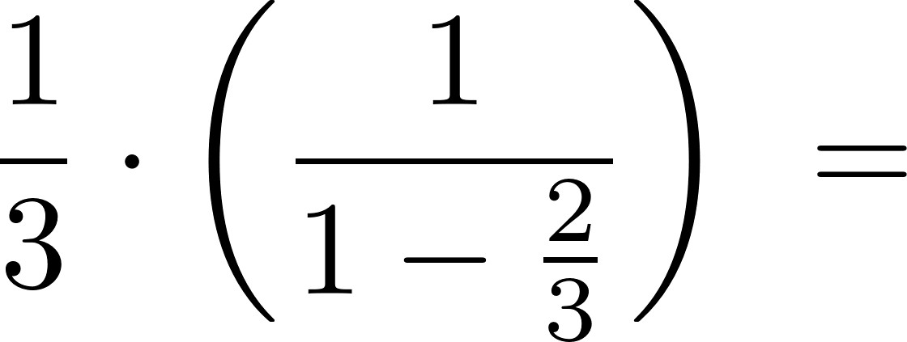
</figure>


<figure>
  
</figure>


<!-- source: page 73 -->

```pseudo
State-of-art: Space-Filling Curves
```
- LEBESGUE’s space filling curve (cont’d)
  - nested intervals of C to be represented by ternary numbers of the form
03.w1w2w3... with wi ∈ {0, 1, 2}

03.0                 03.1                  03.2                  (13.0)

  - example: parameter T = 2/9

[03.0,0
.02,03.1]
3.1]
.0201]
.021]

  - since the middle third (indicated by ‘1’) is repeatedly deleted, the CANTOR
set only contains ternary numbers that consist of ‘0’ and ‘2’


<!-- source: page 74 -->

```pseudo
State-of-art: Space-Filling Curves
```
- LEBESGUE’s space filling curve (cont’d)
  - when mapping C to [0,1]2 according to

03.w1w2w3w4...         02.x2x4...
f:                     ->
2               02.y1y3...
and connecting the image points via linear interpolation, this results to
LEBESGUE’s SFC also referred to as ‘Z-order’


<!-- source: page 75 -->

```pseudo
State-of-art: Space-Filling Curves
```
- LEBESGUE’s space filling curve (cont’d)
  - Z-ordering is well-known from quadtrees / octrees when linearising a tree
by a depth-first traversal (=> lexicographic or MORTON index)
  - for load distribution inverse function f -1 : [0,1]D -> [0,1] necessary
  - bitwise interleaving of coordinate values (x, y) leads to Z-value

7   42 43 46 47 58 59 62 63
6   40 41 44 45 56 57 60 61
x = 6 -> 1102
5   34 35 38 39 50 51 54 55
y = 4 -> 1002                        4   32 33 36 37 48 49 52 53
3   10 11 14 15 26 27 30 31
1101002 -> 52 = Z                    2   8   9   12 13 24 25 28 29
1   2   3   6   7   18 19 22 23
=> simple conversion (x,y) ↔ Z
0   0   1   4   5   16 17 20 21
0   1   2   3   4   5   6   7


<!-- source: page 76 -->

```pseudo
State-of-art: Space-Filling Curves
```
- applications
  - sequentialisation of multidimensional data to 1D while preserving locality
    - data are ‘stringed’ sequentially like pearls
    - neighbouring points in image space [0,1]D are neighbouring points in
unit interval [0,1]
  - important applications such as
    - efficient multidimensional range searches in databases (e.g. Oracle)
    - multi-particle or N-body problems
    - adaptive grid refinement for partial differential equations
    - dynamic load balancing


<!-- source: page 77 -->

```pseudo
State-of-art: Space-Filling Curves
```
- load distribution / balancing
  - assign some iteration of SFC to points in nD-space
  - linearise data according to SFC
  - simple partitioning of data (preserving locality) to processors possible

A               F          G E    C H        I B   A   D    F

B
D       J
I

E                                                                       J
G E    C     H    I B       A   D        F
H
G                            P1             P2             P3
C

  - what to do in case of AMR or data (‘J’) newly inserted into image space?


<!-- source: page 78 -->

- overview

  - terms and definitions ✓
  - process interaction on UMA / NUMA architectures ✓
  - process interaction on NORMA architectures ✓
  - putting everything together: an example ✓
  - load balancing ✓
  - state-of-art: space-filling curves ✓

# Teil 04 (Update 23.04.26)

Source extraction: [../.extracted/slides/04-teil-04-update-23-04-26.mdx](../.extracted/slides/04-teil-04-update-23-04-26.mdx)

<!-- source: page 1 -->

## High-Performance Computing
(CDS-110)

Prof. Dr. rer. nat. habil. Ralf-Peter Mundani
DAViS


<figure>
  
</figure>


<!-- source: page 2 -->

- overview

  - message passing paradigm
  - collective communication
  - programming with MPI

At some point...
we must have faith in the intelligence of the end user.
—Anonymous


<!-- source: page 3 -->

## Course Goals
- upon successful completion of this course, you should be able to
  - appreciate and understand
    - principles of message-coupled systems
    - different communication concepts
    - synchronisation pitfalls arising from message exchange
  - develop an ability to apply MPI in order to write parallel code


<figure>
  
</figure>


<!-- source: page 4 -->

## Message Passing Paradigm
- message passing
  - very general principle, applicable to nearly all types of parallel
architectures (UMA, NUMA, and NORMA)
  - standard programming paradigm for supercomputers and clusters
  - typical (machine-independent) standards: MPI, PVM

- underlying principle
  - parallel program with P processes (with different address space)
  - communication takes place via exchange of messages
  - message exchange via library functions that are available for standard
languages such as C/C++ or Fortran and Python ☺


<!-- source: page 5 -->

## Message Passing Paradigm
- user’s view
  - library functions are the only interface to communication system
  - message exchange via send and receive

process

process                                               process

A
send( )       communication system

process                 A

process                                             process

receive( )


<!-- source: page 6 -->

## Message Passing Paradigm
- types of communication
  - point-to-point a.k.a. P2P (1:1-communication)
  - two processes involved: sender and receiver
  - way of sending interacts with execution of sub-program
    - synchronous: send is provided information about completion of
message transfer, i.e. communication does not complete until message
has been received
    - asynchronous: send only knows when message has left;
communication completes as soon as message is on its way
    - blocking: operations only finish when communication has completed
    - non-blocking: operations return straight away and allow program to
continue; at some later point in time program can test for completion


<!-- source: page 7 -->

## Message Passing Paradigm
- types of communication (cont’d)
  - collective (1:M-communication, M <= P, P number of processes)
  - all (some) processes involved
  - types of collective communication
    - barrier: synchronises processes (no data exchange), i.e. each process is
blocked until all have called barrier routine
    - broadcast: one process sends same message to all (several)
destinations with a single operation
    - scatter / gather: one process provides data items to / takes
data items from all (several) processes
    - reduce: one process takes data items from all (several) processes and
reduces them to a single data item; typical reduce operations: sum,
product, minimum / maximum, ...


<!-- source: page 8 -->

## Message Passing Paradigm
- order of transmission
  - problem: there is no global time in a distributed system
  - hence, wrong send-receive assignments may occur (in case of more than
two processes and the usage of wildcards)

1           2          3                1           2           3

send                                    send
to P3                                   to P3
send                              or    send
to P3                recv buf1          to P3
from any                                 recv buf1
from any

recv buf2                                recv buf2
from any                                 from any


<!-- source: page 9 -->

- overview

  - message passing paradigm ✓
  - collective communication
  - programming with MPI


<!-- source: page 10 -->

## Collective Communication
- broadcast
  - sends same message to all participating processes

A

A                                         A

A

A

sender   receiver


<!-- source: page 11 -->

## Collective Communication
- scatter
  - data from one process are distributed among all processes

A

A   B   C   D                            B

C

D

sender   receiver


<!-- source: page 12 -->

## Collective Communication
- gather
  - data from all processes are collected by a single process

A

B                                          A     B   C   D

C

D

sender            receiver


<!-- source: page 13 -->

## Collective Communication
- gather-to-all
  - all processes collect distributed data from all others

A                                             A   B    C   D

B                                             A   B    C   D

C                                             A   B    C   D

D                                             A   B    C   D

sender           receiver


<!-- source: page 14 -->

## Collective Communication
- all-to-all
  - data from all processes are distributed among all others
  - example: any ideas?

A   B   C   D                             A     E   I   M

E   F   G   H                             B     F   J   N

I   J   K   L                             C     G   K   O

M    N   O   P                             D     H   L   P

sender            receiver


<!-- source: page 15 -->

## Collective Communication
- all-to-all (cont’d)
  - also referred to as total exchange
  - example: transposition of matrix A (stored row-wise in memory)
      - total exchange of blocks Bij
      - afterwards, each process computes transposition of its blocks

( B11    B12   B13   B14 )           ( B11    B21   B31   B41 )
|                        |           |                        |
| B21    B22   B23   B24 |
->      | B12    B22   B32   B42 |
A=|                                 A =|
T
B     B32   B33   B34 |              B     B23   B33   B43 |
|| 31                    ||          || 13                    ||
=> B41   B42   B43   B44 )            => B14   B24   B34   B44 )


<figure>
  
</figure>


<!-- source: page 16 -->

## Collective Communication
- reduce
  - data from all processes are reduced to single data item(s)
  - example: global minimum / maximum / sum / product / ...

A

A
-
B                      B                 R
-
C
-
D
C

D

sender   receiver


<!-- source: page 17 -->

## Collective Communication
- all-reduce
  - all processes are provided reduced data item(s)

A                                      R

A
-
B                      B               R
-
C
-
D
C                                      R

D                                       R

sender   receiver


<!-- source: page 18 -->

## Collective Communication
- reduce-scatter
  - data from all processes are reduced and distributed

A    B   C   D                            R
```pseudo
(R <- A - E - I - M)
```
B
-
E   F   G   H          F                   S
-
J
-
N
I   J   K   L                            T
```pseudo
(T <- C - G - K - O)
```

M    N   O   P                            U
```pseudo
(U <- D - H - L - P)
```

sender            receiver


<!-- source: page 19 -->

## Collective Communication
- parallel prefix
  - processes receive partial result of reduce operation
  - example: matrix multiplication in quantum chemistry

A                                         R
```pseudo
(R <- A)
```
A
-
B                      B                  S
-
```pseudo
C                (S <- A - B)
```
-
D
C                                         T
```pseudo
(T <- A - B - C)
```

D                                         U
```pseudo
(U <- A - B - C - D)
```

sender           receiver


<!-- source: page 20 -->

## Collective Communication
- parallel prefix (cont’d)
  - problem: finding all (partial) results within O(log N) steps
  - implementation: two stages (up and down) using binary trees
  - example: computing partial sums of numbers 1 to 8

36                                                              36

10                                 26                             10                             36

3                7                11                15            3                10              21              36

1        2        3       4        5        6        7        8   1        3        6        10    15        21    28        36

ascend:                                                           descend (level-wise):
valP <- valC1 + valC2                                              even index ( ): valC <- valP
```pseudo
odd index ( ): valC <- valC + valP-1
```


<!-- source: page 21 -->

- overview

  - message passing paradigm ✓
  - collective communication ✓
  - programming with MPI


<!-- source: page 22 -->

## Programming with MPI
- brief overview
  - de facto standard for writing parallel programs
  - both free available and vendor-supplied implementations
  - supports most interconnects
  - available for C/C++, Fortran 77/90, and Python (module mpi4py)
  - target platforms: SMPs, clusters, massively parallel processors
  - useful links: http://www.mpi-forum.org

- running MPI programs
  - here, running program 'heat_equation.py' with 20 processes in a shell
mpiexec -n 20 python heat_equation.py


<!-- source: page 23 -->

## Programming with MPI
- types of communication
  - communication hierarchy

MPI communication

point-to-point                                    collective

blocking                    non-blocking               blocking    non-blocking
(> MPI-2)

synchr.      asynchr.        synchr.       asynchr.


<!-- source: page 24 -->

## Programming with MPI
- some basics
  - processes can only communicate if they share a communicator
    - predefined / standard communicator MPI.COMM_WORLD
      - processes consecutively numbered from 0 (referred to as rank)
      - rank identifies each process within communicator
      - size identifies number of all processes within communicator
    - why creating a new communicator
      - restrict collective communication to subset of processes
      - creating a virtual topology (e.g. torus)
      - ...
```pseudo
MPI.MY_COMM                         5       6
```
2
9
1           0
8
3               7
```pseudo
MPI.COMM_WORLD
```
4


<!-- source: page 25 -->

## Programming with MPI
- some basics (cont’d)
  - determination of rank
comm = MPI.COMM_WORLD
rank = comm.Get_rank()
  - determination of size
comm = MPI.COMM_WORLD
size = comm.Get_size()
  - remarks
    - rank ∈ [0, size-1]
    - size has to be specified at program start


<!-- source: page 26 -->

## Programming with MPI
- some basics (cont’d)
  - example 1: Hello World ☺
from mpi4py import MPI
comm = MPI.COMM_WORLD
rank = comm.Get_rank()
size = comm.Get_size()
```pseudo
if rank == 0:
```
print(f'{size} processes running...')
```pseudo
else:
```
print(f'slave {rank}: Hello world!’)

  - run with n = {10, 20, 50} processes
    - what’s the output…?


<figure>
  
</figure>


<!-- source: page 27 -->

## Programming with MPI
- some basics (cont’d)

MPI data type           Python equivalent
```pseudo
MPI.CHAR                  signed char
MPI.SHORT                 signed short int
MPI.INT                   signed int
MPI.LONG                  signed long int
MPI.UNSIGNED_CHAR         unsigned char
MPI.UNSIGNED_SHORT        unsigned short int
MPI.UNSIGNED              unsigned int
MPI.UNSIGNED_LONG         unsigned long int
MPI.FLOAT                 float
MPI.DOUBLE                double
MPI.LONG_DOUBLE           long double
MPI.PACKED                for matching any other type
```


<!-- source: page 28 -->

## Programming with MPI
- point-to-point communication (P2P)
  - different communication modes
    - synchronous send: completes when receive has been started
    - buffered send: always completes (even if receive has not been
started); conforms to an asynchronous send
    - standard send: either buffered or unbuffered
    - ready send: always completes (even if receive has not been started)
    - receive: completes when a message has arrived
  - all modes exist in both blocking and non-blocking form
    - blocking: return from routine implies completion of message passing
    - non-blocking: modes have to be tested (manually) for completion
  - all modes exist for generic (pickle-based) Python and buffer-like objects
    - use lower-case names (e.g. MPI.send) for first and upper-case names
(e.g. MPI.Send) for latter ones


<!-- source: page 29 -->

## Programming with MPI
- blocking P2P communication
  - neither sender nor receiver are able to continue the program execution
during the message passing stage
  - sending a message (generic)
comm.Send(buf, dest, tag=0)
  - receiving a message
comm.Recv(buf, source=MPI.ANY_SOURCE, tag=MPI.ANY_TAG, status=None)
  - tag: marker to distinguish between different sorts of messages (i.e.
communication context)
  - status: sender and tag can be queried for received messages


<!-- source: page 30 -->

## Programming with MPI
- blocking P2P communication (cont’d)
  - synchronous send: comm.Ssend( arguments )
    - start of data reception finishes send routine, hence, sending process is
idle until receiving process catches up
    - non-local operation: successful completion depends on the occurrence
of a matching receive

  - buffered send: comm.Bsend( arguments )
    - message is copied to send buffer for later transmission
    - user must attach buffer space first (MPI.Attach_buffer()); size should
be at least the sum of all outstanding sends
    - only one buffer can be attached per process at a time
    - buffered send guarantees to complete immediately => local operation:
independent from occurrence of matching receive
    - non-blocking version has no advantage over blocking version


<!-- source: page 31 -->

## Programming with MPI
- blocking P2P communication (cont’d)
  - standard send: comm.Send( arguments )
    - MPI decides (e.g. depending on message size) to send
      - buffered: completes immediately
      - unbuffered: completes when matching receive has been posted
    - completion might depend on occurrence of matching receive

  - ready send: comm.Rsend( arguments )
    - completes immediately
    - matching receive must have already been posted, otherwise outcome
is undefined
    - performance may be improved by avoiding handshaking and buffering
between sender and receiver
    - non-blocking version has no advantage over blocking version


<!-- source: page 32 -->

## Programming with MPI
- blocking P2P communication (cont’d)
  - receive: comm.Recv( arguments )
    - completes when message has arrived
    - usage of wildcards possible
  - general rule: messages from one sender (to one receiver) do not pass each
other, message from different senders (to one receiver) might arrive in
different order than being sent

2       1


<!-- source: page 33 -->

## Programming with MPI
- blocking P2P communication (cont’d)
  - example 2: ping-pong between two processes with ranks 0, 1
from mpi4py import MPI
comm = MPI.COMM_WORLD
rank = comm.Get_rank()
```pseudo
if rank == 0:
```
comm.Send(rank, dest=1, tag=0)
comm.Recv(buf, source=1, tag=0)
elif rank ==1:
comm.Recv(buf, source=0, tag=0)
comm.Send(rank, dest=0, tag=0)
```pseudo
else:
```
print('ERROR: rank does not exist’)

  - run with n = {2, 3} processes
    - what do you observe…?


<figure>
  
</figure>


<!-- source: page 34 -->

## Programming with MPI
- blocking P2P communication (cont’d)
  - example 3: buffered send of two consecutive messages
import numpy as np
from mpi4py import MPI

bufsize = 2*500 + 2*MPI.BSEND_OVERHEAD
buffer = np.empty(bufsize, dtype=np.float32)
```pseudo
MPI.Attach_buffer(buffer)
```

comm = MPI.COMM_WORLD
comm.Bsend(msg1, dest=..., tag=...)
comm.Bsend(msg2, dest=..., tag=...)

```pseudo
MPI.Detach_buffer()
```

  - homework: finish code and run with n = 2 processes


<figure>
  
</figure>


<!-- source: page 35 -->

## Programming with MPI
- blocking P2P communication (cont’d)
  - communication in a ring – does this work?
from mpi4py import MPI
comm = MPI.COMM_WORLD
rank = comm.Get_rank()
size = comm.Get_size()
next = (rank+1)%size
prev = (rank-1+size)%size

comm.Recv(buf, source=prev, tag=0)
comm.Send(rank, dest=next, tag=0)


<!-- source: page 36 -->

## Programming with MPI
- non-blocking P2P communication
  - problem: blocking communication does not return until communication
has been completed => risk of idly waiting and/or deadlocks
  - hence, usage of non-blocking communication
  - communication is separated into three phases
1) initiate non-blocking communication
2) do some work (e.g. involving other communications)
3) wait for non-blocking communication to complete
  - non-blocking routines have identical arguments to blocking counterparts,
except for an extra argument request
  - request handle is important for testing if communication has been
completed


<!-- source: page 37 -->

## Programming with MPI
- non-blocking P2P communication (cont’d)
  - sending a message (generic)
request = comm.Isend(buf, dest, tag=0)
  - receiving a message
request = comm.Irecv(buf, source=MPI.ANY_SOURCE, tag=MPI.ANY_TAG)
  - communication modes
    - synchronous send: comm.Issend( arguments )
    - buffered send: comm.Ibsend( arguments )
    - standard send: comm.Isend( arguments )
    - ready send: comm.Irsend( arguments )


<!-- source: page 38 -->

## Programming with MPI
- non-blocking P2P communication (cont’d)
  - testing communication for completion is essential before
    - making use of the transferred data
    - re-using the communication buffer
  - tests for completion are available in two different types
    - wait: blocks until communication has been completed
```pseudo
MPI.Request.Wait(status=None)
```
    - test: returns TRUE or FALSE depending whether or not communication
has been completed; it does not block
```pseudo
MPI.Request.Test(status=None)
```
  - what’s a comm.Isend( ) with an immediate MPI.Request.Wait( ) ...?


<!-- source: page 39 -->

## Programming with MPI
- non-blocking P2P communication (cont’d)
  - waiting / testing for completion of multiple communications

```pseudo
MPI.Request.Waitall( )    blocks until all have been completed
MPI.Request.Testall( )    TRUE if all, otherwise FALSE
```
blocks until one or more have been completed,
```pseudo
MPI.Request.Waitany( )
```
returns (arbitrary) index
```pseudo
MPI.Request.Testany( )    returns flag and (arbitrary) index
```
blocks until one ore more have been completed,
```pseudo
MPI.Request.Waitsome( )
```
returns index of all completed ones
```pseudo
MPI.Request.Testsome( )   returns flag and index of all completed ones
```

  - blocking and non-blocking communication can be combined


<!-- source: page 40 -->

## Programming with MPI
- non-blocking P2P communication (cont’d)
  - example 4: communication in a ring – again
from mpi4py import MPI
comm = MPI.COMM_WORLD
rank = comm.Get_rank()
size = comm.Get_size()
next = (rank+1)%size
prev = (rank-1+size)%size

comm.Irecv(buf, source=prev, tag=0)
comm.Send(rank, dest=next, tag=0)
```pseudo
MPI.Request.Wait()
```

  - finish code and run for n = {5, 10, 15} processes


<figure>
  
</figure>


<!-- source: page 41 -->

## Programming with MPI
- collective communication
  - characteristics
    - all processes (within communicator) communicate
    - synchronisation may or may not occur
    - no tags allowed
    - all receive buffers must be exactly of the same size


<!-- source: page 42 -->

## Programming with MPI
- collective communication (cont’d)
  - barrier synchronisation
    - blocks calling process until all other processes have reached barrier
    - hence, comm.Barrier( ) always synchronises
comm.Barrier( )
  - broadcast
    - has a specified root process
    - every process receives one copy of the message from root
    - all processes must specify the same root
comm.Bcast(buf, root=0)


<!-- source: page 43 -->

## Programming with MPI
- collective communication (cont’d)
  - gather and scatter
    - have a specified root process
    - all processes must specify the same root
    - send and receive details must be specified as arguments
comm.Gather(sendbuf, recvbuf, root=0)
comm.Scatter(sendbuf, recvbuf, root=0)
  - variants
    - comm.Allgather( ): all processes collect data from all others
    - comm.Alltoall( ): total exchange


<!-- source: page 44 -->

## Programming with MPI
- collective communication (cont’d)
  - global reduction
    - has a specified root process
    - all processes must specify the same root
    - all processes must specify the same operation
    - reduction operations can be predefined or user-defined
    - root process ends up with an array of results
comm.Reduce(sendbuf, recvbuf, op=MPI.SUM, root=0)
  - variants (no specified root)
    - comm.Allreduce( ): all processes receive result
    - comm.Reduce_scatter( ): resulting vector is distributed among all
    - comm.Scan( ): processes receive partial result (=> parallel prefix)


<!-- source: page 45 -->

## Programming with MPI
- collective communication (cont’d)
  - some reduction operations

operator                             result
```pseudo
MPI.MAX             find global maximum
MPI.MIN             find global minimum
MPI.SUM             calculate global sum
MPI.PROD            calculate global product
MPI.LAND            make logical AND
MPI.LOR             make logical OR
MPI.LXOR            make logical XOR
MPI.MAXLOC          find global minimum and its position (i.e. rank)
MPI.MINLOC          find global maximum and its position (i.e. rank)
```


<!-- source: page 46 -->

## Programming with MPI
- non-blocking P2P communication (cont’d)
  - example 5: parallel computation of π
    - Berechnung durch Integration

->

comm = MPI.COMM_WORLD
rank = comm.Get_rank()
size = comm.Get_size()
N = 10**6
h = 1./N; sum = 0.
```pseudo
for i in range(rank,N,size):
```
x = h*(i + 0.5)
sum += 4./(1. + x**2)
local_pi = h*sum
comm.Reduce(local_pi, pi, op=MPI.SUM, root=0)


<figure>
  
</figure>


<figure>
  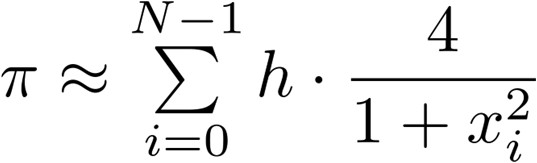
</figure>


<figure>
  
</figure>


<!-- source: page 47 -->

## Programming with MPI
- outlook: bandwidth stress test
  - compute average bandwidth between two processes
from mpi4py import MPI
comm = MPI.COMM_WORLD
rank = comm.Get_rank()
```pseudo
for i in range(1,MAX):
buf = np.ones(2**i)    <- default dtype: np.float64
```
time = MPI.Wtime()
```pseudo
for k in range(10):
```
send buf from rank 0 to rank 1
bps = (8*2**i/(MPI.Wtime()-time)/10.)/10**9

```pseudo
if rank == 0:
```
print("%02d => %.3f GBps" % (i, bps))


<figure>
  
</figure>


<!-- source: page 48 -->

## Programming with MPI
- outlook: parallel Jacobi solver (to be done later)
  - using DD for parallel approach (here size = 4)
  - solving Δu = f for 512 x 512 grid size and initial solution u = 0

  - result (best of three): 73s (par) vs. 210s (ser) -> Sp(4) = 2.87, Eff(4) = 0.719


<figure>
  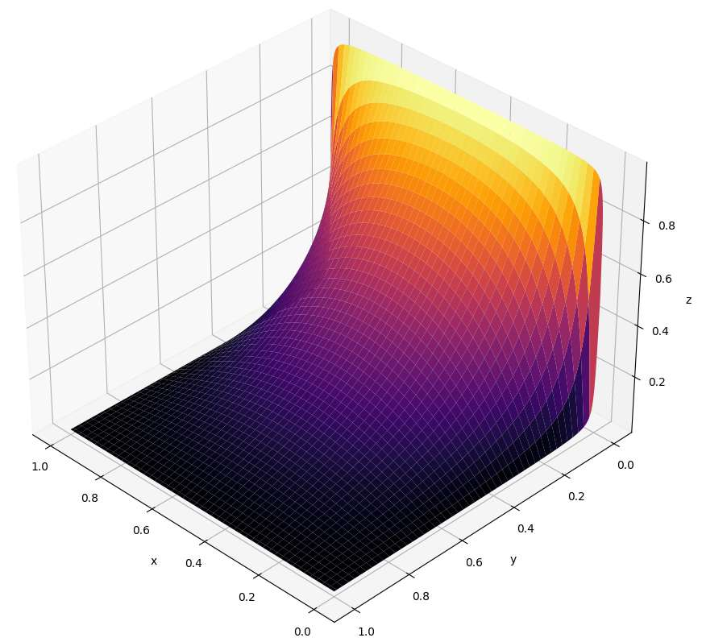
</figure>


<!-- source: page 49 -->

## Programming with MPI
- example: sieve of ERATOSTHENES 1
  - given: set of integer numbers A ranging from 2 to N
  - algorithm
1) find minimum value aMIN of A => next prime number
2) delete all multiples of aMIN within A
3) continue with step 1) until aMIN >
4) hence, A contains only prime numbers
  - parallel approach
      - distribute A among all processes (=> data parallelism)
      - find local minimum and compute global minimum
      - delete all multiples of global minimum in parallel

1 Greek mathematician, born 276 BC in Cyrene (in modern-day Lybia), died 194 BC in Alexandria


<!-- source: page 50 -->

## Programming with MPI
- example: sieve of ERATOSTHENES (cont’d)
  - naïve approach (array A contains N-1 numbers)
import numpy as np
from mpi4py import MPI

comm = MPI.COMM_WORLD
size = comm.Get_size()

#divide A into size parts Ai
```pseudo
while min <= np.sqrt(N):
```
#find local minimum mini from Ai
comm.Allreduce(mini, min, op=MPI.MIN)
#delete all multiples of min from Ai

  - homework: finish code and run for different numbers of N (e.g. 107 or 108)
and various numbers of processes
    - what do you observe…?


<figure>
  
</figure>


<!-- source: page 51 -->

- overview

  - message passing paradigm ✓
  - collective communication ✓
  - programming with MPI ✓

# Teil 05

Source extraction: [../.extracted/slides/05-teil-05.mdx](../.extracted/slides/05-teil-05.mdx)

<!-- source: page 1 -->

## High-Performance Computing
(CDS-110)

Prof. Dr. rer. nat. habil. Ralf-Peter Mundani
DAViS


<figure>
  
</figure>


<!-- source: page 2 -->

- overview

  - cache coherence
  - memory consistency
  - dependency analysis

Technology is dominated by two types of people:
those who understand what they do not manage,
and those who manage what they do not understand.
—Archibald Putt


<!-- source: page 3 -->

## Course Goals
- upon successful completion of this course, you should be able to
  - appreciate and understand
    - basics of cache coherence strategies
    - different memory consistency models
  - develop an ability to analyse nested loops and identify loop dependencies
  - apply multithreading strategies in order to write concurrent code


<figure>
  
</figure>


<!-- source: page 4 -->

## Cache Coherence
- reminder: memory hierarchy
  - memory hierarchy
    - exploitation of program characteristics such as locality
    - compromise between costs and performance
    - components with different speeds and capacities

single access

access speed
register

cache               block access

main memory                 page access

background memory

capacity
serial access
archive memory


<!-- source: page 5 -->

## Cache Coherence
- reminder: cache
  - cache memory
    - fast access buffer between main memory and processor
    - provides copies of current (main) memory content for fast access
during program execution

  - cache management
      - tries to provide always those data that processor needs for the next
computation step
      - due to small capacity certain strategies for load and update operations
of cache content necessary

cache memory (m << n)
cache-line Li i = 0, ..., m-1
0                                          n-1
main memory
block Bj j = 0, ..., n-1       mapping Bj to Li
0                m-1


<!-- source: page 6 -->

## Cache Coherence
- reminder: cache (cont’d)
  - for any memory access the cache controller checks if
(1) the respective memory content has a copy stored in cache
(2) this cache entry is labelled as valid
  - check-up leads to a
      - cache hit: (1) and (2) are fulfilled => access served by cache
      - cache miss: (1) and / or (2) are not fulfilled
      - read miss
      - data is read from memory and a copy stored in cache
      - cache entry is labelled as valid
      - write miss: update strategy decides whether
      - the respective block is loaded (from memory) into cache
and becomes updated due to write access
      - only memory is updated and cache stays unmodified


<!-- source: page 7 -->

## Cache Coherence
- definitions
  - processors with local cache that have independent access to a shared
memory cause validity problems, i.e. several copies of the same memory
block exist that contain different values
  - cache management is called
    - coherent: a read access always provides a memory block’s value from
its last write access
    - consistent: all copies of a memory block in main memory and local
caches are identical (i.e. coherence implicitly given)
  - inconsistencies between cache and main memory occur when updates are
only performed in cache but not in main memory (so called copy-back or
write-back cache policy, in contrast to write-through cache policy)
  - drawback: consistency is very expensive


<!-- source: page 8 -->

## Cache Coherence
- definitions (cont’d)
  - hence, inconsistencies (to some extent) can be acceptable if at least cache
coherence is assured (e.g. temporary variables)
    - write-update protocol
      - an update of a copy in one cache requires also the update of all
other copies in other caches
      - update can be delayed, at the latest with next access
    - write-invalidate protocol
      - exclusive write access of a processor to shared data that should be
updated has to be assured
      - before the update of a copy in one cache all other copies in other
caches are labelled as invalid
  - in general, write-invalidate protocol together with copy-back cache policy
used for SMP systems


<!-- source: page 9 -->

## Cache Coherence
- definitions (cont’d)
  - example: write-invalidate protocol / write-through cache policy

1, 3                                                 2
P1 :              P2 :             P3 :

A=4
5               B=7             A= 4
☠

network / bus
4

1.   P1 gets exclusive access for A
A=4
5         2.   invalidation of other copies of A
B=7         3.   P1 writes to A
4.   update of A in main memory


<!-- source: page 10 -->

## Cache Coherence
- bus snooping
  - processors with local cache are attached to a shared main memory via a
bus (e.g. SMP system)
  - each processor ‘listens’ to all addresses sent over the bus by other
processors and compares them to its own cache-lines
  - in case one cache-line matches this address, bus logic executes the
following steps dependent from the cache-line’s state
    - unmodified cache-line
      - in case of a write access the cache-line becomes invalid
    - modified cache-line
      - bus logic interrupts the transaction and writes the modified
cache-line to the main memory
      - afterwards, the initial transaction is executed again
  - MESI protocol frequently used with bus snooping


<!-- source: page 11 -->

## Cache Coherence
- MESI protocol
  - cache coherence protocol (write-invalidate) for bus snooping
  - each cache-line is assigned one of the following states
    - exclusive modified (M): cache-line is the only copy in any of the caches
and was modified due to a write access
    - exclusive unmodified (E): cache-line is the only copy in any of the
caches and was transferred for read access
    - shared unmodified (S): copies of this cache-line reside in more than
one cache and were transferred for read access
    - invalid (I): cache-line is invalid
  - for write-through cache policy only the states shared unmodified and
invalid are relevant


<!-- source: page 12 -->

## Cache Coherence
- MESI protocol (cont’d)
  - state: invalid
    - due to read / write access a valid copy is loaded into cache
    - other processes (snoop hit on a read) send signal SHARED if they have
a valid copy
    - read miss: read miss shared (RMS) or read miss exclusive (RME) leads
to state transition to S or E, resp.
    - write miss (WM): state transition to M

I                       S
RMS

WM

M                        E


<!-- source: page 13 -->

## Cache Coherence
- MESI protocol (cont’d)
  - state: shared unmodified
    - read hit (RH) / snoop hit on a read (SHR): state is unchanged =>
process sends signal SHARED in case of SHR
    - write hit (WH): state transition to M
    - snoop hit on a write (SHW): state transition to I

RH / SHR
SHW
I                       S

M                       E


<!-- source: page 14 -->

## Cache Coherence
- MESI protocol (cont’d)
  - state: exclusive unmodified
    - RH: state is unchanged => no bus usage necessary
    - SHR: process sends signal SHARED => state transition to S
    - SHW: state transition to I
    - WH: state transition to M => no bus usage necessary

I                       S

SHR

M                       E
WH                  RH


<!-- source: page 15 -->

## Cache Coherence
- MESI protocol (cont’d)
  - state: exclusive modified
    - RH / WH: state is unchanged => no bus usage necessary
    - SHR / SHW: other process is notified via signal RETRY that a copy-back
of this cache-line to main memory is necessary => state transition to I
or S in case of SHW or SHR, resp.

I                   S

SHW

M                       E
RH / WH


<!-- source: page 16 -->

## Cache Coherence
- MESI protocol (cont’d)
  - putting it all together

SHW          RH / SHR
I              S
RMS

RH: read hit
SHW       WM         SHR               RMS: read miss shared
RME: read miss exclusive
WH: write hit
M                  E
WH                      WM: write miss
RH / WH                              RH
SHR: snoop hit on a read
SHW: snoop hit on a write


<!-- source: page 17 -->

## Cache Coherence
- MESI protocol (cont’d)
  - example: SMP system with two processors
    - subsequent read / write access to same cache-line

P1 wants to read cache-line…

P1 :                                    P2 :
EI       A=4
☠                             I       A=☠

    - read miss                           -   snoop hit on a read
    - load valid copy from main
memory
    - state transition I -> E


<!-- source: page 18 -->

## Cache Coherence
- MESI protocol (cont’d)
  - example: SMP system with two processors
    - subsequent read / write access to same cache-line

P2 wants to read cache-line…

P1 :                                    P2 :
ES        A=4                           SI       A= 4
☠

    - snoop hit on a read                 -   read miss
    - send signal SHARED                  -   load valid copy from main
    - state transition E -> S                  memory
      - state transition I -> S


<!-- source: page 19 -->

## Cache Coherence
- MESI protocol (cont’d)
  - example: SMP system with two processors
    - subsequent read / write access to same cache-line

P1 wants to write cache-line…

P1 :                                     P2 :
M
S         A=4
7                            SI        A= 4
☠

    - write hit                           -   snoop hit on a write
    - update cache-line                   -   invalidate cache-line
    - state transition S -> M                  (i.e. state transition S -> I)


<!-- source: page 20 -->

## Cache Coherence
- MESI protocol (cont’d)
  - example: SMP system with two processors
    - subsequent read / write access to same cache-line

P2 wants to read cache-line…

P1 :                                      P2 :
M
ES       A=7                            SI        A= 7
☠

    - snoop hit on a read                 -   read miss
    - send signal RETRY                   -   STOP
    - copy back cache-line and
```pseudo
state transition M -> E
```
    - snoop hit on a read                 -   read miss
    - send signal SHARED                  -   load valid copy from main
    - state transition E -> S                  memory
      - state transition I -> S


<!-- source: page 21 -->

- overview

  - cache coherence ✓
  - memory consistency
  - dependency analysis


<!-- source: page 22 -->

## Memory Consistency
- motivation
  - data transfer between cache and registers managed via load-store-unit
(LSU) of the processor => cache coherence takes effect at the time when
LSU performs read / write access to cache memory
  - in general, modern microprocessors reorder load and store operations for
performance improvement
  - example
    - load operations are executed immediately
    - store operations are internally buffered (FIFO)

address               register value

write
load                              buffer
LSU


<!-- source: page 23 -->

## Memory Consistency
- motivation (cont’d)
  - hence, a subsequent load operation can pass a waiting store operation in
case they have different addresses (to avoid that a load operation reads
obsolete values from cache while current values (still to be written) reside
in the write buffer)
  - further improvement: non-blocking cache / lock-up free cache
    - in case of a cache miss, execution can be continued with subsequent
operations (accessing different cache-lines) without waiting for the
blocked operation to be finished
  - consequence of both strategies: modified order of execution
  - nevertheless, due to local address comparison of affected values there is
no impact on computed result of a program on the monoprocessor system
  - what happens on the multiprocessor systems?


<!-- source: page 24 -->

## Memory Consistency
- motivation (cont’d)
  - even cache coherence is assured for SMP systems, reordering of
operations and / or non-blocking caches might lead to unwanted results
during program execution
  - example (DEKKER’s algorithm)
```pseudo
x <- 0; y <- 0
```
process p1:                       process p2:
```pseudo
x<-1                               y<-1
if y = 0 then do A1 fi            if x = 0 then do A2 fi
```

  - four different possibilities
    - A1 will be executed, A2 will not be executed
    - A2 will be executed, A1 will not be executed
    - A1 and A2 will not be executed
    - A1 and A2 will be executed (unexpected from programmer)


<!-- source: page 25 -->

## Memory Consistency
- motivation (cont’d)
  - intuitively, we would expect that
    - updates of variables take effect everywhere at the same time
    - temporal order of memory accesses is retained
  - but in reality
    - we would need a global clock with very high precision
    - write operations are not atomic (i.e. new values don’t take effect
everywhere at the same time)
    - write accesses have different latencies due to network => race
between single memory accesses (e.g. local / remote read operations
subsequent to a write operation might get different values)
  - hence, further thoughts about memory consistency are necessary


<!-- source: page 26 -->

## Memory Consistency
- notation
  - one line for each processor’s memory accesses
  - time proceeds from left to right
  - memory / synchronisation operations
    - R(x)val : read variable x, obtain value val
    - W(x)val : add value val to variable x
    - } : synchronisation point
    - AQ(L) : acquire lock L for entering critical section
    - RL(L) : release lock L for leaving critical section
  - all variables are assumed to be initialised to 0
  - example (≈ x = x + 1)
P1: R(x)0 W(x)1 R(x)1
---------------------->


<!-- source: page 27 -->

## Memory Consistency
- reminder: strict consistency
  - definition: any read on a data item x returns a value corresponding to the
result of the most recent write on x
  - main aspect is precise serialisation on all memory accesses
  - example: C) is not valid under strict consistency

P1: W(x)1                               P1:       W(x)1
A) ---------------------->              B) ---------------------->
P2:       R(x)1 R(x)1                   P2: R(x)0       R(x)1

P1: W(x)1
C) ---------------------->
P2:       R(x)0 R(x)1


<!-- source: page 28 -->

## Memory Consistency
- sequential consistency
  - slightly weaker model than strict consistency
  - definition by LAMPORT (1979)
“The result of any execution is the same as if the operations of all the processors were
executed [on a monoprocessor] in some sequential order, and the operations of each
individual processor appear in this sequence in the order specified by its program.”

  - that means
    - order of operations to be retained on individual processor
    - any overlap of orders of operations is acceptable as long as the same
overlap is visible on each processor
    - no global clock necessary
  - in other words => a correct sequentialisation of all accesses w/o change of
local ordering can found


<!-- source: page 29 -->

## Memory Consistency
- sequential consistency (cont’d)
  - example: D) is not valid under sequential consistency

P1: W(x)1 W(x)2                        P1:             W(x)1
A) ---------------------->             B) ---------------------->
P2:       R(x)0 R(x)2                  P2: R(x)0 R(x)1

P1: W(x)1                              P1: W(x)1
---------------------->                ---------------------->
P2:       R(x)1 R(x)2                  P2:       R(x)2 R(x)1
C) ---------------------->             D) ---------------------->
P3:       R(x)1 R(x)2                  P3:       R(x)1 R(x)2
---------------------->                ---------------------->
P4: W(x)2                              P4: W(x)2


<!-- source: page 30 -->

## Memory Consistency
- sequential consistency (cont’d)
  - consequences
    - sequential consistent memory is very easy to use but it also entails
very high cost / drawbacks due to
      - only an overlapping execution of sequential operations instead of
a complete parallel execution
      - strong limitations as reordering of operations / non-blocking
caches are forbidden
      - very inefficient in case of frequent write accesses
    - semantic too strong for most problems => weaker models necessary
that are reasonable to use and easy to implement
    - furthermore, sequential consistency assures correct order of memory
accesses but not correct access to shared data objects => still
synchronisation via programmer necessary


<!-- source: page 31 -->

## Memory Consistency
- sequential consistency (cont’d)
  - caution: cache coherence != sequential consistency
  - cache coherence only requires a locally consistent view, i. e.
    - access to different memory locations might be seen in different orders
    - access to the same memory location is globally seen in the same order
  - sequential consistency requires a globally consistent view


<!-- source: page 32 -->

## Memory Consistency
- causal consistency
  - weaker model than sequential consistency
  - definition by HUTTO and AHAMAD (1990)
“Writes that are potentially causally related must be seen by all processes in the same
order. Concurrent writes may be seen in a different order on different machines.”

  - hence, write w(t2) at time t2 is potentially dependent on write w(t1) at
time t1 (with t1 <= t2), when there is a read between these two writes which
may have influenced write w(t2) => if w(t2) causally depends on w(t1) then
only correct sequence is w(t1) -> w(t2)
  - implementing causal consistency requires keeping track of which
processes have seen which writes => construction and maintenance of a
dependence graph


<!-- source: page 33 -->

## Memory Consistency
- causal consistency (cont’d)
  - example: B) is not valid under causal consistency

P1: W(x)1             W(x)3
---------------------------------------------->
P2:       R(x)1 W(x)2
A) ---------------------------------------------->
P3:                         R(x)1 R(x)3 R(x)2
---------------------------------------------->
P4:                         R(x)1 R(x)2 R(x)3

P1: W(x)1
---------------------------------->
P2:       R(x)1 W(x)2
B) ---------------------------------->
P3:                   R(x)2 R(x)1
---------------------------------->
P4:                   R(x)1 R(x)2


<!-- source: page 34 -->

## Memory Consistency
- processor consistency
  - also referred to as PRAM (pipelined RAM) consistency
  - definition by GOODMAN (1989)
“A multiprocessor is said to be processor consistent if the result of any execution is the
same as if the operations of each individual processor appear in the sequential order
specified by its program.”

  - difference to sequential consistency
    - order of operations for all processors must not be uniform, i.e. write
accesses of two processors might be seen in a different sequence from
a third processor than from the previous ones
    - however, write accesses of one processor are seen by all others in the
order specified by its program
    - this better reflects the reality of networks due to latency


<!-- source: page 35 -->

## Memory Consistency
- processor consistency (cont’d)
  - example: B) is not valid under processor consistency

P1: W(x)1
---------------------------------------------->
P2:       R(x)1 W(x)2 W(x)3
A) ---------------------------------------------->
P3:                         R(x)2 R(x)1 R(x)3
---------------------------------------------->
P4:                         R(x)1 R(x)2 R(x)3

P1: W(x)1 W(x)2
B) ---------------------------->
P2:             R(x)2 R(x)1


<!-- source: page 36 -->

## Memory Consistency
- weak consistency
  - in general, access to shared data will be protected via mutual exclusion
(i.e. obtain access, manipulate data, relinquish access); other processes
don’t need to see intermediate values, they only need to see final values
  - classification of shared memory accesses (GHARACHORLOO)

shared

competing                  non-competing
(i.e. critical section)
synchronising           non-synchronising
(to be avoided)
acquire (lock)               release (unlock)


<!-- source: page 37 -->

## Memory Consistency
- weak consistency (cont’d)
  - conditions to be fulfilled for weak consistency
1) accesses to synchronisation variables (associated with a write
operation) are sequentially consistent
2) no access to a synchronisation variable is allowed to be performed
until all preceding write operations have completed everywhere
3) no read / write operation is allowed to be performed until all
preceding accesses to synchronisation variables have been
performed
  - hence, accesses to synchronisation variables are visible for all processes
in the same order (1)
  - all write operations have been completed everywhere (2)
  - all copies are up-to-date according to the synchronisation point (3)


<!-- source: page 38 -->

## Memory Consistency
- weak consistency (cont’d)
  - in weak consistent memory, modifications are not visible until a
synchronisation has been performed
  - a program with properly set synchronisation behaves the same as a
program without synchronisation on sequentially consistent memory
  - example: B) is not valid under weak consistency

P1: W(x)1 W(x)2       }
------------------------------------>
A) P2:             R(x)2 R(x)1 } R(x)2
------------------------------------>
P3:             R(x)1 R(x)2 } R(x)2

P1: W(x)1 W(x)2 }
B) ------------------------------>
P2:             R(x)1 } R(x)1


<!-- source: page 39 -->

## Memory Consistency
- release consistency
  - synchronisation does not tell if entering / leaving a critical section
  - hence, local changes need to be both propagated to all other processors
(sharing a copy) and all other changes need to be consolidated => too
much communication

  - release consistency helps to weaken the communication problem
  - idea: consider locks and propagate locked memory only if needed
1) before any read / write operation on shared data is performed, all
preceding acquires done by the process must have completed
successfully
2) before a release is allowed to be performed, all preceding read /
write operations done by the process must have been completed
3) acquire / release accesses are processor consistent


<!-- source: page 40 -->

## Memory Consistency
- release consistency (cont’d)
  - eager release consistency: all changes are propagated via the release
operation => still huge communication overhead
  - lazy release consistency: all local copies are updated via the acquire
operation => complex implementation but avoidance of redundant
communication
  - example: B) is not valid under release consistency

P1: AQ(L) W(x)1 W(x)2 RL(L)
---------------------------------------------------->
A) P2:                         AQ(L) R(x)2 RL(L)
---------------------------------------------------->
P3:                                           R(x)1

P1: AQ(L) W(x)1 W(x)2 RL(L)
B) ---------------------------------------------->
P2:                   R(x)1 AQ(L) R(x)1 RL(L)


<!-- source: page 41 -->

## Memory Consistency
- characteristics of different models

consistency                                         description

strict       absolute time ordering of all accesses matters

w/o synchronisation
all processes see all accesses in same order; nevertheless, accesses are
sequential
not ordered in time
causal       all processes see causally-related accesses in same order
all processes see writes from one process in the order they were used;
processor
writes from different processes may not always be seen in that order
only after a synchronisation is performed data can be counted on to be

w/ synch.
weak
consistent
release      data is made consistent when critical section is exited


<!-- source: page 42 -->

- overview

  - cache coherence ✓
  - memory consistency ✓
  - dependency analysis


<!-- source: page 43 -->

## Dependency Analysis
- types of dependencies
  - a program might have execution-order constraints between statements
(i.e. instructions) due to dependencies
  - hence, dependence analysis should determine whether or not it is safe to
reorder or parallelise these statements
  - topics to be addressed by dependence analysis
      - control dependencies
      - data dependencies
      - loop dependencies


<!-- source: page 44 -->

## Dependency Analysis
- control dependencies
  - definition: an instruction executes if the previous instruction evaluates in a
way that allows its execution
  - hence, a statement S2 is control dependent on S1 iff the execution of S2 is
conditionally guarded by S1
  - example
1: if u > 2 then           // branch: if u <= 2 goto 3
```pseudo
2:    u<-u-z
```
fi
```pseudo
3: v <- x * y
4: w <- u + v
```

  - however, lines 3 and 4 will execute regardless of how the branch at line 1
executes => lines 3 and 4 are not control dependent on line 1 and may
execute concurrently
  - essential for exploitation of instruction-level parallelism


<!-- source: page 45 -->

## Dependency Analysis
- data dependencies
  - arise due to competitive access to shared data
  - to be distinguished
    - flow dependence: read after write (RAW)
    - antidependence: write after read (WAR)
    - output dependence: write after write (WAW)
    - input dependence: read after read (RAR)
  - data dependencies might lead to inefficiencies and bottlenecks, hence
preventing optimisations such as out-of-order execution or parallelisation
  - modern tools use dependence graphs, for instance, to find potential
problem areas (= cycles within graphs) and examine to see if they can be
broken
  - example: KAP preprocessors for C, F77, and F90


<!-- source: page 46 -->

## Dependency Analysis
- data dependencies (cont’d)
  - flow dependence a.k.a. true dependence (RAW)
    - a statement S2 is flow dependent on S1 iff S1 modifies a resource that
S2 reads and S1 precedes S2 in execution
    - example (sequence in a loop)
```pseudo
1: a[i] <- x[i] - 3
2: b[i] <- a[i] / c[i]
```

    - general problem: flow dependence cannot be avoided
    - here, a[i] has to be calculated first in line 1 before using it in line 2 =>
lines 1 and 2 cannot be processed in parallel


<!-- source: page 47 -->

## Dependency Analysis
- data dependencies (cont’d)
  - antidependence (WAR)
    - a statement S2 is antidependent on S1 iff S2 modifies a resource that S1
reads and S1 precedes S2 in execution
    - example (sequence in a loop)
```pseudo
1: a[i] <- x[i] - 3
2: b[i] <- a[i+1] / c[i]
```

    - a[i+1] is first used with its former value in line 2 and only then
computed at the next execution of the loop in line 1 => several
iterations of the loop cannot be processed in parallel
    - in general, antidependence can be avoided


<!-- source: page 48 -->

## Dependency Analysis
- data dependencies (cont’d)
  - output dependence (WAW)
    - a statement S2 is output dependent on S1 iff S1 and S2 modify the same
resource and S1 precedes S2 in execution
    - example (sequence in a loop)
```pseudo
1: c[i+4] <- b[i] + a[i+1]
2: c[i+1] <- x[i]
```

    - some value is first assigned to c[i+4] in line 1 and after three
executions of the loop a new value is assigned to the same element
again in line 2 => several iterations of the loop cannot be processed in
parallel
    - nevertheless, output dependence can also be avoided


<!-- source: page 49 -->

## Dependency Analysis
- data dependencies (cont’d)
  - input dependence (RAR)
    - a statement S2 is input ‘dependent’ on S1 iff S1 and S2 read the same
resource and S1 precedes S2 in execution
    - example (sequence in a loop)
```pseudo
1: d[i] <- a[i] + 3
2: b[i] <- a[i+1] / c[i]
```

    - a[i+1] is first used in line 2 and afterwards used again at the next
execution of the loop in line 1 => not a dependence in the same sense
as the others, hence it does not prohibit reordering instructions or
parallel execution of lines 1 and 2


<!-- source: page 50 -->

## Dependency Analysis
- data dependencies (cont’d)
  - removing of name dependencies
    - antidependence and output dependence may be removed through
renaming of variables
    - example:
```pseudo
1: a <- 2 * x                              1: c <- 2 * x
2: b <- a / 3         renaming =>           2: b <- c / 3
3: a <- 9 * y                              3: a <- 9 * y
```

    - problem: line 3 (in variable a) is both antidependent on line 2 and
output dependent on line 1
    - after renaming, both dependencies have been removed, but line 2 (in
variable c) is still flow dependent on line 1


<!-- source: page 51 -->

## Dependency Analysis
- loop dependencies
  - statements (almost always w.r.t. array access and modification) within a
loop body might form a dependence
  - problem: finding dependencies throughout different iterations
  - prototype of a ‘normalised’ nested loop with N levels
```pseudo
for i1 <- 1 to n1 do                       // loop #1
for i2 <- 1 to n2 do                     // loop #2
```

```pseudo
for iN <- 1 to nN do                   // loop #N
...<-...                                 // statements
```

  - nesting level K (1 <= K <= N): number of surrounding loops + 1
  - iteration number IK: value of iteration variable at nesting level K


<!-- source: page 52 -->

## Dependency Analysis
- loop dependencies (cont’d)
  - iteration vector I: vector of integers containing the iteration numbers IK of
a particular iteration for each of the loops in order of the nesting levels

I = (I1, I2, ..., IN)T with iteration numbers IK , 1 <= K <= N

  - iteration space: set of all possible iteration vectors (for a statement)
  - precedence I < J: iteration I precedes iteration J iff

existsK: IR = JR , forallR: 1 <= R < K, and IK < JK

  - statement S(I): statement S under iteration vector I


<!-- source: page 53 -->

## Dependency Analysis
- loop dependencies (cont’d)
  - a statement S2(J) is loop dependent on S1(I) iff

1) I < J or
I = J and there exists a path from S1 to S2 in the loop body
2) a memory location is accessed by S1 on iteration I and by S2
on iteration J
3) one of these accesses is a write

  - theorem of loop dependence

There exists a dependence graph from statement S1 to statement S2
in a common nested loop if and only if there exist two iteration vectors
I and J (for the nested loop), such that S2(J) is loop dependent on S1(I).


<!-- source: page 54 -->

## Dependency Analysis
- loop dependencies (cont’d)
  - distance vector D(I, J): if statement S2(J) is loop dependent on S1(I) then
the dependence distance vector is computed as follows

D(I,J)K = JK - IK , 1 <= K <= N

  - direction vector R(I, J): if statement S2(J) is loop dependent on S1(I) then
the dependence direction vector is computed as follows

{ ‘<’ if D(I, J)K > 0
|
|
R(I, J)K = { ‘=’ if D(I, J)K = 0    ,1<=K<=N
|
|} ‘>’ if D(I, J)K < 0


<!-- source: page 55 -->

## Dependency Analysis
- loop dependencies (cont’d)
  - types of different loop dependencies
    - loop-carried dependence
      - dependence from statement S1(I) to statement S2(J) iff R(I, J)
contains a ‘<’ as its leftmost component which is not equal to ‘=’
      - level of a loop-carried dependence conforms to the index of the
leftmost component of R(I, J) that is not equal to ‘=’
    - loop-independent dependence
      - dependence from statement S1(I) to statement S2(J) iff I = J


<!-- source: page 56 -->

## Dependency Analysis
- loop dependencies (cont’d)
  - example
```pseudo
for i <- 1 to N do
for j <- 1 to M do
1:       a[i, j] <- b[i, j]
2:       c[i, j] <- 2*c[i, j] + a[i-1, j]
od
od
```

    - again, loop dependence iff
      - 1) I <= J
      - 2) S1(I) and S2(J) access the same resource
      - 3) one of these accesses is a write


<!-- source: page 57 -->

## Dependency Analysis
- loop dependencies (cont’d)
  - example
    - flow dependence (RAW) in variable a
```pseudo
1: a[i, j] <- ...
2:   ... <- ... + a[i-1, j]
```

      - D(I, J) = (1, 0)T and R(I, J) = (‘<’, ‘=’)T
      - hence, a loop-carried dependence of level 1
    - antidependence (WAR) in variable c
```pseudo
2:    ... <- 2*c[i, j] + ...
2: c[i, j] <- ...
```

      - D(I, J) = (0, 0)T and R(I, J) = (‘=’, ‘=’)T
      - hence, a loop-independent dependence


<!-- source: page 58 -->

- overview

  - cache coherence ✓
  - memory consistency ✓
  - dependency analysis ✓

## Original Sources

- Teil 01: [raw PDF](../.raw/materials/01-einfuehrung/01-teil-01.pdf) · [machine extraction](../.extracted/slides/01-teil-01.mdx)
- Teil 02: [raw PDF](../.raw/materials/02-netztopologien/01-teil-02.pdf) · [machine extraction](../.extracted/slides/02-teil-02.mdx)
- Teil 03: [raw PDF](../.raw/materials/03-grundlagen-der-parallelisierung/01-teil-03.pdf) · [machine extraction](../.extracted/slides/03-teil-03.mdx)
- Teil 04 (Update 23.04.26): [raw PDF](../.raw/materials/04-nachrichtengekoppelte-systeme/01-teil-04-update-23-04-26.pdf) · [machine extraction](../.extracted/slides/04-teil-04-update-23-04-26.mdx)
- Teil 05: [raw PDF](../.raw/materials/05-speichergekoppelte-systeme/01-teil-05.pdf) · [machine extraction](../.extracted/slides/05-teil-05.mdx)
