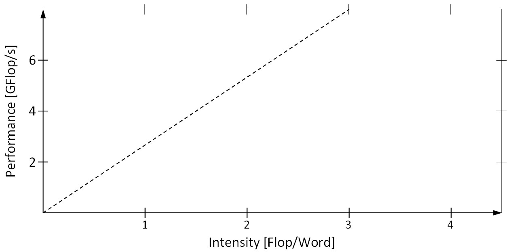

# Aufgabenblatt 01

Source task: [extracted task](../.extracted/tasks/01-aufgabenblatt-01.mdx)

Solution status: **moodle-solution-available**

Solution page: [01-aufgabenblatt-01-loesung](./solutions/01-aufgabenblatt-01-loesung.mdx)

## Task Text

<!-- source: page 1 -->

## High Performance Computing (CDS-110)
Aufgabenblatt 1: Speicherzugriffe & Roofline-Modell

## Aufgabe 1
Die Schönauer-Vektortriade
```pseudo
for i <- 1 to N do
a(i) <- b(i) + c(i)*d(i)
od
```
soll auf einer superskalaren Architektur ausgeführt werden, die gleichzeitig eine Multiplikation sowie
eine Addition berechnen kann. Wie viele Zyklen sind notwendig, um eine vollständige Iteration obiger
Schleife auszuführen, wenn der Prozessor pro Zyklus
I.    zwei Worte laden (d.h. OP) und ein Wort speichern (d.h. WB) oder
II.   vier Worte laden und zwei Worte speichern kann?
Der Einfachheit halber dürfen Sie annehmen, dass alle skalaren Grössen in Registern vorgehalten
werden können und die Ergebnisse einer arithmetischen Operation (EX) direkt zurückgeschrieben
werden, d.h. EX und WB finden im selben Zyklus statt. Die beiden Operationen IF und DE dürfen für
die Analyse vernachlässigt werden.

## Aufgabe 2
Gegeben sei eine idealisierte superskalare Architektur mit zwei Gleitkomma-Einheiten (FPUs), einer
Taktfrequenz von 3.2 GHz sowie einer Spitzenbandbreite gemäss folgendem Diagramm.


<figure>
  
</figure>


<!-- source: page 2 -->

Bestimmen Sie für die Schönauer-Vektortriade
  - die Arbeit W, d.h. die Anzahl aller Operationen (inkl. Lade-/Speicheroperationen),
  - den Speicherverkehr Q, d.h. die Anzahl aller transferierten Speicherwörter sowie
  - die arithmetische Intensität I = W / Q,
und entscheiden Sie damit anhand des Roofline-Modells, ob die Anwendung durch den Speicher
(memory bound) oder die Berechnung (compute bound) beschränkt wird. Begründen Sie Ihre Antwort!

Die Bearbeitung der Aufgaben erfolgt freiwillig.

## Working Area

- Attempt status: not started
- Checked solution: not written yet
- Notes:

## Original Sources

- Task: [raw PDF](../.raw/materials/01-einfuehrung/02-aufgabenblatt-01.pdf) · [machine extraction](../.extracted/tasks/01-aufgabenblatt-01.mdx)
- Moodle solution: [raw PDF](../.raw/materials/01-einfuehrung/03-aufgabenblatt-01-loesung.pdf) · [machine extraction](../.extracted/solutions/01-aufgabenblatt-01-loesung.mdx) · [working copy](solutions/01-aufgabenblatt-01-loesung.mdx)
