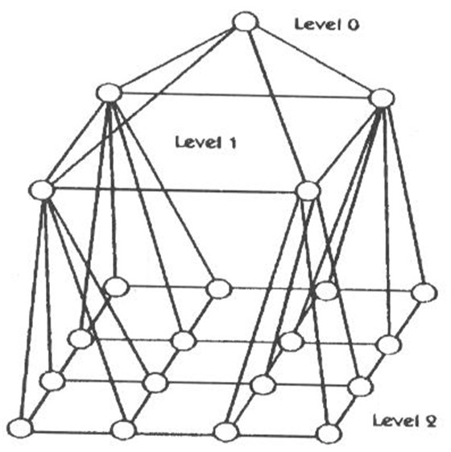

# Aufgabenblatt 04

Source task: [extracted task](../.extracted/tasks/04-aufgabenblatt-04.mdx)

Solution status: **moodle-solution-available**

Solution page: [04-aufgabenblatt-04-loesung](./solutions/04-aufgabenblatt-04-loesung.mdx)

## Task Text

<!-- source: page 1 -->

## High Performance Computing (CDS-110)
Aufgabenblatt 4: Netztopologien II

## Aufgabe 1
a) Gegeben sei ein 2-dimensionales Gitter der Grösse M x N, dessen Knoten in x-Richtung von 1
bis M und in y-Richtung von 1 bis N durchnumeriert sind. Für zwei beliebige Knoten n1 und n2
mit Koordinaten (x1, y1) bzw. (x2, y2) soll die Anzahl an möglichen kürzesten Wegen ermittelt
werden. Geben Sie eine Formel nur in Abhängigkeit von x1, y1, x2, y2, M und N an, mithilfe derer
sich die maximale Anzahl kürzester Wege vom Knoten n1 zum Knoten n2 berechnen lässt.
b) Gegeben sei ein d-dimensionaler Hyperwürfel. Für zwei beliebige Knoten n1 und n2 mit
Koordinaten v11 v12 ... v1d-1 v1d bzw. v21 v22 ... v2d-1 v2d soll die Anzahl an möglichen kürzesten
Wegen ermittelt werden. Geben Sie eine Formel nur in Abhängigkeit von d, v11 v12 ... v1d-1 v1d
und v21 v22 ... v2d-1 v2d an, mithilfe derer sich die maximale Anzahl kürzester Wege vom Knoten
n1 zum Knoten n2 berechnen lässt.

## Aufgabe 2
Gegeben sind die ersten drei Level eine rekursiven Netztopologie – eine Pyramide. Jeder Elterknoten
hat dabei immer genau vier Kinder auf dem nächsten Level, die ihrerseits alle als
2-dimensionales Gitter vernetzt sind (siehe Skizze).

Bild 1: Beispiel einer Pyramidennetztopologie mit Höhe H = 3 und N = 21 Knoten

a) Geben Sie eine geschlossene Formel nur in Abhängigkeit der Höhe H an, mithilfe derer sich die
Gesamtanzahl an Knoten N einer allgemeinen Pyramidennetztopologie berechnen lässt.
b) Berechnen Sie die Kosten (d.h. Anzahl der Kanten), den Durchmesser und die Bisektionsweite
einer allgemeinen Pyramidennetztopologie nur in Abhängigkeit von H und N.

Die Bearbeitung der Aufgaben erfolgt freiwillig.

<figure>
  
</figure>

## Working Area

- Attempt status: not started
- Checked solution: not written yet
- Notes:

## Original Sources

- Task: [raw PDF](../.raw/materials/02-netztopologien/04-aufgabenblatt-04.pdf) · [machine extraction](../.extracted/tasks/04-aufgabenblatt-04.mdx)
- Moodle solution: [raw PDF](../.raw/materials/02-netztopologien/05-aufgabenblatt-04-loesung.pdf) · [machine extraction](../.extracted/solutions/04-aufgabenblatt-04-loesung.mdx) · [working copy](solutions/04-aufgabenblatt-04-loesung.mdx)
