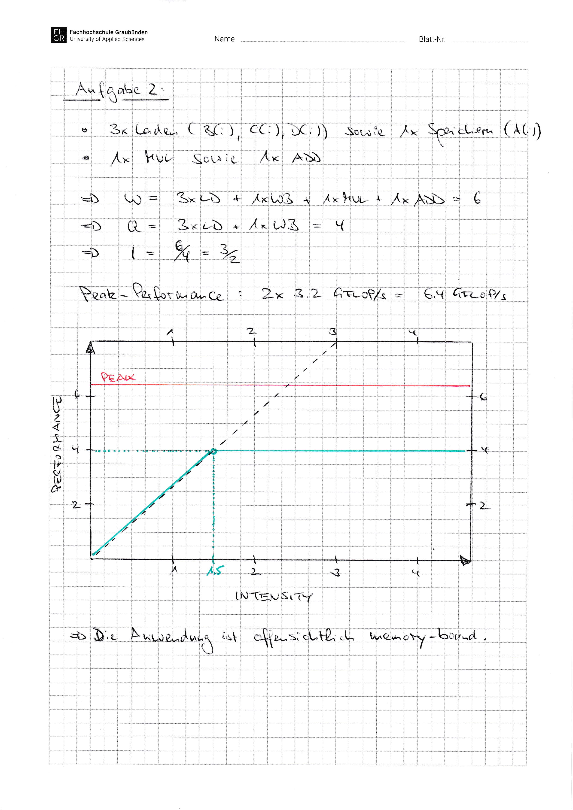

# Aufgabenblatt 01 -- Lösung

This is the versioned working copy of the Moodle solution. It has not been independently checked yet.

<!-- source: page 1 -->
<!-- visual-only: source page has no trusted extracted text -->

<figure>
  
</figure>

<!-- source: page 2 -->
<!-- visual-only: source page has no trusted extracted text -->

<figure>
  
</figure>

## Original Sources

- Solution: [raw PDF](../../.raw/materials/01-einfuehrung/03-aufgabenblatt-01-loesung.pdf) · [machine extraction](../../.extracted/solutions/01-aufgabenblatt-01-loesung.mdx)
- Related task: [raw PDF](../../.raw/materials/01-einfuehrung/02-aufgabenblatt-01.pdf) · [machine extraction](../../.extracted/tasks/01-aufgabenblatt-01.mdx)
