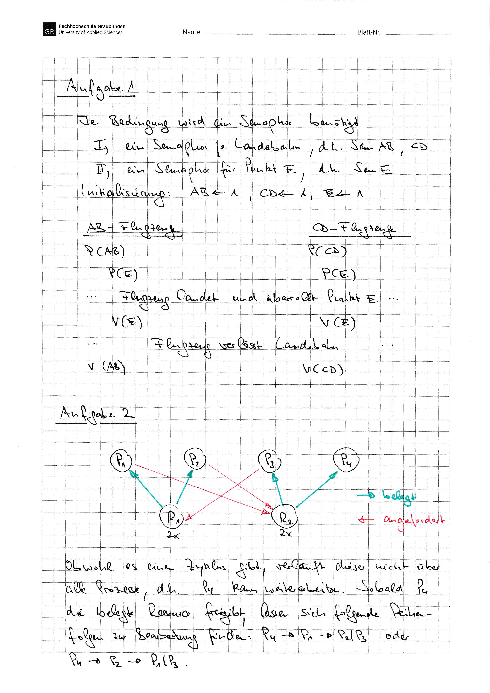

# Aufgabenblatt 07 -- Lösung

This is the versioned working copy of the Moodle solution. It has not been independently checked yet.

<!-- source: page 1 -->
<!-- visual-only: source page has no trusted extracted text -->

<figure>
  
</figure>

## Original Sources

- Solution: [raw PDF](../../.raw/materials/03-grundlagen-der-parallelisierung/05-aufgabenblatt-07-loesung.pdf) · [machine extraction](../../.extracted/solutions/07-aufgabenblatt-07-loesung.mdx)
- Related task: [raw PDF](../../.raw/materials/03-grundlagen-der-parallelisierung/04-aufgabenblatt-07.pdf) · [machine extraction](../../.extracted/tasks/07-aufgabenblatt-07.mdx)
