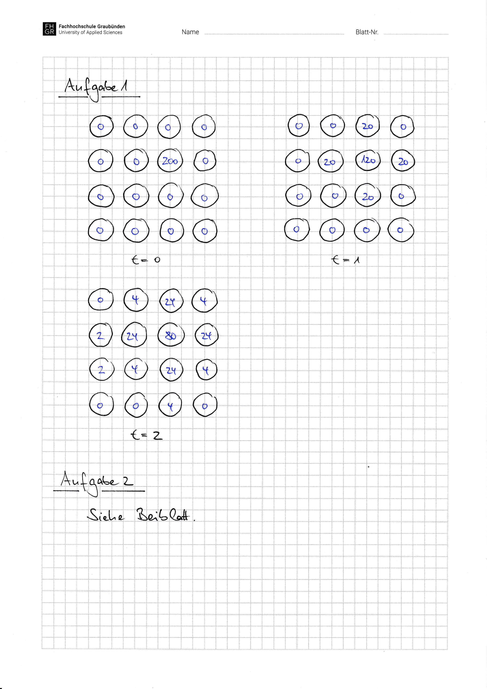

# Aufgabenblatt 08 -- Lösung

This is the versioned working copy of the Moodle solution. It has not been independently checked yet.

<!-- source: page 1 -->
<!-- visual-only: source page has no trusted extracted text -->

<figure>
  
</figure>


<!-- source: page 2 -->

Blatt 08 / Aufgabe 2: Dining Philosophers

neuer Zustand HUNGRY => Idee: ‚hungrige‘ Philosoph:innen testen erst, ob sie essen dürfen

```pseudo
semaphore mutex; mutex <- 1
semaphore phil[N]; phil[0] <- 0; phil[1] <- 0; …; phil [N-1] <- 0
state[]; state[0] <- THINK; state[1] <- THINK; …; state[N-1] <- THINK
```

```pseudo
begin procedure PHILOSOPHER(num)
while (TRUE) do
```
THINK()
get_chopsticks(num)
EAT()                                               // nothing happens here
put_chopsticks(num)
```pseudo
od
end
```

```pseudo
begin procedure TEST(num)
if state[num] = HUNGRY &&
state[LEFT(num)] != EATING &&
state[RIGHT(num)] != EATING then
state[num] <- EATING
V(phil[num])
```
fi
```pseudo
end
```

```pseudo
begin procedure get_chopsticks(num)
state[num] <- HUNGRY
P(mutex)
```
TEST(num)
```pseudo
V(mutex)
P(phil[num])
end
```

```pseudo
begin procedure put_chopsticks(num)
state[num] <- THINK
P(mutex)
```
TEST(LEFT(num))
TEST(RIGHT(num))
```pseudo
V(mutex)
end
```

In der Prozedur put_chopsticks( ) testet Philosoph:in num via (TEST(LEFT(num)) and
TEST(RIGHT(num))) zuerst, ob die Nachbarn essen können und aktiviert sie anschliessend via
```pseudo
V(phil[num])).
```

## Original Sources

- Solution: [raw PDF](../../.raw/materials/03-grundlagen-der-parallelisierung/07-aufgabenblatt-08-loesung.pdf) · [machine extraction](../../.extracted/solutions/08-aufgabenblatt-08-loesung.mdx)
- Related task: [raw PDF](../../.raw/materials/03-grundlagen-der-parallelisierung/06-aufgabenblatt-08.pdf) · [machine extraction](../../.extracted/tasks/08-aufgabenblatt-08.mdx)
